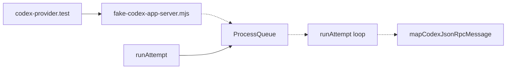
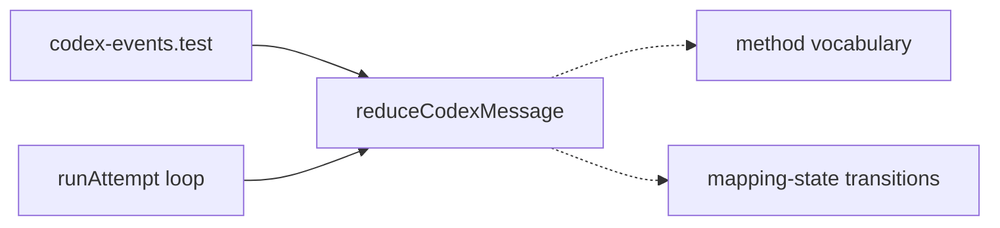
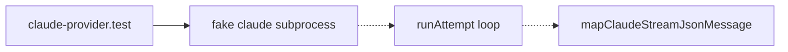
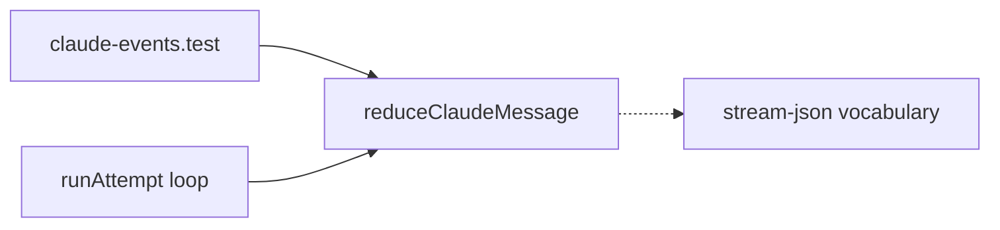
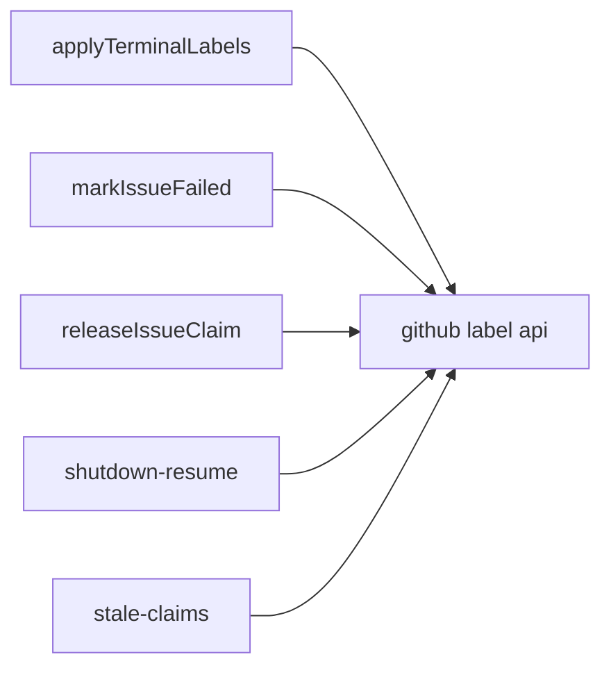
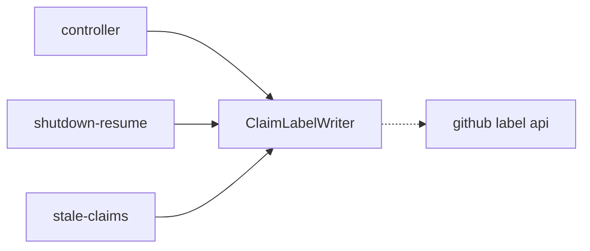
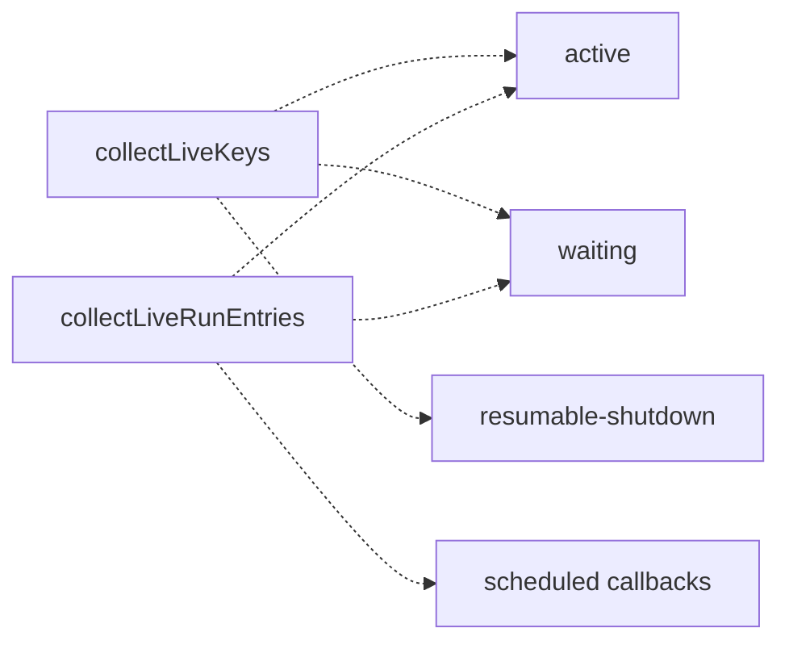
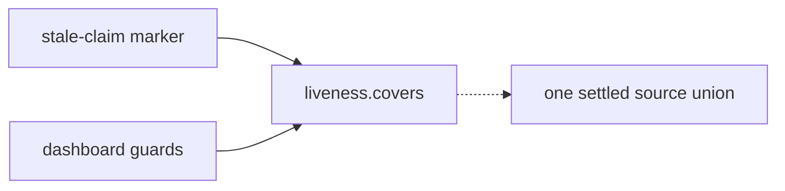
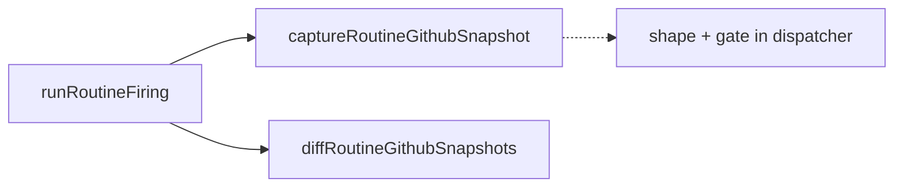
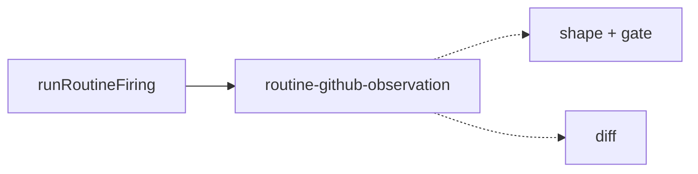

# Architecture review — symphonika — 2026-08-31

**Scope**: Provider and lifecycle hot spots inferred from recent `git log` (codex/claude providers, run-controller, run-store, http/pages, routines). A sub-agent walked the codebase for shallow modules and seams; the persisted `.architecture/backlog.md` was reconciled against `gh` first.
**Picked**: `codex-event-reducer` — see PR (opened after this report) and `.architecture/backlog.md`.
**Degradations**: none. `gh` authenticated; sub-agents available (exploration + design-it-twice); `codebase-design` vocabulary loaded.

**Reconciliation this run**: `outcome-projection` was `in-flight` on PR #610; `gh pr view 610` shows it merged 2026-08-31, so it is now `landed`. That freed the top of the proposed list.

**Diagram legend**: solid edges are the interface a caller sees; dashed edges are inside the implementation, behind the seam.

## Candidates

### codex-event-reducer — extract the Codex JSON-RPC message reducer  ·  Strong  ·  score 22/25

- **Files**: `src/providers/codex.ts` — `mapCodexJsonRpcMessage` at `src/providers/codex.ts:427-638`, with its helpers `thinkingEvent` (640), `progressMarkerEvent` (666), `jsonRpcErrorEvent` (692), `codexToolCallInput` (1193), `isInputRequiredMethod` (716), and the field accessors (1225-1279); new `src/providers/codex-events.ts`; new `tests/codex-events.test.ts`. **File-count estimate: ~3.**
- **Score**: 22/25
  - **Leverage 5** — extraction removes the entire "spawn `fake-codex-app-server.mjs`, drive the whole `runAttempt` async iterable, assert on emitted events" test-setup class for *every* mapping rule, and pays across ~13 JSON-RPC method branches.
  - **Locality 4** — all message→event mapping and its mutable mapping-state transitions (delta accumulation, marker rate-limit, `threadId`/`turnId` fallbacks) concentrate in one module; teaching Codex a new message type becomes a one-file edit plus a test row.
  - **Blast radius 2** — `codex.ts` plus one new module and its test; `mapCodexJsonRpcMessage` is private and `ProviderEvent` is unchanged, so no published interface moves.
  - **Heat 4** — `codex.ts` changed in #607, #601, #598, #592, #587; the mapping itself gained the `willRetry`→progress and progress-marker rules very recently.
- **Problem**: `mapCodexJsonRpcMessage` is a **deep** function — ~210 lines encoding the whole Codex app-server protocol vocabulary (input-required detection, agent-message delta accumulation, reasoning-vs-tool-call disambiguation, command-output/diff progress markers, token/rate-limit updates, `turn/completed` vs `turn/failed`, and the `willRetry` transient-drop rule) — but it is reachable only through a **shallow, wide seam**: a spawned subprocess feeding JSON-RPC over stdout, wrapped in a `ProcessQueue`. The real bugs live in the mapping (ADR 0087/0088 both fixed rules *inside* this function), yet the only way to exercise a rule is to author a new `--scenario` in the fake server and run an entire attempt. The interface under test (a subprocess) is far more complex than the behaviour being tested (a pure `raw → event` decision).
- **Deletion test**: **Concentrates.** Deleting the module would scatter the JSON-RPC method vocabulary and the mapping-state transitions back into the provider's read loop — exactly where they came from. The mapping is a genuine unit of behaviour, not a pass-through; pulling it behind one seam is the deepening.
- **Solution**: Move the mapping into `src/providers/codex-events.ts` as a pure reducer over an explicit mapping-state slice — the fields the mapping actually reads and writes (`lastAgentMessage`, `lastProgressMarkerAtMs`, `threadId`, `turnId`, and the injected `now`), not the whole `ActiveCodexRun` (which also carries `child`, `cancelled`, `nextRequestId`, none of which the mapping touches). `codex.ts` keeps the process/queue lifecycle and calls the reducer per message. The exact reducer shape is chosen in the Design section.
- **Benefits**: **Leverage** — every mapping rule becomes a table-driven unit test (`reduce(rawMessage, state) → {event, state}`) with no subprocess, no async iterable, no filesystem. **Locality** — the protocol lives in one file next to a test that pins each branch; the process loop shrinks to lifecycle only. **Test surface** — the behaviour is exercised *through the interface itself* rather than past it through a fake server, which is the point of the deepening.

### claude-event-reducer — extract the Claude stream-JSON reducer  ·  Strong  ·  score 22/25 (runner-up candidate)

- **Files**: `src/providers/claude.ts` — `mapClaudeStreamJsonMessage` at `src/providers/claude.ts:193` (called from 187); new `src/providers/claude-events.ts`. **File-count estimate: ~2.**
- **Score**: 22/25 — leverage 5, locality 4, blast radius 2, heat 4. Identical rubric profile to the pick; it is the sibling refactor.
- **Problem**: The exact same shallowness as `codex-event-reducer`, one provider over. `mapClaudeStreamJsonMessage` (which returns an event *array*, unlike the Codex single-event mapper) is only testable through `claude-provider.test.ts`'s fake-subprocess harness.
- **Deletion test**: **Concentrates** — same reasoning as the pick.
- **Solution**: Extract into `src/providers/claude-events.ts` as a pure `(raw, state) => {events, state}` reducer.
- **Benefits**: Same leverage/locality/test-surface win as the pick.
- **Recommendation**: Strong. This is the natural next firing — see *Pick* for why it lost the tie this run.

### issue-claim-label-writer — one seam for the sym:* label state-machine  ·  Worth exploring  ·  score 21/25

- **Files**: `src/lifecycle/run-controller.ts` — `markIssueNeedsHuman`/`markIssueFailed`/`markIssueBlocked`/`applyTerminalLabels`/`releaseIssueClaim` at `3672-3908`, `rollbackScheduledRunClaimLabel` at `1837`; same `sym:*` write vocabulary in `src/lifecycle/shutdown-resume.ts` and `src/lifecycle/stale-claims.ts:78`. **File-count estimate: ~4.**
- **Score**: 21/25 — leverage 4, locality 4, blast radius 2, heat 5.
- **Problem**: The claim/outcome label transitions (add `sym:failed`, fall back to `sym:human-needed` on API failure; strip `sym:running`; clean up terminal labels on a closed issue) are hand-rolled as ~24 inline `bestEffort(() => api.removeLabelsFromIssue(...))` call sites, each carrying the label strings and fallback ordering. The label *constants* are isolated (`src/operational-labels.ts`), but the *transitions* are not.
- **Deletion test**: **Concentrates** — deleting today's helpers moves the label vocabulary and best-effort-with-fallback rules to callers, which is the current shape. A `ClaimLabelWriter.markTerminal(outcome)`/`.release(phase)` interface hides the ordering.
- **Solution**: A small module owning the transition table and best-effort fallback, called by the controller and the shutdown/stale paths.
- **Benefits**: **Leverage** across ~24 sites; **locality** for the "failed→human-needed fallback" rule that today has no focused test. **Test surface**: the fallback becomes directly assertable.
- **Recommendation**: Worth exploring, but larger and riskier than the reducers — it touches terminal-label *ordering*, which is ADR 0002/0024-adjacent, so its behaviour must be pinned carefully before moving.

### live-run-ownership-registry — shared liveness union  ·  Speculative  ·  score 18/25

- **Files**: `src/http/pages.ts` (`collectLiveRunEntries`/`findLiveRunIdForIssue`/`livePullRequestOwner*` at `3877-4045`), `src/lifecycle/stale-claims.ts` (`LiveIssueKeys`/`collectLiveKeys` at `112-183`). **File-count estimate: ~3.**
- **Score**: 18/25 — leverage 3, locality 4, blast radius 2, heat 4.
- **Problem**: "Which `(project, repo, issue)` currently has a live/claim-holding run" is one concept, re-derived independently in two hot files, and a `pages.ts` comment even asserts the two use "the same three-source union."
- **Deletion test**: **Concentrates** — a single `covers(project, repo, issue)` seam would let the stale-claim marker and the dashboard's clear-stale-claim + PR-merge guards read one union.
- **Solution**: A shared liveness module owning the key derivation.
- **Benefits**: **Locality** — a change to the union becomes a one-file edit instead of two.

> **The union is not actually shared, by design.** `collectLiveKeys` unions active + waiting + **resumable-shutdown** runs (and covers scheduled work via the in-memory registry, ADR 0088); `collectLiveRunEntries` unions active + waiting + resolved **scheduled callbacks** and omits resumable-shutdown (ADR 0047/0089). Each documents *why* its sources differ. Folding them into one seam is therefore a **behavioural decision**, not a behaviour-preserving deepening — and the autonomy contract makes an un-evidenced fork a bail-out, not a coin flip. Recorded `proposed` for a human to settle the target semantics; not eligible as an unattended pick until then.

### routine-github-observation — move capture next to its diff  ·  Speculative  ·  score 17/25

- **Files**: `src/routines/dispatcher.ts` (`captureRoutineGithubSnapshot` and shapers at `1808-1986`), `src/routines/outcome.ts` (`diffRoutineGithubSnapshots` at `117`). **File-count estimate: ~2.**
- **Score**: 17/25 — leverage 3, locality 4, blast radius 2, heat 3.
- **Problem**: Understanding "what a routine firing detected on GitHub" means bouncing `dispatcher.ts` (capture + row-shaping + issues-vs-PR availability gating) ↔ `outcome.ts` (the diff); the shaping half is stranded away from the diff it feeds.
- **Deletion test**: **Concentrates** — the shaping and availability-gating belong beside the diff in `outcome.ts`.
- **Solution**: Move the capture/shape/gate trio into `outcome.ts` (or a module beside it) so `runRoutineFiring` calls one seam.
- **Benefits**: **Locality** for the `kind: git` "both channels available" rule, currently only touched via the routine-daemon integration path.

## Dropped

| Candidate | Dropped because |
|---|---|
| `github-pr-enum-normalizers` | Leverage 1 — fails the deletion test; the enum switches are bound to the GraphQL query strings in the same file, so extraction separates the parse from its query and complexity moves, not concentrates. (carried from prior run) |
| `provider-json-field-accessors` | Leverage 1 — `field`/`objectField`/`stringField`/`numberField`/`booleanField` are triplicated across `codex.ts`, `claude.ts`, and `dispatcher.ts`, but the helpers are shallow by nature (interface ≈ implementation), so sharing them concentrates no behaviour. A DRY cleanup, not a deepening. |
| `snapshot-search` (scored 15/25) | Borderline deletion test — snapshot filter/sort in `pages.ts` is largely presentation-shaped, so extraction risks moving complexity to route handlers; also couples into `live-run-ownership-registry`. Kept `proposed` at low score rather than picked. |

## Too large to automate

None this run — no surviving candidate scored blast radius 5.

## Pick

**`codex-event-reducer` (22/25).** The top of the proposed list opened up when `outcome-projection` reconciled to `landed` (PR #610 merged). Two candidates then tied at 22/25: `codex-event-reducer` and `claude-event-reducer` — identical rubric profiles because they are the same refactor on sibling providers.

**Tie-break (deterministic, per the rubric):** equal blast radius (2), equal heat (4), so the tie falls to *files touched most recently*. `src/providers/codex.ts` carries distinct recent commits after the last change shared with `claude.ts` (#598, #592, #587); `claude.ts`'s last independent change was #568. Codex wins.

The top two are **within 1 point (in fact tied)**: `claude-event-reducer` is the natural next firing, and landing the Codex reducer first establishes the shape the Claude one will mirror.

This pick is a clean, behaviour-preserving pure-function extraction with a private interface and no ADR conflict — exactly the low-risk, high-leverage work an unattended test-first run should take. `live-run-ownership-registry` scored lower and, more importantly, would require a behavioural decision the evidence cannot settle (see its card); `issue-claim-label-writer` (21/25) is a strong but larger and ADR-adjacent secondary.

## Design

_Written in step 4 (design-it-twice + adjudication); the file is amended and committed again after this section is filled._
