# Architecture review — symphonika — 2026-08-31

**Scope**: Hot-spot modules by recent churn — `run-controller.ts` (#2 churned),
`run-store.ts` (#1), `http/pages.ts` (#3), `providers/{codex,claude}.ts`,
`routines/dispatcher.ts`, `issue-polling.ts`. Deepening pays off through future
change, so the scan weighted the most-churned files (YAGNI on cold code).
**Picked**: `outcome-projection` — see PR and `.architecture/backlog.md`
**Degradations**: none. `gh` authenticated; sub-agent exploration available.

> Diagram convention: solid edges are the module **interface**; dashed edges are
> **inside** the implementation (hidden behind the seam).

This is the first `pm-deepen` firing to persist `.architecture/`. Earlier
refactor-audit runs used the interactive upstream and recorded their picks in
agent memory rather than a committed backlog; the three they landed
(concurrency-cap policy, snapshot JSON-column codec, jsonl stream queue) are
excluded here as already-landed and seeded into the backlog as `landed`.

## Candidates

### `outcome-projection` — extract `ClassifiedTerminal` projections next to their producer  ·  Strong  ·  score 23/25

- **Files** — `src/lifecycle/run-controller.ts:4259-4392` (the cluster:
  `BLOCKED_TERMINAL_REASONS`, `isBlockedOutcome`, `mapOutcomeToRunState`,
  `narrowTerminalLabel`, `fuseWorkflowTerminal`, `signalsFromTerminal`);
  consumers at `:1952-1962`, `:3060-3064`, `:3319`, `:3338`, `:3401`, `:3757`,
  `:3898`. Producer of the input type: `src/lifecycle/classify-failure.ts:22`
  (`ClassifiedTerminal`). Precedent: `src/lifecycle/pr-signal-projection.ts`.
  **File-count estimate: 3** (new module, run-controller import, new test).
- **Score** — **23/25**
  - **Leverage 4** — the projection becomes directly table-testable, removing a
    whole class of test setup: today the only way to assert "this terminal
    outcome yields *that* RunState / label / predicate signals" is to drive a
    full dispatch integration. Call sites don't shrink (they already delegate),
    so not a 5.
  - **Locality 5** — the rules for turning a terminal outcome into a persisted
    `RunState`, a `sym:*` label, and workflow predicate signals are one concept
    that today lives interleaved with unrelated I/O helpers; a change to those
    rules becomes a one-file edit.
  - **Blast radius 1** — 3 files, no published interface changes; all six symbols
    are module-private today.
  - **Heat 5** — `run-controller.ts` is the #2 churned file (98 commits) and this
    exact region encodes ADR 0058/0046 and was touched by the most recent work
    (#600 resume-shutdown-cancelled, #598 willRetry-liveness).
- **Problem** — The cluster is a coherent concept — *given a `ClassifiedTerminal`,
  project it to a `RunState`, a terminal label, and a `WorkflowPredicateMap`* —
  but it is scattered through the tail of a 4425-line file and physically
  interleaved with unrelated helpers: `resolveTokenFromEnv` (`:4331`),
  `appendJsonl` (`:4343`), and `normalizeRawIssue` (`:4347`) all sit *between*
  `fuseWorkflowTerminal` and `signalsFromTerminal`. Understanding "how does a
  terminal outcome become a persisted state + label + next-step signals" means
  reading five functions spread across 130 lines mixed with I/O. The input type
  already lives in a real seam (`classify-failure.ts`), but its *projection*
  leaked back into the controller — the shallow half of an otherwise deep design.
- **Deletion test** — Concentrates. These are pure `ClassifiedTerminal → X`
  mappers with no `this`/I/O; deleting them forces callers to re-derive the
  RunState/label/signal rules inline at the consumer sites, which is strictly
  worse. Good signal.
- **Solution** — New `src/lifecycle/outcome-projection.ts` exporting
  `mapOutcomeToRunState`, `fuseWorkflowTerminal`, `signalsFromTerminal`,
  `isBlockedOutcome`, `narrowTerminalLabel` (with `BLOCKED_TERMINAL_REASONS` a
  private implementation detail). It sits next to `classify-failure.ts` (which
  produces `ClassifiedTerminal`) and mirrors the existing `pr-signal-projection.ts`
  precedent one-for-one. `run-controller.ts` imports the names it already calls.
- **Benefits** — **Leverage**: the terminal-outcome projection rules — the exact
  place ADR-driven changes keep landing — become unit-testable through a small
  interface instead of a spawned dispatch. **Locality**: RunState/label/signal
  policy concentrates in one 60-line module next to its producer, so the next
  ADR touching terminal semantics is a one-file edit with a table test.
- **Before / After**

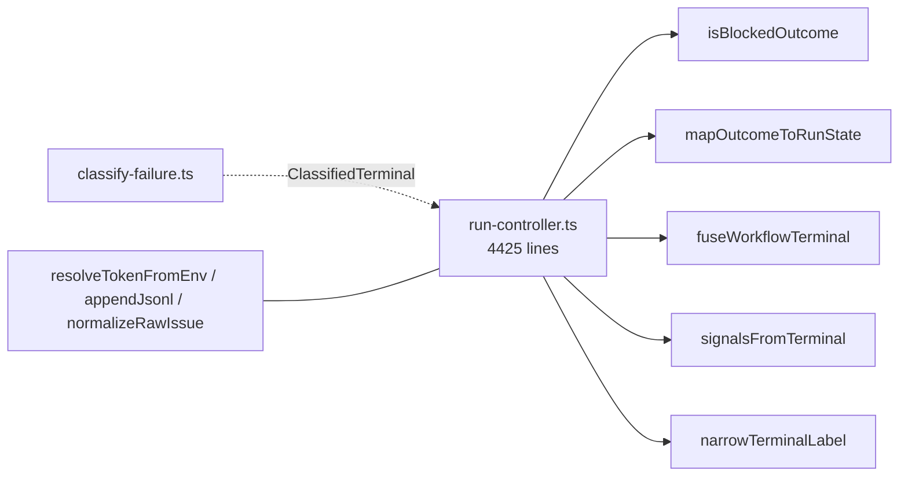

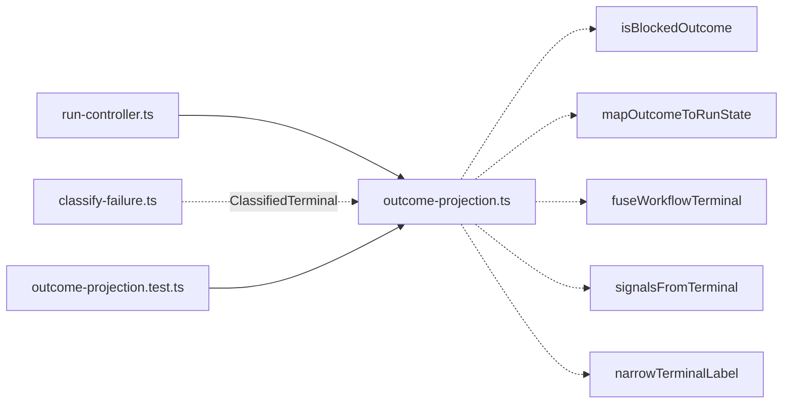

### `codex-event-reducer` — pure `(raw, state) → {events, state}` out of the Codex provider process  ·  Worth exploring  ·  score 22/25

- **Files** — `src/providers/codex.ts:410-651` (`mapCodexJsonRpcMessage`,
  `thinkingEvent`, `progressMarkerEvent`), which mutate `activeRun.lastAgentMessage`
  / `lastProgressMarkerAtMs`. **File-count estimate: 2.**
- **Score** — **22/25** — Leverage 5 (the heaviest test-setup removal on the
  list — mapping is exercised today only by writing a fake app-server script and
  spawning a real child process), Locality 4, Blast radius 2 (module + provider
  shell; state threading), Heat 4 (20 commits, touched by #598/#592).
- **Problem** — The provider's essential complexity (the JSON-RPC vocabulary, the
  `willRetry → progress` rule at `:594`, token-delta coalescing) is fused to
  process/queue plumbing and reads/writes a mutable `ActiveCodexRun`, so it is
  observable only by spawning a subprocess.
- **Deletion test** — Concentrates. The mapper *is* the provider's core; deleting
  it moves nothing useful to callers. The only non-purity is threaded run state,
  which the extraction makes explicit.
- **Solution** — `src/providers/codex-events.ts` exporting a pure reducer over an
  explicit state record; the factory keeps a thin stateful shell owning the
  process/queue.
- **Benefits** — **Leverage**: every mapping case becomes a plain `(raw, state)`
  assertion. **Locality**: the raw→normalized translation concentrates behind the
  existing `createCodexProvider` seam.
- **Before / After**

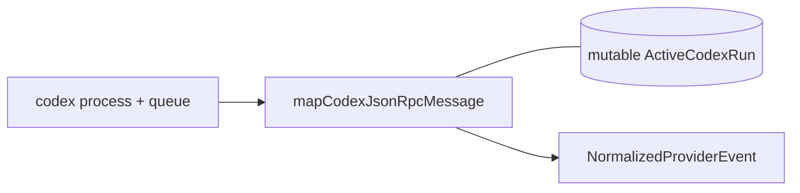

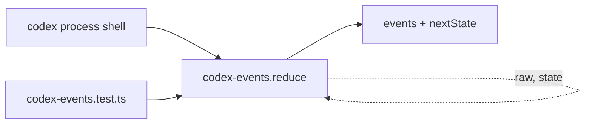

### `claude-event-reducer` — pure `(raw, state) → {events, state}` out of the Claude provider process  ·  Worth exploring  ·  score 22/25

- **Files** — `src/providers/claude.ts:181-421+` (`mapClaudeStreamJsonMessage`,
  `mapSystemMessage`, `mapAssistantMessage`, `mapResultMessage`, `mapStreamEvent`),
  mutating `activeRun.sessionId`. **File-count estimate: 2.**
- **Score** — **22/25** — Leverage 5, Locality 4, Blast radius 2, Heat 4 (17
  commits, touched by #592 reasoning). Same shape as `codex-event-reducer` but an
  independent extraction (Claude returns an event *array*, Codex a single event).
- **Problem / Deletion test / Solution** — As `codex-event-reducer`: the stream-json
  translation is deep behaviour fused to a mutable run record and a spawned
  subprocess; extracting a pure reducer concentrates it and makes it directly
  testable.
- **Before / After**

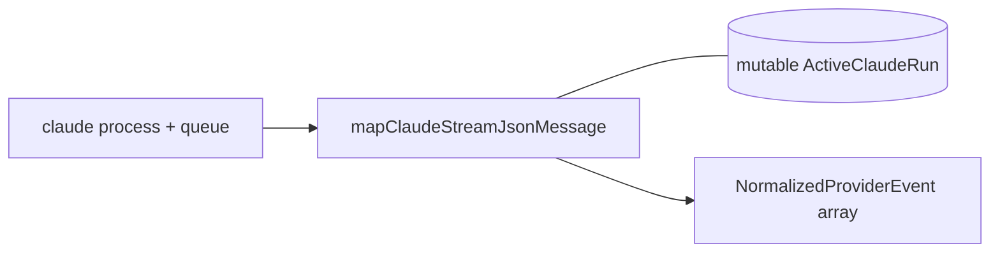

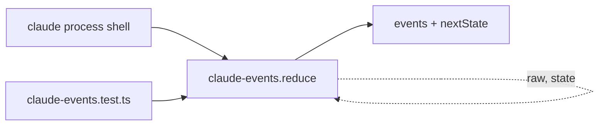

### `artifact-kind-catalog` — one descriptor catalog for the six parallel artifact-kind constructs  ·  Worth exploring  ·  score 18/25

- **Files** — `src/run-store.ts:5711-5771` (`RUN_ARTIFACT_KINDS`,
  `ATTEMPT_ARTIFACT_KINDS` — byte-identical, `ATTEMPT_ARTIFACT_KIND_SET`,
  `artifactPath`, `attemptArtifactPath` — identical switch bodies) plus the
  descriptor builders at `:4144` and `:5508`; `src/http/pages.ts:6907` label
  switch. **File-count estimate: 3.**
- **Score** — **18/25** — Leverage 3 (duplication elimination + drift-proofing,
  not much hidden behaviour), Locality 4 (adding a kind becomes one catalog edit
  instead of ≥5 lockstep sites), Blast radius 1, Heat 3 (files churn, the arrays
  themselves are stable).
- **Problem** — The "artifact kind" concept is smeared across six lockstep
  constructs; a seventh kind is shotgun surgery with no compiler tie between the
  duplicated arrays.
- **Deletion test** — Concentrates. A single `{kind, column, label}[]` descriptor
  drives the arrays (map), the set (derived), both path lookups (`row[column]`),
  and the labels.
- **Solution** — A kind catalog; `artifactPath(row, kind)` becomes
  `row[catalog[kind].column]`; the two descriptor builders collapse to one.
- **Before / After**

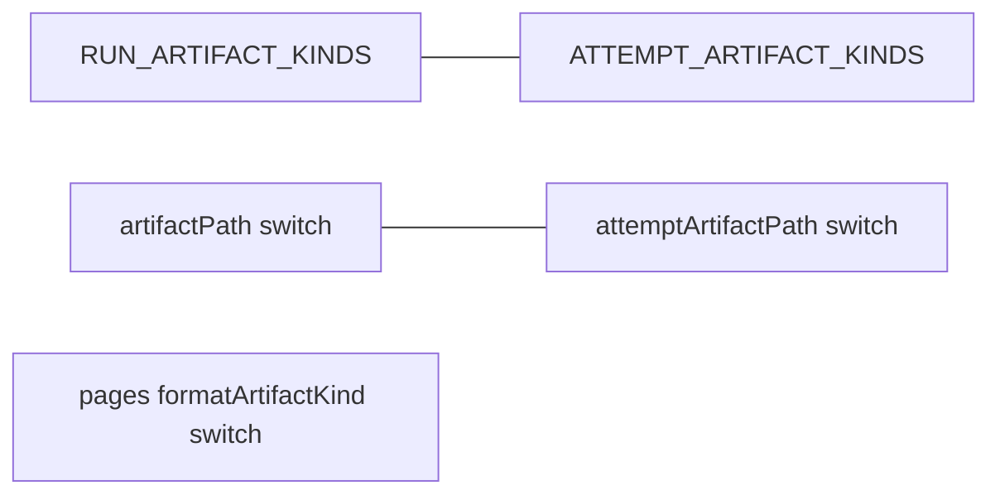

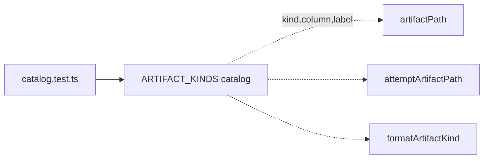

### `routine-evidence-redaction` — lift the secret-redaction + jsonl-serialize cluster out of the dispatcher  ·  Worth exploring  ·  score 18/25

- **Files** — `src/routines/dispatcher.ts:2364-2437` (`serializeJsonl`, `redactAll`,
  `redactRoutineOutcomeClaim`, `redactValueDeep`, `resolveRedactSecrets`,
  `secretsForEmailConfig`). **File-count estimate: 3.**
- **Score** — **18/25** — Leverage 3, Locality 4, Blast radius 1, Heat 3 (dispatcher
  hot at 39 commits; the cluster itself is stable).
- **Problem** — A distinct safety concern with a load-bearing invariant ("redact
  string values *before* `JSON.stringify`, or escaping breaks contiguous-substring
  matching", comment at `:2364`) is buried at the bottom of a 2457-line dispatcher.
- **Deletion test** — Concentrates. Pure/`(config,env)`-pure functions; deleting
  them scatters the redact-before-serialize invariant across every jsonl append.
- **Solution** — `src/routines/evidence-redaction.ts` (or fold into
  `routines/evidence.ts`); `appendJsonl`/`appendIndexedJsonl` keep their signatures.
- **Before / After**

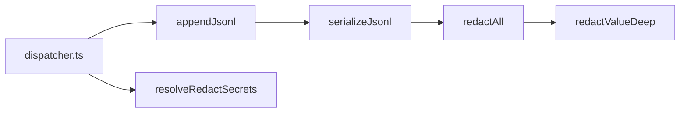

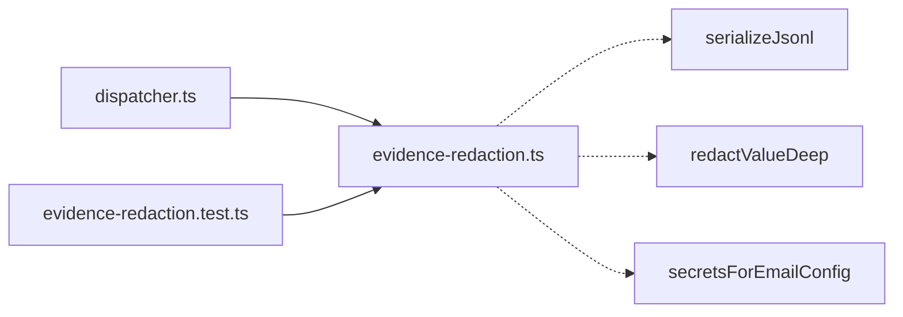

### `coalesce-events` — promote the Codex message-stream reducer to a pure exported function  ·  Worth exploring  ·  score 18/25

- **Files** — `src/http/pages.ts:7020-7085` (`coalesceEvents`), `EventDisplayRow`
  (`:6987`), sole caller `renderEventsTable` (`:6835`). **File-count estimate: 2.**
- **Score** — **18/25** — Leverage 3, Locality 3, Blast radius 1, Heat 4 (pages.ts
  #3 churned; the transcript region moves with provider event shapes).
- **Problem** — A self-contained stateful reducer with non-trivial branching lives
  as a private function inside a 7431-line HTML module and can only be observed by
  rendering a table and asserting on the HTML string.
- **Deletion test** — Concentrates. Pure `events[] → EventDisplayRow[]`; deleting
  it entangles reduction with markup.
- **Solution** — Export `coalesceEvents` + `EventDisplayRow` from
  `src/http/event-coalescing.ts`; `renderEventsTable` imports and renders.
- **Before / After**

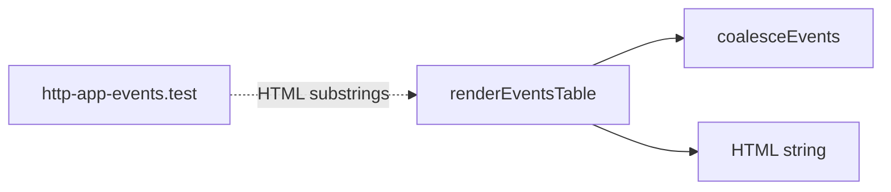

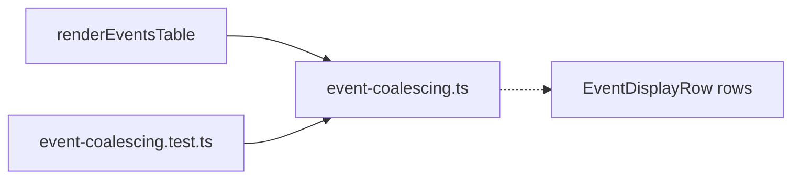

### `status-presentation` — extract the scattered pill/family classifiers into one pure module  ·  Speculative  ·  score 18/25

- **Files** — `src/http/pages.ts:3193-3247`, `:4133-4157`, `:5027-5078`
  (`stateFamily`, `routineStateFamily`, `issueVerdictFamily`,
  `pullRequestStateFamily`, `pullRequestSignalsText`, `pullRequestOriginLabel`).
  **File-count estimate: 2.**
- **Score** — **18/25** — Leverage 3, Locality 4, Blast radius 2 (many edit points
  across ~1900 lines of pages.ts), Heat 4.
- **Problem** — The domain-state → visual "family" (ok/fail/blocked/progress/neutral)
  → pill mapping is one concept fragmented across ~1900 lines; three `*Family`
  functions independently encode the same five-bucket vocabulary. Zero direct
  tests — verified only through HTML substrings.
- **Deletion test** — *Mostly* concentrates: the `*Family` functions are pure
  `state → union`; the `*Pill` wrappers carry thin HTML and should stay in pages.
  Risk of merely relocating markup if the seam is drawn carelessly — hence
  Speculative.
- **Solution** — `src/http/status-presentation.ts` exporting the pure family
  classifiers; pages keeps `labelPill`/`statePill` as one-line markup adapters.
- **Before / After**

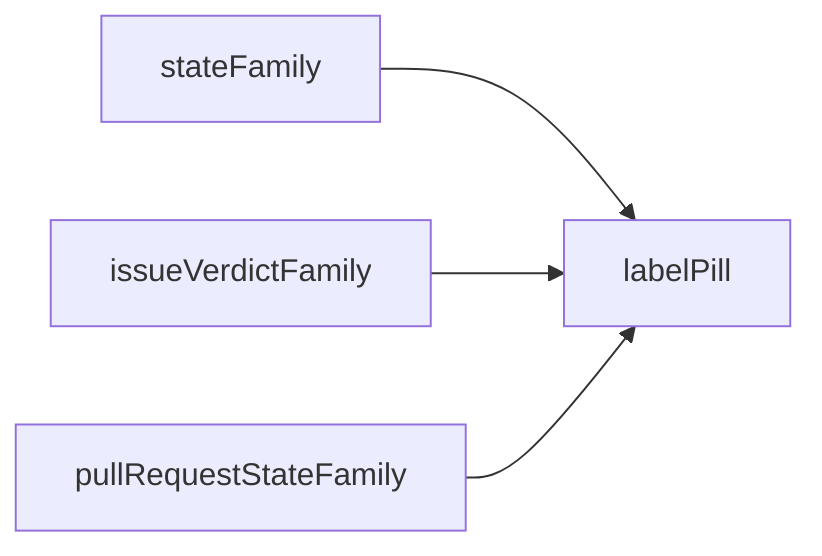

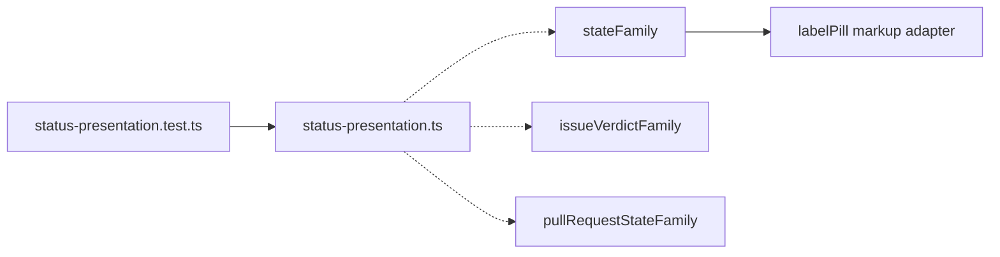

## Dropped

| Candidate | Dropped because |
|---|---|
| `github-pr-enum-normalizers` | Leverage 1 — fails the deletion test. The four enum-whitelist switches (`issue-polling.ts:1573-1625`) are tightly bound to the GraphQL query strings in the same file; extracting them separates the parse from the query it parses, so complexity would move, not concentrate. |

## Too large to automate

None. No surviving candidate scored blast radius 5; none crosses a package/tier or
published-interface seam.

## Pick

**`outcome-projection` (23/25).** It is the highest-scoring survivor and a Strong
recommendation: a pure, module-private cluster with a ready sibling home
(`classify-failure.ts`) and an exact precedent (`pr-signal-projection.ts`), in the
hottest source region, at blast radius 1.

The top two are **within 1 point**: the runner-up candidate is
**`codex-event-reducer` (22/25)**, which offers a larger test-setup reduction
(pure reducer vs. spawned subprocess) but at blast radius 2 with mutable-state
threading across the provider shell — higher payoff, higher risk. It is the
natural next firing. `claude-event-reducer` ties it at 22/25 and is its sibling.

## Design

Written in step 4 after this report was committed; see the amended
`## Design` section below.
