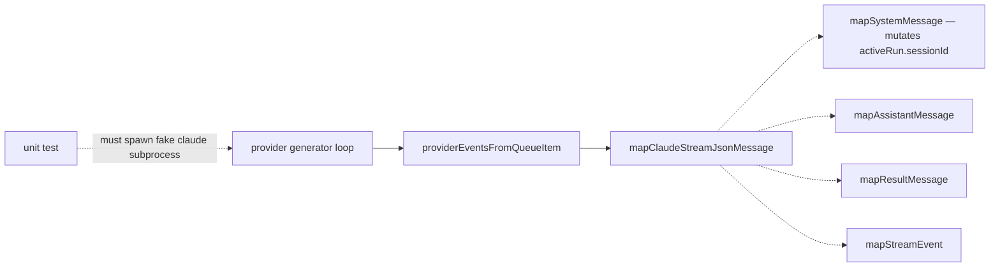
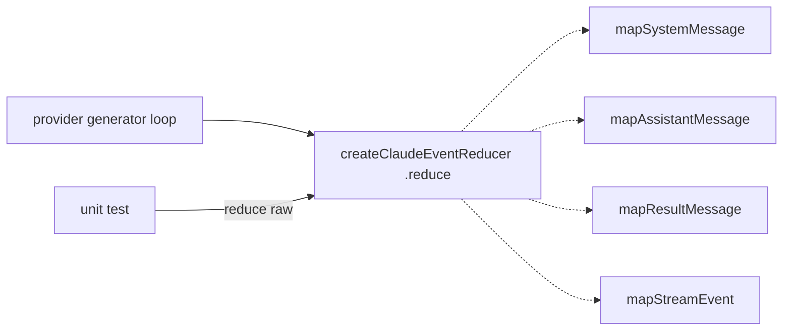

# Architecture review — symphonika — 2026-09-01

**Scope**: Reconciliation of the persisted backlog plus a hot-spot pass over recent
`git log` (`src/providers/*`, `src/run-store.ts`, `src/lifecycle/run-controller.ts`,
`src/http/pages.ts`). The Codex event-reducer (#617) landed 2026-08-31, so its tied
sibling `claude-event-reducer` is the natural next firing — this run verifies it is
still valid and picks it.
**Picked**: `claude-event-reducer` — see [PR](#) and `.architecture/backlog.md`
**Degradations**: none. `gh` authenticated; sub-agents available; branch adopted (see Pick).

Diagram legend: **solid edges are the interface** a caller wires; **dashed edges are
inside the implementation**.

## Candidates

### claude-event-reducer — extract the Claude stream-json → Normalized Event mapping behind a reducer seam  ·  Strong  ·  score 22/25

- **Files**: `src/providers/claude.ts:193-264` (`mapClaudeStreamJsonMessage`) plus the
  helpers `mapSystemMessage` (266), `mapAssistantMessage` (297), `mapResultMessage` (372),
  `mapStreamEvent` (433), `isInputRequiredType` (482), `isInputRequiredTool` (491),
  `isTerminalFailure` (495), and the leaf field accessors at 690-737; new
  `src/providers/claude-events.ts`, new `src/providers/claude-json.ts`, new
  `tests/claude-events.test.ts`. **~4 files estimated.**
- **Score**: 22/25
  - **Leverage 5** — the mapping is behaviourally dense (7 top-level message types,
    fan-out of assistant content blocks to multiple events, `session_id` carry-forward,
    input-required detection across two shapes) yet reachable today only by spawning a
    fake `claude` subprocess and asserting on the emitted Normalized Event Log. Deepening
    removes a whole class of subprocess test setup and pays back at every message type.
  - **Locality 4** — after extraction, a change to how one Claude message becomes a
    Normalized Event is a one-file edit in `claude-events.ts`, verified by a unit test in
    the same seam, instead of a change threaded through the provider generator.
  - **Blast radius 2** — a module and its direct caller; no published interface changes
    (`AgentProvider` surface is untouched). Estimate 4 files.
  - **Heat 4** — `claude.ts` changed in #607, #601, #568 and the provider adapters are a
    standing hot spot; the identical codex refactor landed one day earlier.
- **Problem**: `mapClaudeStreamJsonMessage` and its six helpers are private to
  `claude.ts` and are only invoked from inside the provider's async generator, after a
  child process has been spawned and its stdout parsed into a `ProcessQueueItem`. The
  mapping is not shallow — it is the deep part — but its **interface is the subprocess**:
  the only way a test can drive it is to launch a fake `claude` binary emitting
  stream-json. The `session_id` carry-forward compounds this: `mapSystemMessage` mutates
  `activeRun.sessionId` (claude.ts:280) and every later message reads it back via
  `?? activeRun.sessionId`, so the mapping carries state that is invisible and
  unassertable from outside the generator.
- **Deletion test**: deleting the mapping cluster would **concentrate** complexity — every
  caller currently gets the entire raw-to-normalized translation for one method call
  (`providerEventsFromQueueItem`). Without it, the provider loop would inline seven
  message-type branches. Complexity concentrates here, not moves; it is a genuine
  deepening candidate, not a DRY move.
- **Solution**: introduce `createClaudeEventReducer()` returning a `{ reduce(raw) }`
  closure that owns the `session_id` carry-forward internally and returns `ProviderEvent[]`.
  Move the six map helpers and the two `isInputRequired*` predicates into
  `claude-events.ts`; move the leaf JSON field accessors into `claude-json.ts` (they are
  used only by the mapping, so nothing else in `claude.ts` regresses). The provider
  constructs one reducer per run and calls `reducer.reduce(item.raw)` in
  `providerEventsFromQueueItem`. This mirrors the landed `codex-event-reducer` /
  `codex-json.ts` pair exactly, but is cleaner: the Claude reducer needs **no injected
  deps** (`now`, `session`) because its only state is mapping-internal.
- **Benefits**: **leverage** — the Normalized Event Log for Claude becomes directly
  testable: feed a raw stream-json object, assert the emitted events, with no subprocess.
  **locality** — session-id carry-forward and every message-type branch live in one
  module with its own test file. The **test surface** moves from HTML/subprocess-level
  integration assertions to plain unit calls on `reduce(raw)`, reinforcing ADR 0003's
  intent (keep the Normalized Event Log independent of stream-json details).
- **Before**



- **After**



Solid edges are the interface; dashed edges are inside the implementation. In the After
diagram the test reaches the reducer through the same interface the provider uses.

### issue-claim-label-writer — runner-up candidate  ·  Worth exploring  ·  score 21/25

Carried from the backlog unchanged (see `.architecture/backlog.md`). Lifts the `sym:*`
claim/outcome label transition state-machine out of ~24 inline call sites in
`run-controller.ts` behind a `ClaimLabelWriter` seam. Within 1 point of the pick, so it is
the natural next firing — but it touches terminal-label ordering (ADR 0002/0024-adjacent)
and best-effort fallback semantics, needing its behaviour pinned carefully, and has a
larger blast radius than the reducer. The reducer wins on lower blast radius and on being
a proven, de-risked pattern (its codex twin merged one day ago).

The remaining `proposed` candidates (`artifact-kind-catalog`, `routine-evidence-redaction`,
`coalesce-events`, `status-presentation`, `live-run-ownership-registry`,
`routine-github-observation`, `snapshot-search`) are all scored 15–18/25 and carried
unchanged in the backlog; none outscores the pick.

## Dropped

| Candidate | Dropped because |
|---|---|
| `github-pr-enum-normalizers` | Leverage 1 — fails the deletion test; the enum switches are bound to the GraphQL query strings in the same file, so extraction would move complexity, not concentrate it. Filter unchanged this run. |
| `provider-json-field-accessors` | Leverage 1 — a cross-provider DRY cleanup, not a depth win; the helpers are shallow by nature (interface ≈ implementation). Filter unchanged this run. Note: `claude-json.ts` in the pick is a *per-provider* split the reducer needs locally, mirroring `codex-json.ts` — not the cross-provider share this dropped entry describes. |

## Too large to automate

None surfaced this run. No candidate scored blast radius 5.

## Pick

**`claude-event-reducer` (22/25).** It is the top surviving candidate after reconciling the
backlog: `codex-event-reducer` (#617) merged 2026-08-31 and moved to `landed`, `outcome-projection`
(#610) was already `landed`, and no `in-flight` entry retains an open PR — so implementation
is unblocked. The runner-up **candidate** is `issue-claim-label-writer` (21/25), **within 1
point**, which makes it the natural next firing; the reducer outranks it on blast radius and
because its identical sibling just landed cleanly, de-risking the pattern.

Verification this run: `mapClaudeStreamJsonMessage` and helpers still present at
`claude.ts:193+`; the `session_id` state is written only at claude.ts:280 and read only in
the map functions (222/251/302/376/439) — confirming it is mapping-internal; the field
accessors (690-737) are used only by the mapping; no `pm-deepen/claude-event-reducer` branch
exists on origin or locally; no ADR conflict (ADR 0003 supports the seam).

**Branch**: adopted `sym/symphonika/routine/refactor-audit/01M1D161CG` — non-default, 0
commits ahead of `origin/main`, no upstream, unpublished on origin (all four adoption
conditions held). Per the skill an adopted branch is **not renamed**, so the slug lives here
and in the backlog rather than in the branch name.

## Design

Three interfaces were designed in parallel by independent sub-agents, then a fourth
sub-agent that authored none of them adjudicated against depth → locality → seam placement
→ test surface → blast radius, in that priority order.

### Design A — minimal stateful closure (WINNER, interface)

```ts
export type ClaudeEventReducer = { reduce: (raw: unknown) => ProviderEvent[] };
export function createClaudeEventReducer(): ClaudeEventReducer;
export function isTerminalFailure(type: string | undefined): boolean;
```

One reducer per Run; feed message items in stream order. The `session_id` carry-forward is
a private `let` in the closure — no caller can name or mutate it — so `ActiveClaudeRun`
loses its `sessionId` field entirely. **No injected deps**: unlike the codex sibling, the
Claude mapping has no clock (no rate-limited markers/timestamps) and its session identity is
mapping-owned, not provider-owned, so neither `now` nor a `session()` snapshot is needed.
`reduce` returns `ProviderEvent[]` because assistant messages fan out to multiple Normalized
Events. Hides: the 7-way `type` dispatch, the content-block fan-out, the session carry-forward,
and the loosely-typed leaf accessors.

### Design B — pure explicit-state reducer (RUNNER-UP design)

```ts
export type ClaudeReducerState = { readonly sessionId?: string };
export const initialClaudeReducerState: ClaudeReducerState;
export function reduceClaudeMessage(
  raw: unknown, state: ClaudeReducerState
): { events: ProviderEvent[]; state: ClaudeReducerState };
```

Referentially transparent; the caller threads `state` across the loop. Wins the *test surface*
criterion narrowly (a test can seed `{ sessionId }` directly instead of replaying a system/init
message) and would be 3 files. **Why it loses**: it promotes a mapping-internal invariant into a
public type *and* a standing caller obligation — forgetting `reducerState = reduction.state`
silently drops the carry-forward and still type-checks. That is a simultaneous depth (criterion 1)
and locality (criterion 2) regression that its lone priority-4 test-surface convenience cannot
outrank.

### Design C — per-type handler registry (self-refuted)

`createClaudeMessageMapper(handlers?)` with an exported `defaultClaudeHandlers` table and a
`ClaudeMapContext` `setSessionId` port. Its own author concluded it is over-engineered: the
second adapter does not exist (three providers each have distinct wire protocols and their own
mapping modules; no per-run handler customization), so the handler-table is a *hypothetical seam*,
and externalizing session state into a `ctx` setter turns a hidden invariant into a contract any
handler can violate — making the module **shallower**. Recommended collapsing to A.

### Adjudication

| Criterion | Winner | Why |
|---|---|---|
| Depth | A | `reduce` teaches one factory + one method; B exposes 3 names + a threading protocol, C a handler table + `setSessionId` port. |
| Locality | A | Carry-forward lives and dies in one closure; B relocates the bug surface into the caller loop, C lets any handler mutate session. |
| Seam placement | A interface, B/C file layout | A's interface exposes no state nothing external varies. But A's proposed `claude-json.ts` split is the opposite hypothetical seam: post-extraction `claude.ts` uses **zero** leaf accessors, so `claude-json.ts` would have exactly one consumer. The codex split is real only because `codex-json.ts` has two (`codex.ts` + `codex-events.ts`). |
| Test surface | B (narrowly) | B can seed state directly; but A is fully exercisable through `reduce` (the landed `codex-events.test.ts` proves it), and A's tests cannot fabricate impossible states. Priority-4, weak. |
| Blast radius | corrected A = 3 files | A-as-described was 4 files; dropping `claude-json.ts` makes it 3, erasing B's edge. |

**Winner: Design A's interface, corrected with B/C's accessor placement** — keep the leaf
accessors private inside `claude-events.ts`; do **not** create `claude-json.ts`. Verified: all
~40 accessor call sites (claude.ts:197-466) sit inside the five mapping functions that move;
the retained functions (`createClaudeProvider`, `providerEventsFromQueueItem`, `withOutputSchema`,
`writeClaudeInput`, `validate*`) operate on argv arrays and the child process and call no
accessor. So a `claude-json.ts` would be a one-consumer hypothetical seam; A's "consistency with
codex" argument fails because the two-consumer precondition that justified `codex-json.ts` does
not hold for Claude.

**Resulting file layout (3 files):** new `src/providers/claude-events.ts` (reducer + moved
helpers + private accessors + exported `isTerminalFailure`), edited `src/providers/claude.ts`
(import the reducer, drop `ActiveClaudeRun.sessionId`, collapse `providerEventsFromQueueItem`),
new `tests/claude-events.test.ts`.
