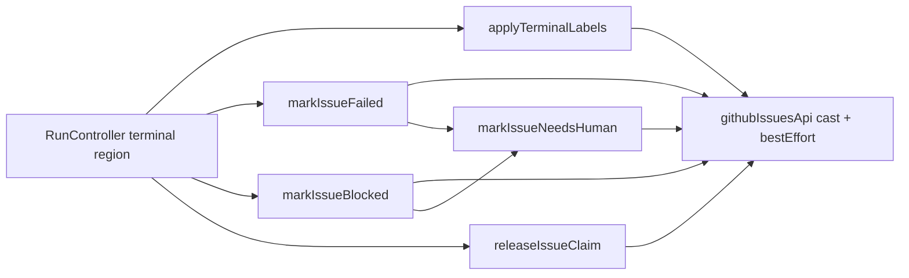
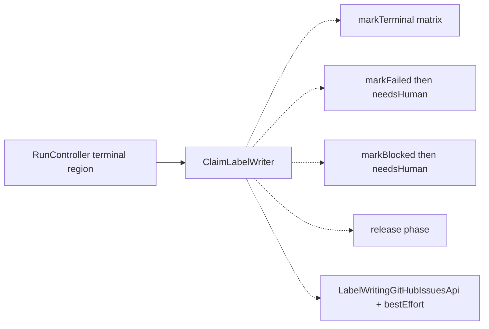
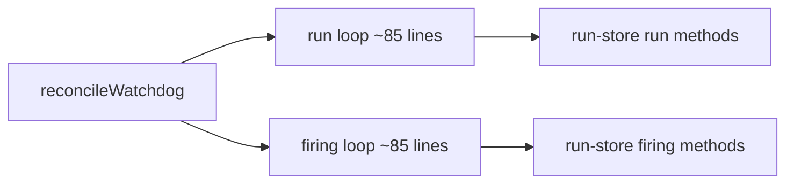
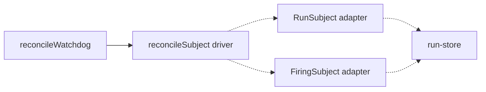

# Architecture review — symphonika — 2026-09-02

**Scope**: Hot-spot-weighted scan of the run lifecycle. `run-controller.ts` (18 changes
in the last 60 commits), `run-store.ts` (19), `http/pages.ts` (14), `watchdog.ts`,
`daemon.ts`, and `routines/dispatcher.ts` are the churn centres; the persisted backlog
was reconciled against merged/open PRs first, then a fresh sub-agent pass looked for new
candidates outside the backlog's coverage.
**Picked**: `issue-claim-label-writer` — see PR (to be opened) and `.architecture/backlog.md`.
**Degradations**: none. `gh` authenticated; sub-agents available; `codebase-design`
vocabulary used as defined.

> **Diagram legend**: solid edges are the module's public interface; dashed edges are
> inside the implementation, hidden from callers.

## Candidates

### issue-claim-label-writer — lift the `sym:*` terminal-outcome label state-machine behind a `ClaimLabelWriter` seam  ·  Strong  ·  score 21/25

- **Files**: `src/lifecycle/run-controller.ts` — the terminal-outcome label cluster:
  `applyTerminalLabels` (`:4510`, 6 call sites), `markIssueFailed` (`:4458`, direct at
  `:3273`/`:4951`), `markIssueBlocked` (`:4484`, direct at `:1428`), `markIssueNeedsHuman`
  (`:4434`, internal fallback), `releaseIssueClaim` (`:4642`, 6 call sites),
  `rollbackScheduledRunClaimLabel` (`:2322`, thin log-wrapper over `releaseIssueClaim`),
  the `bestEffort` helper (`:5050`), and the `ApplyLabelsInput` type (`:369`). New module
  `src/lifecycle/claim-label-writer.ts` + `tests/claim-label-writer.test.ts`. **File-count
  estimate: 3** (new module, new test, `run-controller.ts`).
- **Score — 21/25**
  - **Leverage 4** — one deeply-nested caller (the ~230-line terminal region inside
    `run-controller.ts`) stops reaching past the seam to hand-write GitHub label calls, and
    a whole class of test setup disappears: the terminal-label decision is currently only
    reachable by driving a full dispatch through `RunController` and asserting on
    `githubIssuesApi.addLabelsToIssue.mock.calls`.
  - **Locality 4** — the label decision matrix (which `sym:*` for which outcome, the
    `human-needed` fallback, the `input_required` special-case, the cancelled/closed-issue
    cleanup) becomes a one-file concern. A future change to terminal-label ordering becomes
    a one-file edit instead of tracing six `applyTerminalLabels` call sites.
  - **Blast radius 2** — a module and its single direct caller; no published interface
    changes (all six methods are `private`). File-count 3 sits at the 1↔2 band boundary;
    scored 2 (module + caller) to match the persisted entry rather than re-rank.
  - **Heat 5** — `run-controller.ts` is the repo's hottest lifecycle file (18 of the last
    60 commits), and terminal-label ordering is exactly the kind of behaviour those commits
    keep adjusting.
- **Problem** — The terminal-outcome label state-machine is *shallow-by-dispersal*: no
  single module owns "given a run's terminal outcome, which `sym:*` labels change". Instead
  the decision is smeared across ~230 lines of private methods on `RunController`, each a
  thin wrapper around `this.githubIssuesApi.addLabelsToIssue(...)` guarded by a repeated
  `isLabelWritingGitHubIssuesApi` cast and a `bestEffort` try/catch. The interesting
  behaviour — the *ordering* and *fallback* rules — has no locality:
  - `failed && willRetry` → no terminal label (a retry is coming);
  - `failed && fsmContinuing` → no terminal label (the workflow advanced/parked);
  - `failed` terminal → `sym:failed`, then `sym:human-needed` (even if the `sym:failed`
    add throws — the fallback still fires);
  - `blocked` (`isBlockedOutcome`) → `sym:blocked`, then `sym:human-needed`;
  - `input_required` → `sym:failed` regardless of `fsmContinuing`;
  - `cancelled` + `closed_issue` → remove `sym:running`, release claim, then remove
    `sym:failed`/`sym:blocked`/`sym:human-needed`;
  - `cancelled` + `eligibility_loss` → remove `sym:running`, release claim;
  - `cancelled` (other) → remove `sym:running` only.
- **Deletion test** — CONCENTRATE. Delete the cluster and the terminal-label rules would
  have to be re-inlined at every `applyTerminalLabels`/`releaseIssueClaim` call site;
  today they are already only *nearly* concentrated (the private methods sit together but
  are reachable only through the controller). A `ClaimLabelWriter` module concentrates the
  ordering/fallback matrix and the availability posture in one deep unit; complexity does
  not move to callers, it lands behind a four-method interface.
- **Solution** — Extract a `ClaimLabelWriter` module owning the `LabelWritingGitHubIssuesApi`
  (or its degrade-to-named-error posture), the `bestEffort` wrapper, and the label matrix.
  `RunController` constructs one and calls `markTerminal(ApplyLabelsInput)`,
  `markFailed({issueNumber, repository})`, `markBlocked({issueNumber, repository})`, and
  `release({issueNumber, phase, repository})`. `markNeedsHuman` stays internal to the
  module (only ever a fallback). `rollbackScheduledRunClaimLabel` stays in the controller as
  a one-line `writer.release(...)` + debug-log wrapper.
- **Benefits** — *Leverage*: the terminal-label matrix is exercised directly, in
  `tests/claim-label-writer.test.ts`, by constructing a fake two-method API and calling
  `markTerminal(...)` — no `RunController`, no `RunStore`, no provider fakes, no dispatch.
  *Locality*: the "which label, in which order, with which fallback" decision has one home;
  the eight-row matrix above becomes a table a reader can verify in one place. The
  test surface improves from "assert on mock-call sequences after driving the whole engine"
  to "call the seam, assert the labels".

### watchdog-subject-port — one `reconcileSubject` driver behind a `WatchdogSubject` port  ·  Worth exploring  ·  score 20/25

- **Files**: `src/lifecycle/watchdog.ts:179-273` (run reconcile loop) and `:275-345`
  (routine-firing reconcile loop) — two near-identical ~85-line loops; `sampleRun`
  (`:475-502`) and `sampleRoutineFiring` (`:504-529`); the twinned run-store method pairs at
  `src/run-store.ts:1558-1688`. Estimate ~4 files.
- **Score — 20/25** (leverage 4 — every future watchdog signal is written once, not twice;
  locality 4 — the run-vs-firing difference lands in two thin adapters; blast radius 2 —
  private sites, well covered by `watchdog.test.ts`; heat 4 — watchdog is a top recent
  theme). Within 1 point of the pick.
- **Problem** — `reconcileWatchdog` runs the same control flow twice
  (`listCandidates → getSample → sampleProgress → idleClock → upsertSample → terminal
  decision → markStale → requestCancel → onTerminated → log`); commit #622 *added* the
  second copy for routine firings, so each new bound must now be written in two places. The
  only real differences are the run-store method pair, the terminal policy (runs get
  wall-clock cap + output-token budget + idle grace per ADR 0091; firings get idle grace
  only), and the cancel reason/observer.
- **Deletion test** — CONCENTRATE. A `WatchdogSubject` port collapses both loops into one
  `reconcileSubject` driver; ~85 duplicated lines disappear behind ~20-line adapters.
- **Solution / Benefits** — one deep driver, run/firing knowledge behind two thin adapters;
  the reconcile control flow becomes testable once instead of twice.

### run-slot-lease — a `RunSlotLease` owning build/arm/clear/ownership-CAS  ·  Worth exploring  ·  score 19/25

- **Files**: `src/lifecycle/run-controller.ts` — `RunSlotDeadline` factory (`:506-590`),
  `createRunSlotDeadline` + ownership CAS (`:681-750`), threaded manually through
  `dispatchOneFresh` (`:1146-1208`), `claimAndPersistRun` (two ad-hoc deadlines,
  `:3126-3313`), `runAttemptLifecycle` (`:3352-3653`), `iterateAttempt` (`:4203-4290`).
  Estimate ~5 files.
- **Score — 19/25** (leverage 4, locality 3, blast radius 3, heat 5). Below the pick;
  larger blast (all-private but spread across a ~500-line multi-method flow).
- **Problem** — The deadline is a shallow 6-member object whose *lifecycle* is the friction:
  callers re-derive `runCapMs(config)` and pick the origin at three construction sites, must
  pair `arm()`/`clear()` across a long flow, wrap each bounded I/O in `.race(...)`, and poke
  `.signal?.aborted` directly. This seam *produces bugs*: #655, #631, #653, #654 are each a
  caller getting the sequencing wrong.
- **Deletion test** — PARTIAL concentrate: a `RunSlotLease` concentrates the three
  construction sites, the arm/clear bookkeeping, and the ownership CAS, but the per-call
  `.race()` naming of each bounded op stays at the call site.
- **Note** — recorded as a strong future candidate because of the recurring-bug evidence;
  the residual `.race()` dispersal is why it does not clear the pick's leverage.

### daemon-project-state-projection — `project-state-projection.ts` owns the row-precedence  ·  Speculative  ·  score 16/25

- **Files**: `src/daemon.ts:2191-2362` (`readProjectStateInputs`, `fallbackProjectStateInputs`,
  `projectStateInputFromReport`/`FromPrior`, `rawProjectMode`/`Weight`/`PollIdentityKey`),
  called from `persistProjectPollState` (`:2001-2048`). Estimate ~3 files.
- **Score — 16/25** (leverage 3, locality 4, blast radius 2, heat 2 — project-poll-state is
  absent from recent commit themes). Cleanest of the new finds but coldest.
- **Problem / Deletion test** — ~150 lines of 4-way precedence reconciliation
  (poll-report → validation-invalid → prior-state-when-skipped → valid-default) inlined in
  the daemon, unit-tested only via integration. Extracting `project-state-projection.ts`
  (`rawConfig + status + priors → inputs`) CONCENTRATES the precedence and gives it a unit
  seam; `readFile` stays in the daemon.

## Carried-over proposed candidates (already carded in prior reviews)

These remain `proposed` in the backlog with their persisted scores; friction re-verified
present this run. Not re-carded to keep the report readable.

| Slug | Score | Modules |
|---|---|---|
| `artifact-kind-catalog` | 18/25 | `run-store.ts`, `http/pages.ts` |
| `routine-evidence-redaction` | 18/25 | `routines/dispatcher.ts` |
| `coalesce-events` | 18/25 | `http/pages.ts` |
| `status-presentation` | 18/25 | `http/pages.ts` |
| `live-run-ownership-registry` | 18/25 | `http/pages.ts`, `lifecycle/stale-claims.ts` (leverage-capped; behavioural decision — human-gated) |
| `routine-github-observation` | 17/25 | `routines/dispatcher.ts`, `routines/outcome.ts` |
| `snapshot-search` | 15/25 | `http/pages.ts` (couples into `live-run-ownership-registry`) |

## Dropped

| Candidate | Dropped because |
|---|---|
| `github-pr-enum-normalizers` | Leverage 1 — fails the deletion test; the enum switches are bound to the GraphQL query strings in the same file, so extraction moves complexity, not concentrates it. |
| `provider-json-field-accessors` | Leverage 1 — a DRY clean-up, not a depth win; the helpers are shallow by nature (interface ≈ implementation), so sharing them concentrates no behaviour. |

## Too large to automate

None this run. No surviving candidate scored blast radius 5.

## Pick

**`issue-claim-label-writer` (21/25)**. It is the top surviving candidate and was named the
natural next firing by the two prior runs. The runner-up **candidate** is the fresh find
`watchdog-subject-port` (20/25) — **within 1 point**, so the pick was close; it is the
natural next firing and is now on the backlog as `proposed`.

**Scope decision (recorded so the next firing does not re-derive it as new).** The backlog
entry's `Modules` field previously also listed `shutdown-resume.ts` and `stale-claims.ts`
and the dispatch-time `sym:claimed` *add* sites. Those are deliberately **out of scope** for
this deepening:

- The dispatch-time claim *assertion* (`sym:claimed`/`sym:running` add) is interleaved with
  the dispatch mutex and slot-ownership logic (`run-controller.ts:960-1220`, `2360-2480`,
  `3140-3300`) — a different concern (asserting a claim under a lock) from resolving a
  terminal *outcome*. Lifting it would drag the hottest, most bug-prone code into the seam.
- `shutdown-resume.ts` (`sym:claimed`/`sym:stale` clear on resume) and `stale-claims.ts`
  (`sym:stale` add) are already standalone modules with their own `tryAddLabelsToIssue`/
  `tryRemoveLabelsFromIssue` availability posture; folding them in is a cross-module
  unification, not a behaviour-preserving extraction.

The named seam in the backlog — `ClaimLabelWriter.markTerminal(outcome)` / `.release(phase)`
— is precisely the terminal-outcome cluster, and the `~4 estimated files` only ever fit that
cluster. The `Modules`/`Summary` fields are corrected accordingly this run.

**ADR check.** ADR 0002 (orchestrator-owned operational labels) fixes *which* labels the
orchestrator may write; this refactor preserves those writes exactly. ADR 0077
(issue-triage-and-label-writes) governs the **web-UI** mutation seam (`writeIssueLabels`/
`pages.ts`), a different path this refactor does not touch. No ADR is contradicted — the
extraction is behaviour-preserving.

## Design

_Written in step 4, appended after this section is committed._
