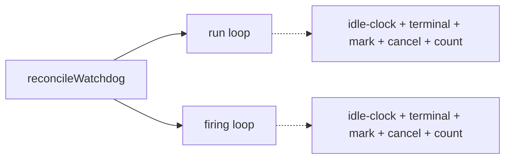
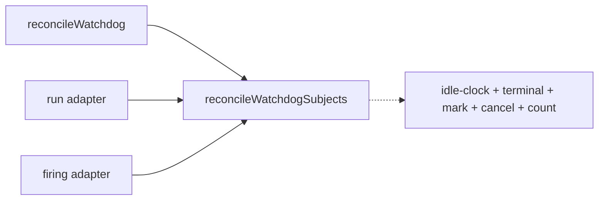
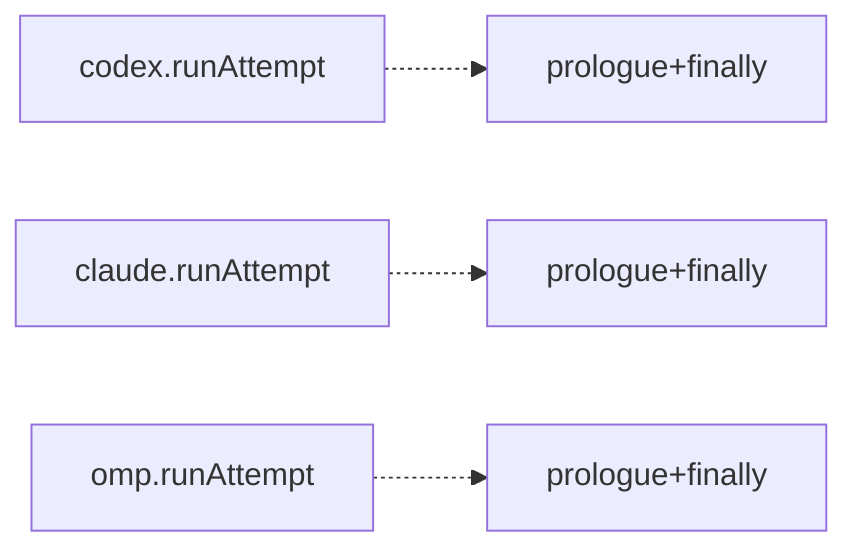
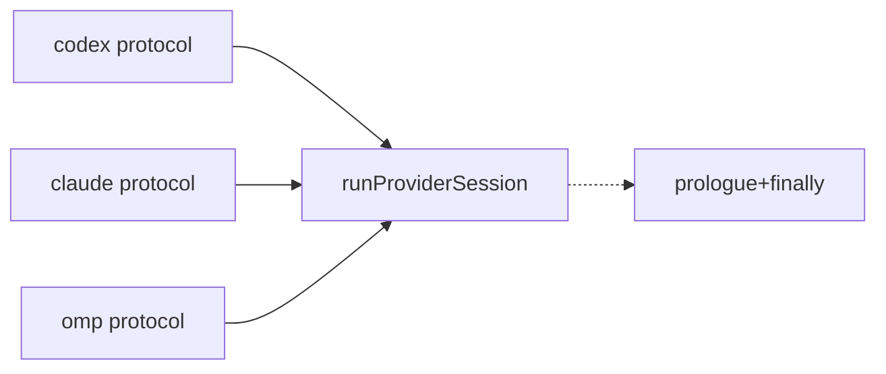

# Architecture review — symphonika — 2026-09-03

**Scope**: Hot-spot-weighted scan of the recently-changed core — `src/run-store.ts`,
`src/http/pages.ts`, `src/lifecycle/{run-controller,watchdog}.ts`,
`src/routines/dispatcher.ts`, `src/daemon.ts`, `src/providers/{codex,claude,omp}.ts` — plus
reconciliation of the persisted `.architecture/backlog.md`. Deepening pays off through future
change, so the scan follows the files that keep appearing in `git log`.
**Picked**: `watchdog-subject-port` — see the PR and `.architecture/backlog.md`.
**Degradations**: none. `gh` authenticated; sub-agents available; `codebase-design` vocabulary used
throughout. `improve-codebase-architecture` was **not** used (it is the interactive upstream); `tdd`
was **not** delegated (its human seam-confirmation gate cannot be satisfied unattended — step 5 is
red-green inline instead).

In the diagrams below, **solid edges are the interface** a caller sees; **dashed edges are inside the
implementation**, hidden behind the seam.

## Candidates

### watchdog-subject-port — one reconcile driver behind a WatchdogSubject port  ·  Strong  ·  score 20/25

- **Files**: `src/lifecycle/watchdog.ts` — the two reconcile loops in `reconcileWatchdog`
  (`:179-273` run, `:275-345` routine-firing), the samplers `sampleRun` (`:475-502`) and
  `sampleRoutineFiring` (`:504-529`); new `src/lifecycle/watchdog-subject.ts` (port type + driver);
  new `tests/watchdog-subject.test.ts`. **File-count estimate: ~3.** The twinned run-store method
  pairs (`src/run-store.ts:1571-1872`) are the *data* the adapters call; they stay put — unifying
  their table-specific SQL is a separate concern (see `leaked-subject-sweep`).
- **Score**: **20/25** — leverage 4, locality 4, blast radius 2, heat 4.
  - *Leverage 4*: two call sites collapse to one driver, and the ADR-0054 idle-clock ordering plus
    the sample→upsert→terminal→mark→cancel→count sequence — race-critical, currently duplicated —
    gets a single unit seam testable without a `RunStore`.
  - *Locality 4*: a change to the shared liveness sequence is one edit to the driver instead of two
    parallel edits that must be kept identical; the run-vs-firing variance concentrates in two named
    adapters.
  - *Blast radius 2*: one module and a new sibling + test, ~3 files, no published interface crosses.
  - *Heat 4*: `watchdog.ts` was touched by #680 on 2026-09-02 (the most recent touch of any
    candidate's files); #608/#622/#629 added the wall-clock cap and the routine-firing loop that
    created this duplication.
- **Problem**: `reconcileWatchdog` runs two ~85-line loops with byte-identical skeletons — resolve
  config, read the previous sample, sample progress, run `watchdogIdleClock`, upsert, then decide a
  terminal reason, mark stale, `requestCancel`, count, notify, log. The **shallowness** is that the
  shared liveness sequence has no interface of its own: it is inlined twice, so the ADR-0054 ordering
  invariant (idle-clock before the terminal decision) and the sampled/terminated accounting are
  asserted in two places that must be hand-kept in lockstep. The routine-firing loop was added whole
  by #622; the next liveness rule change reopens the same copy-paste.
- **Deletion test**: **Concentrates.** Delete the driver and the liveness sequence scatters back into
  two loops where a future edit to one silently diverges from the other. A `WatchdogSubject` port
  concentrates the sequence in one tested place and pushes the genuine differences — ADR-0091 keeps
  the convergence budget and wall-clock cap Run-only, so a Firing is bounded by idle-grace alone;
  Runs carry a `watchdogGeneration` CAS fence, Firings do not — into two thin adapters.
- **Solution**: Extract `reconcileWatchdogSubjects(subject, deps)` into `watchdog-subject.ts`, driving
  one loop over a `WatchdogSubject<Candidate, Sample>` port whose members are exactly the run-vs-firing
  variance: `listCandidates`, `projectName`, `previousSample`, `sample`, `persistSample`,
  `terminalReason` (the ADR-0091 policy split), `cancelId`, `cancelReason`, `markStale`, `onTerminated`
  (owning the observer try/catch and the terminate log). `reconcileWatchdog` builds two adapters from
  its existing `ReconcileWatchdogInput` and calls the driver twice, summing the counts and awaiting the
  shared cancellation array once.
- **Benefits**: **Leverage** — the liveness sequence is written once; **locality** — a rule change
  lands in the driver, a policy change in one adapter; **test surface** — the driver is exercised
  through the port with a hand-rolled fake subject, pinning "idle-clock precedes terminal decision",
  "upsert-false short-circuits", "mark-stale-false short-circuits", and the sampled/terminated
  accounting, none of which currently has a seam short of standing up a real `RunStore` and a fake
  workspace tree.
- **Recommendation strength**: Strong.

Above: the liveness sequence inlined twice, `S` and `S2` kept identical by hand.

Below: one driver `D` owns the sequence; the two adapters carry only the variance.

### provider-run-harness — shared runAttempt prologue/epilogue across the three providers  ·  Worth exploring  ·  score 20/25

- **Files**: `src/providers/codex.ts` (`runAttempt` prologue `:118-186`, `finally` `:325-339`, `cancel`
  `:83-116`), `src/providers/claude.ts` (`:73-143`, `:167-180`, `:54-71`), `src/providers/omp.ts`
  (`:135-178`, `:319-328`, `:108-133`); new `src/providers/provider-session.ts` + test. **~5 files.**
- **Score**: **20/25** — leverage 4, locality 4, blast radius 2, heat 4.
  - *Leverage 4*: three providers share the ADR-0052 placeholder-before-await registration, the
    cancel-recheck synthetic `process_exit`, and the ADR-0064 teardown ordering; a harness gives that
    race a unit seam.
  - *Locality 4*: an ADR-0052/0064 change becomes one edit — but the wide divergence surface (below)
    stays per-provider, so it is not a clean 5.
  - *Blast radius 2*: three providers + new module + test, internal interfaces only.
  - *Heat 4*: `codex.ts`/`claude.ts`/`omp.ts` are warm (#657, #672, #680), but their most recent touch
    (omp #672, 14:21) is *older* than `watchdog.ts`'s (#680, 15:51) — the tie-break below.
- **Problem**: Each provider's `runAttempt` opens with a ~55-line prologue carrying the same 15-line
  ADR-0052 race comment verbatim, and closes with an identical `finally` (delete → `stopProviderScope`
  → `waitForFlush`) carrying the same ADR-0064 comment. The invariants have no interface; they are
  copied three ways and **already drifting** (see below).
- **Deletion test**: **Concentrates** for the invariant subset — but the divergence surface is wide:
  the `activeRun` factory, the command transform (`withOutputSchema(applyRoutineArguments(...))` for
  claude, plain for codex/omp), the spawn env (claude's `CLAUDE_CODE_DISABLE_BACKGROUND_TASKS`), the
  cancel-interrupt body (codex `turn/interrupt`, claude `undefined`, omp `abort`), the synthetic-event
  shape (omp's `processExitEvent(...)` helper vs an inline literal), and the protocol body all differ.
  A faithful harness needs ~7 hooks over a ~55-line body, which tempers the depth win.
  > **Benign-drift finding (recorded so the next firing does not re-derive it):** omp's early-cancel
  > branch calls `stopProviderScope` (omp.ts:157) and adds a second `shutdownProviderProcess` in its
  > `finally` (omp.ts:321) that codex/claude omit. This is **harmless**: `wrapForProviderScope`
  > (`process-scope.ts:131`) only *builds* a `systemd-run --scope` command — no durable scope exists
  > until `spawnProviderProcess` runs it — so on early-cancel there is nothing to stop and omp's call
  > is a no-op. The harness can therefore preserve all three behaviours behind a hook without a
  > behaviour decision; it is not `live-run-ownership-registry`-style bail territory.
- **Solution**: `runProviderSession({ label, activeRuns, makeActiveRun, transformCommand,
  spawnEnv, onCancelInterrupt, protocol }, input)` where `protocol` is the provider-specific
  async-generator body (queue creation, handshake, read-loop). Prologue/epilogue live once.
- **Benefits**: prevents the next ADR-0052/0064 edit from drifting a third time; gives the
  cancel-before-spawn race a unit seam instead of three fake-subprocess integration tests.
- **Recommendation strength**: Worth exploring — genuinely tied with the pick; loses only the
  deterministic tie-break. Natural next firing.

Above: the ADR-0052/0064 prologue+finally copied three ways (`P`,`P2`,`P3`), drifting.

Below: one harness `H` owns prologue+finally; each provider passes only its protocol body.

### run-slot-lease — a lease owning build+arm/clear+ownership CAS  ·  Worth exploring  ·  score 19/25

- **Files**: `src/lifecycle/run-controller.ts` — `RunSlotDeadline` (`:495-590`), `createRunSlotDeadline`
  + ownership CAS (`:675-750`), threaded through `dispatchOneFresh`, `claimAndPersistRun`,
  `runAttemptLifecycle`, `iterateAttempt`. **~5 files.**
- **Score**: **19/25** — leverage 4, locality 3, blast radius 3, heat 5. Heat evidence grew this run
  (#651 "reconcile post-create run claim failures" joins the cited #631/#653/#654/#655), but the
  score is unchanged: heat was already 5 and the borderline deletion test (each bounded op still names
  its own `.race()` at the call site, so complexity only partly concentrates) still caps leverage.
- **Problem**: three construction sites and the arm/clear bookkeeping that keep producing sequencing
  bugs. **Deletion test**: partially concentrates. **Recommendation strength**: Worth exploring —
  larger blast than the reducer/port picks.

### provider-attempt-runner — the runAttempt *consumer* scaffolding  ·  Speculative  ·  score 18/25

- **Files**: `src/lifecycle/run-controller.ts` `iterateAttempt` (`:4340-4458`),
  `src/routines/dispatcher.ts` (`:1449-1550`), `src/provider-probe.ts` (`:28-90`); possible new
  `src/lifecycle/provider-attempt.ts`. **~3-4 files.**
- **Score**: **18/25** — leverage 3, locality 3, blast radius 2, heat 5. Three sites build the same
  15-field `ProviderRunInput` and repeat scratch-lifecycle + ADR-0052 cancel-recheck + per-event
  redact-and-persist, but the *sink* (`persistProviderEvent` sequence rows vs `appendRoutineEvent`
  jsonl cursors) and deadline threading differ. **Deletion test**: borderline — the input-builder and
  scratch/cancel scaffolding concentrate, but the sinks keep complexity at the call site (same caveat
  class as `run-slot-lease`). **Recommendation strength**: Speculative — extract the input-builder,
  leave the sink injected; revisit after a provider consumer stabilises.

### leaked-subject-sweep — startup-sweep run-vs-firing twins  ·  Speculative  ·  score 15/25

- **Files**: `src/run-store.ts` `findLeakedRuns` (`:5695-5741`) / `findLeakedRoutineFirings`
  (`:5779-5819`), `markRunsStale` / `markRoutineFiringsFailed`. **~2-3 files.**
- **Score**: **15/25** — leverage 2, locality 3, blast radius 2, heat 4. A second run-vs-firing twin
  pair on the crash-recovery startup-sweep axis, cross-referencing each other in comments.
  **Deletion test**: leans toward *moves* — the SQL differs by table (`runs` has a `stale` state and
  `leaked_active_run_cleanup_pending`; `routine_firings` settle as `failed` with their own pending
  marker and `commits_ahead` case), so a shared port pushes differences into adapters rather than
  concentrating behaviour. **Recommendation strength**: Speculative — fold into the run-vs-firing
  duality story that `watchdog-subject-port` opens rather than picking standalone.

## Dropped

| Candidate | Dropped because |
|---|---|
| `mutate-and-publish` | Leverage 1 — 17 `const apply = …; this.publishAll(apply())` epilogues in run-store are a real repeated idiom, but the helper `mutateAndPublish(fn)` would be shallow (interface ≈ implementation, concentrating no behaviour). Same character as the already-dropped `provider-json-field-accessors`. A plain DRY cleanup, not a deepening. |

Prior `dropped` entries (`github-pr-enum-normalizers`, `provider-json-field-accessors`) remain in
`.architecture/backlog.md`; their filters were re-checked this run and still apply.

## Too large to automate

None this run. No surviving candidate hit blast radius 5.

## Pick

**`watchdog-subject-port`, 20/25.** The **top two are exactly tied at 20/25**:
`watchdog-subject-port` and `provider-run-harness`. Both are "collapse near-duplicate procedures
behind a port" refactors of comparable shape, blast radius (2), and heat (4). The rubric tie-break —
lower blast radius (tie), then higher heat (tie), then **most-recently-touched files** — resolves it:
`watchdog.ts` was last touched at 2026-09-02 15:51 (#680), the provider files at 14:21 (#672), so the
watchdog files are the more recent. Picking the incumbent also honours the persisted-backlog dedup
property: `watchdog-subject-port` has been scored at 20/25 and named the "natural next firing" by the
last two firings, so taking it is the deterministic, non-thrashing choice.

The **runner-up candidate** is `provider-run-harness` (20/25) — the natural next firing, now recorded
in the backlog as `proposed` with its benign-drift finding. `run-slot-lease` (19/25) follows.

## Design

Written in step 4, after this report was first committed.
