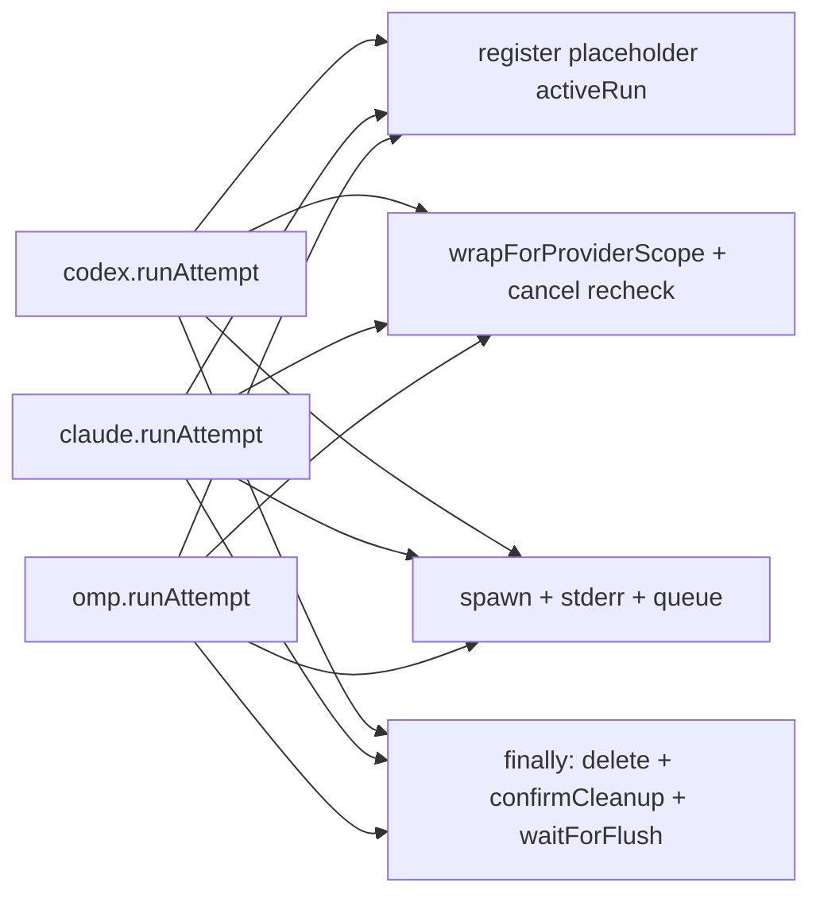
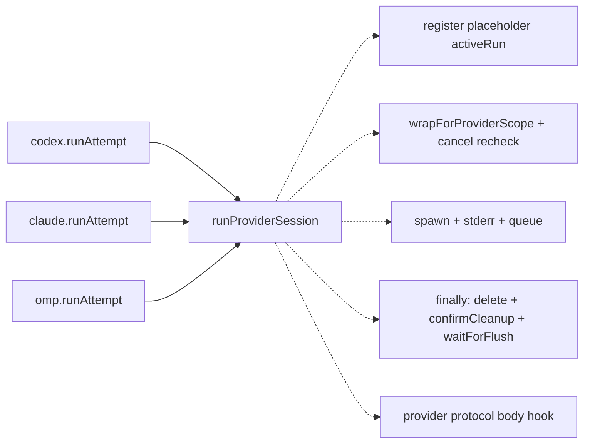
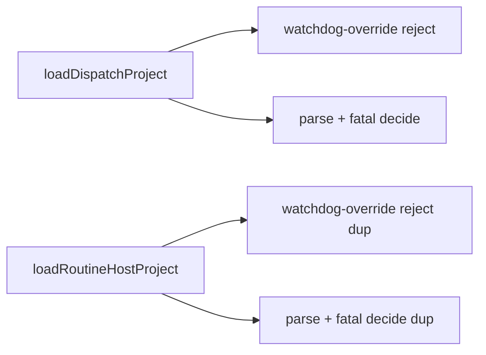
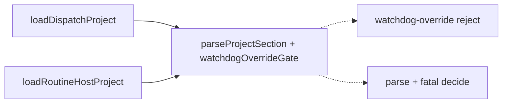

# Architecture review — symphonika — 2026-09-04

**Scope**: Hot-spot scan weighted by recent `git log` — the Agent Provider adapters
(`src/providers/{codex,claude,omp}.ts`, most-changed after run-store/run-controller) plus a fresh
sub-agent sweep of `run-store.ts`, `run-controller.ts`, `daemon.ts`, `http/pages.ts`,
`routines/dispatcher.ts`, `reload.ts`, `issue-polling.ts`, `http/app.ts`, and
`pull-request-followup.ts`. Reconciled against `.architecture/backlog.md` and open/merged PRs.
**Picked**: `provider-run-harness` — see [PR](#) and `.architecture/backlog.md`
**Degradations**: none — `gh` authenticated, sub-agent explore available, full quality gate discoverable.

In the Mermaid diagrams, **solid edges are the interface** a caller wires by hand; **dashed edges are
inside the implementation** the seam hides.

## Candidates

### `provider-run-harness` — one Agent Provider session harness behind the three runAttempts  ·  Strong  ·  score 20/25

- **Files**: `src/providers/codex.ts:120-192` (prologue), `:331-349` (`finally`), `:85-118` (cancel);
  `src/providers/claude.ts:75-127` (prologue), `:173-191` (`finally`), `:56-73` (cancel);
  `src/providers/omp.ts:137-183` (prologue), `:324-338` (`finally`), `:110-135` (cancel); new
  `src/providers/provider-session.ts` + `tests/provider-session.test.ts`. **File-count estimate: ~5.**
- **Score 20/25** — leverage 4, locality 4, blast radius 2, heat 4:
  - *Leverage 4*: three call sites each shed a byte-identical ~55-line ADR-0052 prologue and an
    identical ADR-0064 `finally`; the placeholder-`activeRun` cancel race is defined once instead of
    three times, so a future provider stops re-deriving it. Not 5 — the protocol bodies stay
    provider-specific, so no whole class of test setup disappears.
  - *Locality 4*: the pre-spawn cancel race (ADR 0052), the scratch/scope/stderr wiring, and the
    scope-cleanup `finally` (ADR 0064) become a one-file edit; today a fix to any of them is a
    three-file edit that must stay in sync (the omp copy already carries a `// Same …` annotation
    admitting the drift risk).
  - *Blast radius 2*: a module and its three direct callers; no published interface changes — the
    exported `create{Codex,Claude,Omp}Provider` signatures and the `AgentProvider` shape are unchanged.
  - *Heat 4*: `codex.ts` (11), `claude.ts` (7), `omp.ts` (6) are all in the top of the 60-commit
    change-frequency list; recent provider churn (#672 omp exit close time, #684 scope-cleanup
    persistence, #680 codex plans) keeps touching exactly this prologue/finally region.
- **Problem**: The three `runAttempt` generators are **shallow at their shared edges**. Each opens
  with the same sequence — register a placeholder `activeRun` *before* the `wrapForProviderScope`
  await (so a cancel landing during the probe has somewhere to go, ADR 0052), render the command
  template, wrap for the provider scope, re-check `cancelled` and emit a synthetic `process_exit`,
  `markProviderScopeCleanupPending`, spawn, attach the stderr tee, build the queue — and each closes
  with the same `finally`: `activeRuns.delete`, `confirmProviderScopeCleanup`, `stderrCapture.waitForFlush`.
  The `attachProviderStderrLog` call, the `confirmProviderScopeCleanup` call, and the `waitForFlush`
  call (with its comment) are **byte-identical** across all three files. The interface a reader must
  learn to understand one provider is nearly the whole prologue; the genuinely provider-specific
  part is only the protocol body between them.
- **Deletion test**: **Concentrates.** Delete the harness and the ADR-0052 pre-spawn cancel race and
  the ADR-0064 scope-cleanup ordering must be re-stated at every provider that spawns a process —
  which is exactly today's state and exactly what keeps producing paired edits (#672/#684 touched two
  of the three copies). A single `runProviderSession` owning the race and the teardown concentrates
  that invariant in one tested place; the protocol bodies, which really do differ, stay at the edges.
- **Solution**: Introduce `runProviderSession(deps, input)` in `src/providers/provider-session.ts`.
  It owns the prologue and the `finally`, and yields to the provider through a small set of hooks:
  an `activeRun` factory, a command transform applied before `wrapForProviderScope`, spawn-env
  extras, a synthetic cancel-exit event factory, a queue factory, and the protocol body itself
  (an async generator taking the spawned child + queue + activeRun). A companion `cancelProviderRun`
  helper owns the shared cancel shape (look up, set `cancelled`, `shutdownProviderProcess` with a
  provider-specific interrupt body). The three adapters keep their exported factories and shrink to
  their protocol bodies + hook wiring.
- **Benefits**: **Leverage** — a fourth provider adapter, or a change to the cancel race, is written
  once. **Locality** — the ADR-0052/0064 invariants live in one module with one test file, instead
  of being characterization-tested three times through three fake subprocesses. **Test surface** —
  the harness's prologue/finally can be exercised through a trivial fake protocol-body hook and a
  recording `processScope`, without a per-provider fake-subprocess transcript, so the race and the
  teardown ordering get direct unit coverage they lack today.

**Before** — each provider wires the shared prologue/finally itself:

**After** — one harness owns them; providers pass their protocol body as a hook:

### `config-project-parse-outcome` — shared project-section parse gate in reload  ·  Worth exploring  ·  score 17/25

- **Files**: `src/reload.ts:1095-1195` (`loadDispatchProject`), `:1200-1263` (`loadRoutineHostProject`);
  shared idiom also at `:651`, `:696`. **File-count estimate: ~3** (`reload.ts` + a small
  `project-config-parse.ts` + test).
- **Score 17/25** — leverage 3, locality 4, blast radius 1, heat 3:
  - *Leverage 3*: two sibling loaders repeat a **byte-identical** 15-line watchdog-override
    whole-snapshot-rejection block (`:1121-1136` vs `:1218-1233`, the second annotated `// Same …`)
    and a structurally identical reload-vs-first-load fatal-decision block (`:1138-1148` vs
    `:1235-1245`); collapsing them concentrates two real policy invariants, but the surrounding
    zod-error-push idiom is pure DRY that would move, not concentrate — so 3, not 4.
  - *Locality 4*: single file today, single seam afterwards.
  - *Blast radius 1*: contained to `reload.ts` + a helper + test; no published interface.
  - *Heat 3*: `reload.ts` is on the hot list (#685 config-validation churn) but the project-loader
    region specifically is quieter than the provider prologue.
- **Problem**: The dispatch-project and routine-host loaders are drifting twins. The SPEC-5.1
  watchdog-override rejection and the reload/first-load "revert whole snapshot vs drop one project"
  fatal-decision policy are each duplicated verbatim, each with its own explanatory comment — a reader
  must read both copies to trust either.
- **Deletion test**: **Partially concentrates.** A `parseProjectSection(schema, raw, prefix, errors)`
  plus a `watchdogOverrideGate(rawProject, index, errors)` would own the two invariants once; the
  loaders' tails (dispatch: polling + workflow load + `disabled` carry-forward; host: `agent` + `mode`,
  no workflow) genuinely differ and stay separate. Real but sub-20 — recorded for a future firing.
- **Solution**: Lift the watchdog-override gate and the project-section parse-and-fatal-decide into a
  shared `project-config-parse.ts`, leaving each loader its distinct tail.
- **Benefits**: **Locality** — the whole-snapshot-rejection invariant lives in one place. **Test
  surface** — the fatal-decision policy becomes unit-testable without constructing two full config
  loads.

**Before**:

**After**:

## Dropped

No new hard-filter drops this run. The standing `dropped` entries — `mutate-and-publish`,
`github-pr-enum-normalizers`, `provider-json-field-accessors` (all leverage 1, fail the deletion
test) — were re-checked against their filters and still apply; they remain `dropped` in the backlog.
The fresh scan's near-misses (`issue-polling.ts` `try*` API wrappers, `http/app.ts` artifact-stream
trio, `daemon.ts` poll-state twins, `pull-request-followup.ts` loop prologue,
`fsm-expansion.ts` codec pairs) were rejected before scoring: each either fails the deletion test
(complexity moves to callers) or is already territory of an existing backlog item
(`artifact-kind-catalog`, `daemon-project-state-projection`).

| Candidate | Dropped because |
|---|---|
| `issue-polling-try-api-wrappers` | Leverage 1 — shallow-by-nature guards; collapsing strips the `this` binding and moves the guard to callers |
| `app-artifact-stream-trio` | Not new — the artifact-kind catalog it shares is already owned by `artifact-kind-catalog` (add `http/app.ts` to that item's scope, don't split) |

## Too large to automate

None surfaced this run (no blast-radius-5 candidate). The largest eligible candidate,
`run-slot-lease` (19/25, blast radius 3, ~5 files), is one-PR-sized and stays `proposed`.

## Pick

**`provider-run-harness` (20/25).** It is the top surviving candidate after the hard filters, and it
was the exactly-tied runner-up to last firing's `watchdog-subject-port` (#695, now merged) — the
natural next firing. The runner-up **candidate** this run is `run-slot-lease` (19/25), **within 1
point**, so the pick was close: `run-slot-lease` is the natural next firing after this one. It lost
on two axes — a **partial** deletion test (each bounded op still names its own `.race()` at the call
site, so complexity only partly concentrates) and a larger blast radius (3 vs 2, ~5 files crossing
more of `run-controller.ts`). `provider-run-harness`'s deletion test is cleaner: the ADR-0052 cancel
race and ADR-0064 teardown fully concentrate into one module.

The friction was re-verified against the current tree this run: the prologue, `finally`, and cancel
shapes are still near-identical across the three providers, and the stderr-attach /
`confirmProviderScopeCleanup` / `waitForFlush` calls are still byte-identical.

## Design

_Written in step 4 after this report was first committed._
