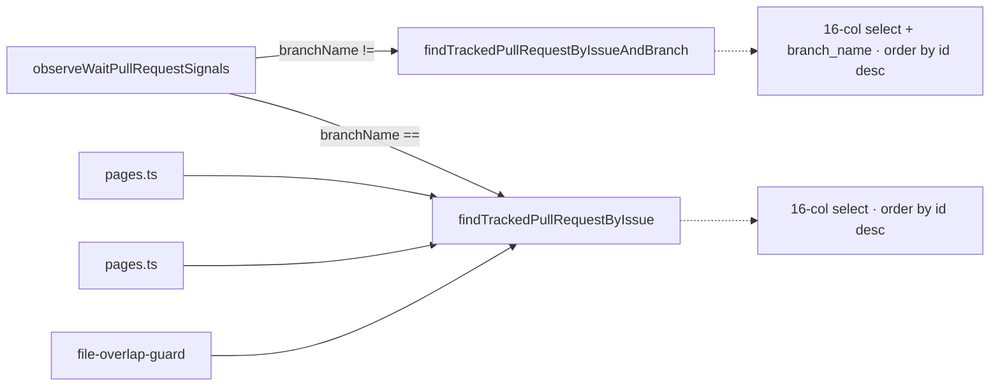
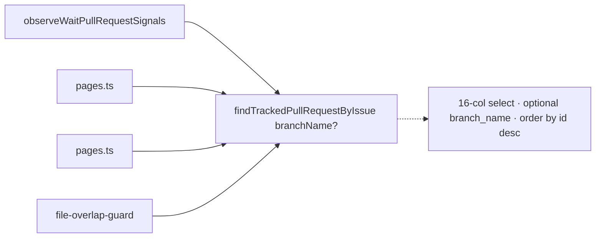
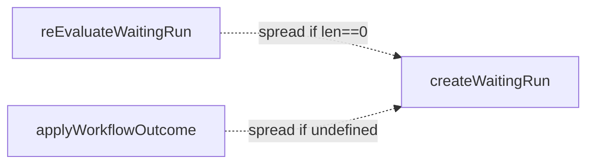
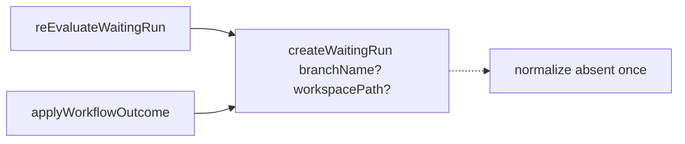
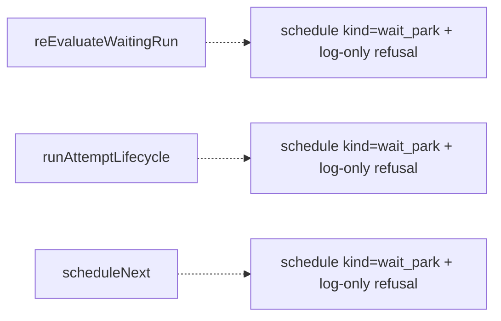
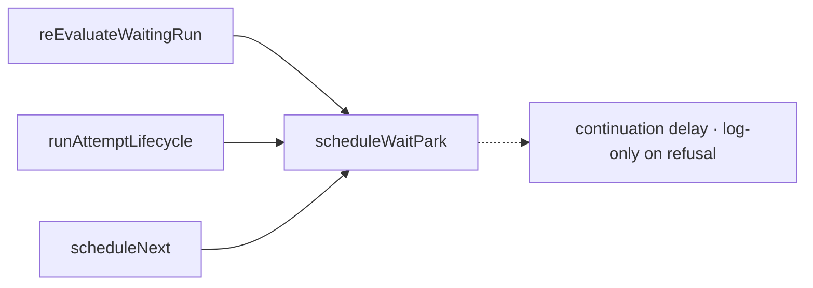
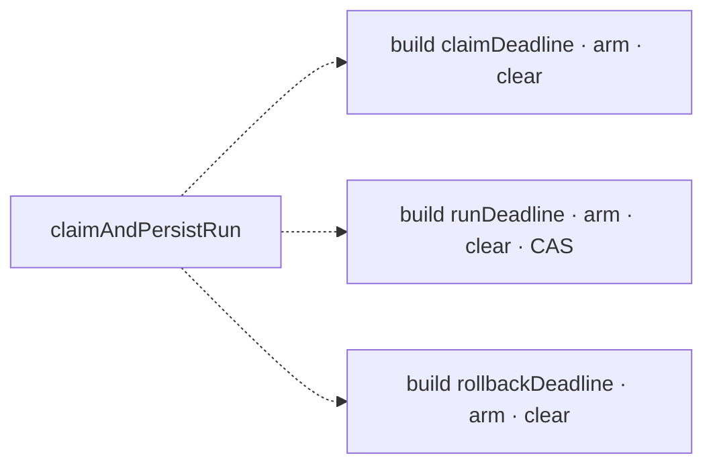
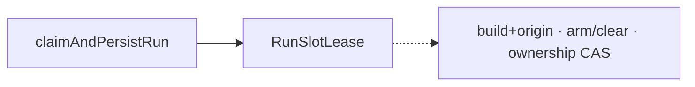

# Architecture review — symphonika — 2026-09-11

**Scope**: The recently-hot raw-FSM wait-state run lifecycle. `git log` since the
last firing (2026-09-04) is dominated by `src/lifecycle/run-controller.ts` (14
commits) and the wait-park / blocked-sentinel / PR-existence-gate cluster
(`run-store.ts` ×5, `daemon.ts` ×5, `blocked-sentinel.ts`, `terminal-reason.ts`,
`state-machine-dispatch.ts`, `pull-request-followup.ts`). PRs #735/#736/#741/#743/#744
all landed there. YAGNI: deepening pays off through *future* change, so the scan
weighted that area first.
**Picked**: `tracked-pull-request-lookup` — see PR #747 and `.architecture/backlog.md`
**Degradations**: none — `gh` authenticated, quality gate discoverable, sub-agent
exploration available. The step-4 design pass was produced **inline** rather than
via parallel design sub-agents (the design space is a two-method merge, tightly
bounded — three genuinely-distinct interfaces enumerate directly); adjudication
used the advisor. Noted per report-format.

**Diagram legend**: solid edges are the interface a caller sees; dashed edges are
inside the implementation.

## Candidates

### tracked-pull-request-lookup — one issue-scoped Tracked-PR lookup that owns branch-scoping · Strong · score 20/25

- **Files**:
  - `src/run-store.ts:5770-5790` (`findTrackedPullRequestByIssue`) and
    `src/run-store.ts:5800-5821` (`findTrackedPullRequestByIssueAndBranch`, added
    2026-09-10 by #736) — the twin pair.
  - `src/lifecycle/run-controller.ts:2024-2034` (`observeWaitPullRequestSignals`) —
    the sole caller of the branch-scoped variant, choosing between the two on a
    `input.branchName.length > 0` ternary.
  - Unaffected unscoped callers (they pass no branch): `src/http/pages.ts:3785`,
    `src/http/pages.ts:6754`, `src/lifecycle/file-overlap-guard.ts:303`.
  - File-count estimate: **~3** (`run-store.ts`, `run-controller.ts`, one store test).
- **Score**: **20/25**
  - **Leverage 3** — one call site (`observeWaitPullRequestSignals`) simplifies
    materially, and a twin store method is removed. Not 4: the caller selects
    between two *public* store methods rather than reaching past a seam into store
    internals; the honest win is that the store, not the caller, comes to own the
    branch-scoping decision and the "absent branch" notion.
  - **Locality 4** — the rule "scope a Tracked-PR lookup to the run's own Issue
    Branch when known, because an Issue accumulates one `tracked_pull_requests` row
    per redispatched chain's branch and the newest-by-id may belong to a *different*
    branch" concentrates inside one Run Store method instead of living in a
    call-site ternary plus a 12-line comment.
  - **Blast radius 1** — 2 source files + 1 test; no published/exported interface
    (a `RunStore` instance method). The 4 other unscoped call sites keep compiling
    unchanged (optional parameter).
  - **Heat 5** — `findTrackedPullRequestByIssueAndBranch` and the caller ternary
    are both #736 (2026-09-10, this week); `run-store.ts` (5) and
    `run-controller.ts` (14) are the two hottest files since the last firing.
- **Problem**: #736 discovered that the issue-wide "newest tracked PR by id" lookup
  can return a row for the *wrong* Issue Branch when an Issue carries more than one
  `tracked_pull_requests` row (rows are upserted by `(project, pr_number)` and never
  deleted, so a redispatched Issue accumulates one per chain's branch). Its fix
  added a **second, near-identical** store method — same 16-column `select`, same
  `from tracked_pull_requests ... order by id desc limit 1`, same
  `mapTrackedPullRequestRow` tail — differing only by one `and branch_name = ?`
  clause and one bound parameter. The choice between them now lives at the call
  site as a ternary, so the caller must know a Run-Store-internal fact
  (multi-row-per-Issue) to pick the right query, and the two query bodies are a
  drift pair.
- **Deletion test**: **concentrates**. The unified method is *deep* — a simple
  signature (`{issueNumber, projectName, branchName?}`) over a complex body (16-col
  SQL + row mapping + the branch-scoping/absent-branch rule). Delete it and every
  one of its 5 callers re-inlines that SQL and rediscovers when to add the branch
  predicate. This is the opposite of the previously-dropped shallow-by-nature
  helpers (`provider-json-field-accessors`, `mutate-and-publish`), whose interface
  ≈ implementation.
- **Solution**: merge the two into a single
  `findTrackedPullRequestByIssue({ issueNumber, projectName, branchName? })`. When
  `branchName` is `undefined` **or** `""` (empty string is run-controller's
  "branch unknown" sentinel; `input.branchName` is typed `string`), the method is
  unscoped exactly as today; when it is a non-empty branch, it adds
  `and branch_name = ?`. The caller passes `input.branchName` unconditionally and
  drops its ternary — no `|| undefined` coercion survives, because the store owns
  "absent". Remove `findTrackedPullRequestByIssueAndBranch`.
- **Benefits**: *leverage* — the caller stops encoding the multi-row-per-Issue rule
  and the empty-string sentinel; the Run Store owns both. *Locality* — a future
  change to branch-scoping (e.g. tie-break by `last_observed_at`) is a one-method
  edit. *Test surface* — the #736 branch-scoping behaviour is currently **untested
  at the unit level** (no test references the branch-scoped method); the merged
  method is directly pinnable: two rows for one Issue on different branches, the
  newest-by-id on the *wrong* branch, assert the branch-matching (older) row comes
  back. Today that path is reachable only through a private async
  `observeWaitPullRequestSignals`.
- **Before / After**:





- **Recommendation strength**: Strong.

### create-waiting-run-normalization — let the Run Store own "absent branch/workspace" · Worth exploring · score 18/25

- **Files**: `src/lifecycle/run-controller.ts:2660-2672` and
  `src/lifecycle/run-controller.ts:5331-5343`, both calling
  `runStore.createWaitingRun`. Estimate ~2-3.
- **Score**: **18/25** — leverage 3 (two sites simplify; a live divergence is
  removed), locality 4, blast radius 1 (2 files, internal store signature), heat 3
  (warm — `#707` 2026-09-04 and older, adjacent to but not this exact week's work).
- **Problem**: both sites hand-normalize `branchName`/`workspacePath` with
  conditional spreads before the store call, and they already **diverge** — site 1
  guards on `row.branchName.length === 0` (empty-string), site 3 on
  `input.branchName === undefined` (optional). Two different notions of "absent"
  the type system does not catch (the same class as the pick's `""`-vs-`undefined`
  concern).
- **Deletion test**: concentrates (mildly) — let `createWaitingRun` treat empty and
  undefined identically and both callers drop the spreads; the divergence becomes
  unrepresentable. Complexity moves into the store, which already owns the row shape.
- **Solution**: `createWaitingRun` accepts `branchName?`/`workspacePath?` and
  normalizes internally.
- **Benefits**: locality (one definition of "absent" for a waiting row); test
  surface (store-level, no controller).
- **Before / After**:





- **Recommendation strength**: Worth exploring. Natural sibling of the pick — same
  "store owns absent" shape; a good next firing.

### schedule-wait-park-epilogue — one seam for the wait-park re-schedule + log-only refusal · Worth exploring · score 17/25

- **Files**: `src/lifecycle/run-controller.ts:2673-2683`, `4670-4684`, `5840-5850`
  (three wait-park schedule blocks); consumer `executeWaitPark` `1663-1675`; refusal
  handler `logWaitReevaluationRefused` `4164`. Estimate ~1-2.
- **Score**: **17/25** — leverage 3 (three sites collapse; the asymmetric-refusal
  invariant concentrates), locality 4, blast radius 1 (1 file, private method),
  **heat 2** — the schedule blocks are cold (2026-05-13/18); only the
  `if (!scheduled)` refusal lines are recent (#674, 2026-09-03). In the hot *file*,
  on cold *lines*.
- **Problem**: three sites spell the identical `this.schedule({ ... kind: "wait_park" ... })`
  followed by `if (!scheduled) this.logWaitReevaluationRefused(...)`. The invariant —
  a wait-park re-eval uses the continuation delay and *logs but does not cancel* on
  scheduler refusal (deliberately asymmetric to `state_advance`/`retry`, which
  cancel, because a durable waiting row self-recovers on daemon restart) — is
  re-encoded three times.
- **Deletion test**: concentrates — a `scheduleWaitPark({ waitingRunId, issueNumber, projectName, runId }): boolean`
  private method owns exactly the schedule+refusal block; each caller keeps its own
  distinct row persistence (reuse-the-row vs create-a-child-waiting-row). Do *not*
  fold all 11 `this.schedule` sites — the wait_park log-only refusal is intentionally
  different from the cancel-on-refusal of the others.
- **Solution**: extract the private `scheduleWaitPark` method.
- **Benefits**: locality (one place to change wait-park re-schedule policy); test
  surface (the log-only-on-refusal asymmetry becomes assertable in isolation).
- **Before / After**:





- **Recommendation strength**: Worth exploring. Highest raw leverage of the scan,
  held back only by cold lines — revisit if the wait-park schedule policy changes.

### run-slot-lease — a RunSlotLease owning build+arm/clear+ownership CAS · Worth exploring · score 16/25

- **Files**: `src/lifecycle/run-controller.ts` — `RunSlotDeadline` `554-563`,
  factory `585-638`, `createRunSlotDeadline` `734-799`, and the construct/arm/clear
  rituals in `executeRetry` `1500-1517` and three times inside `claimAndPersistRun`
  (`4319-4327`, `4384-4404`, `4421-4428`). Estimate ~5.
- **Score**: **16/25** (re-scored down from 19/25 on 2026-09-04) — leverage 4,
  locality 3, blast radius 3, **heat 2** (was 5). The scored heat of 5 reflected
  #631 being fresh at scoring time; every deadline site is still `42a9d8bb` (#631,
  2026-09-01) and nothing since — this week's raw-FSM wait-state PRs touched the
  *separate* `throwIfIssueParkedAtRawFsmState`/claim-guard mechanism, not the
  deadline plumbing. Friction unchanged; simply no longer hot.
- **Problem**: the "construct-or-`NO_RUN_SLOT_DEADLINE` → `.arm()` → `.race()` →
  `.clear()`" ritual is written out three times inside `claimAndPersistRun` alone
  (claim / run / rollback), plus `executeRetry`; `.arm()` ×4 and `.clear()` ×5
  across the file. Recurring sequencing bugs (#631/#653/#654/#655) cluster here.
- **Deletion test**: **partial** — a `RunSlotLease` concentrates the construct/arm/
  clear ritual, but the 14 `.race()` calls each still name their own bounded
  operation at the call site, so complexity partially stays (unchanged from the
  original scoring note).
- **Solution**: a `RunSlotLease` owning build-from-policy+origin, scoped arm→clear,
  and the ownership CAS.
- **Benefits**: locality (arm/clear bookkeeping in one type); fewer sequencing-bug
  surfaces.
- **Before / After**:





- **Recommendation strength**: Worth exploring. Strong on recurring-bug evidence and
  leverage; held back by partial deletion test, larger blast, and now-cold lines.

## Dropped

| Candidate | Dropped because |
|---|---|
| `wait-terminal-contract` | Deletion test **moves** — the two wait-terminal paths (`terminalizeBlocked`) and the provider path (outcome-projection + `ClaimLabelWriter.applyTerminal`) are genuinely different mechanisms; unifying touches the just-landed #610 outcome-projection module. Adjacency risk, not a seam. |
| `blocked-terminalization-phase` | Leverage low — `terminalizeBlocked` and `terminalizePullRequestDiscoveryExhausted` differ only in a `release({phase})` **log tag** (verified in `claim-label-writer.ts:300-321` — `phase` does not drive behaviour); collapsing is a ~5-line dedup, complexity mostly stays. Not a deepening. |
| `raw-fsm-park-ownership` | Already deep — `isIssueParkedAtRawFsmState` is the shared predicate; the fail-open (ownership) vs fail-closed (guard) split is documented as intentional. No seam to add. |
| `wait-state-predicate-split` | Leverage low — `isParkedAction`/`isArtifactOnlyWaitState` (run-controller) vs `isIssueContentActionKind` (`workflow/types.ts`) are split across two files, but concentrating them concentrates little behaviour. |
| `mutate-and-publish` | (pre-existing) Leverage 1 — shallow-by-nature transaction-then-publish helper. |
| `issue-polling-try-api-wrappers` | (pre-existing) Leverage 1 — shallow guards; collapsing moves the guard and strips `this` binding. |
| `github-pr-enum-normalizers` | (pre-existing) Leverage 1 — switches bound to the GraphQL query strings in the same file. |
| `provider-json-field-accessors` | (pre-existing) Leverage 1 — shallow-by-nature accessors; a DRY cleanup, not a deepening. |

## Too large to automate

None this scan. No candidate tripped blast radius 5.

## Pick

**`tracked-pull-request-lookup` (20/25).** It is the clear top scorer and the only
candidate whose hot lines are *this week's* (#736, 2026-09-10) — the deepening
directly hardens the code #736 just changed, and closes a unit-test gap #736 left
open. The runner-up **candidate**, `create-waiting-run-normalization` (18/25), is
2 points back — **not** within 1 point, so the pick is clear rather than close.
Both share the "the Run Store owns *absent*" shape; the runner-up is the natural
next firing. `run-slot-lease`, last firing's designated next pick, was re-scored
from 19 to 16 because its heat dropped (its lines have been static since #631,
2026-09-01) — recorded in the backlog so the drop is auditable rather than silent.

## Design

_Written at step 4 (below), after this section was first committed._

### Design-it-twice (produced inline — see Degradations)

The interface is a two-method merge; three genuinely-distinct shapes exist.

**Design A — optional parameter, store owns "absent" (minimal surface).**

```ts
findTrackedPullRequestByIssue(input: {
  issueNumber: number;
  projectName: string;
  branchName?: string; // undefined OR "" => unscoped; non-empty => scoped
}): TrackedPullRequest | undefined
```

Usage: `observeWaitPullRequestSignals` passes `branchName: input.branchName`
unconditionally; the 4 existing unscoped callers omit `branchName`. Hides: the
`and branch_name = ?` clause and the empty-string-means-absent rule. Dependency
strategy: none new — a `RunStore` method over the existing `tracked_pull_requests`
table. Trade-offs: `branchName?` is subtly overloaded (absent *and* empty both mean
unscoped) — mitigated by a one-line method comment, and it is exactly the sentinel
the caller already uses. Smallest diff; removes the twin.

**Design B — general criteria object (maximum flexibility).**

```ts
findTrackedPullRequest(criteria: {
  projectName: string;
  issueNumber?: number;
  branchName?: string;
  prNumber?: number;
}): TrackedPullRequest | undefined
```

One "find one tracked PR by criteria" method that could later absorb
`findTrackedPullRequestByProjectAndNumber` too. Hides: all `where`-clause assembly.
Trade-offs: speculative — only one branch-scoped caller exists, so a general
criteria object is a *hypothetical* seam (one adapter, not two). It also weakens
every call site's type (any field optional ⇒ "find by nothing" is representable and
must be guarded at runtime). YAGNI violation.

**Design C — typed scope value object (decision made explicit).**

```ts
type TrackedPrScope =
  | { kind: "issue" }
  | { kind: "issueBranch"; branchName: string };

findTrackedPullRequestForIssue(
  input: { issueNumber: number; projectName: string },
  scope: TrackedPrScope
): TrackedPullRequest | undefined
```

Makes "scoped vs unscoped" a first-class, type-checked value — the strongest answer
to the `""`-vs-`undefined` ambiguity, since "absent" is unrepresentable. Trade-offs:
every caller must *construct* a scope; the 4 unscoped callers get more verbose
(`{ kind: "issue" }`) for no gain, and `observeWaitPullRequestSignals` still writes
a ternary — it just builds a scope object instead of picking a method. Interface
weight up, blast up, with the branch-selection logic still at the call site.

### Adjudication

Criteria, in order: **depth** (behaviour per unit of interface a caller must
learn), **locality**, **seam placement** (does something actually vary — one
adapter is hypothetical, two is real), **test surface**, **blast radius**.

- **Depth**: A wins — the common caller learns nothing new (optionally pass a
  branch it already has); C forces every caller to learn a scope vocabulary; B
  forces a guard against the empty-criteria case.
- **Locality**: A and C both move the branch decision store-ward, but under C the
  *selection* (`row.branchName ? issueBranch : issue`) stays at the call site; A
  moves both the query and the absent-handling.
- **Seam placement**: only one branch-scoped caller exists → the variation is a
  single optional parameter, not a taxonomy. B's and C's richer seams are
  hypothetical (one adapter). A is honest about the seam that exists.
- **Test surface**: A and C are equal (both directly pinnable); B's optional-
  everything shape needs extra "invalid criteria" tests.
- **Blast radius**: A smallest (2 src files, optional param — 4 callers untouched);
  C touches all callers; B touches all callers and their types.

**Winner: Design A.** **Runner-up design: C** — it best expresses the "absent"
ambiguity by making it type-unrepresentable, but loses on depth and blast: it taxes
the 4 unscoped callers with scope-construction and leaves the branch-selection
ternary at the call site, so it raises interface weight without concentrating the
decision A concentrates. B is rejected as a speculative/YAGNI seam. The advisor,
consulted with the pick, scoring, and these trade-offs on the record, prescribed
Design A's exact behaviour — the Run Store owns "absent", treating `undefined` and
`""` alike so no `|| undefined` coercion survives at the call site — which is
precisely C's residual flaw (a call-site ternary/coercion remaining) and B's
over-generalisation ruled out.
