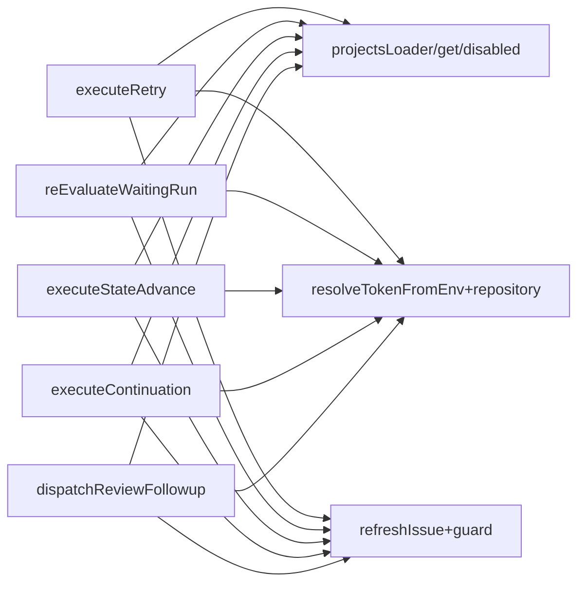
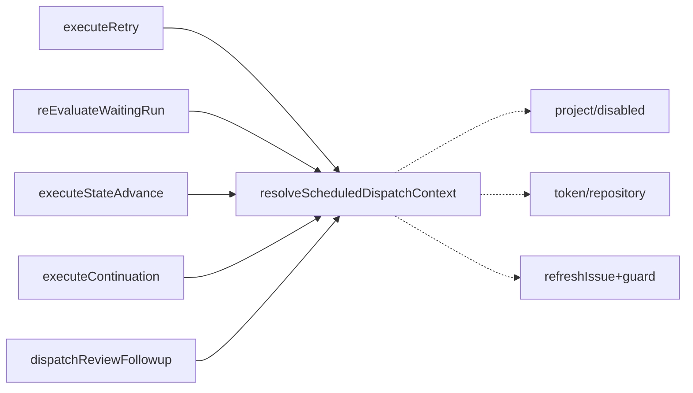
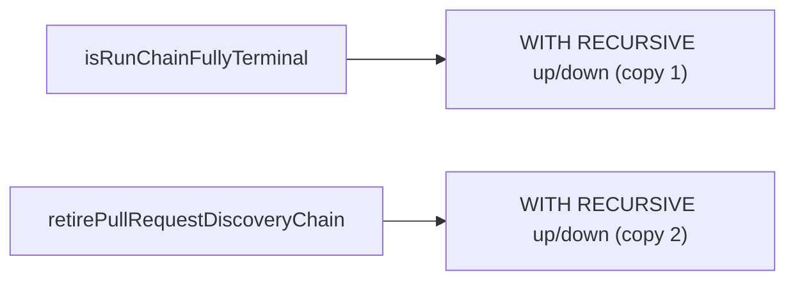
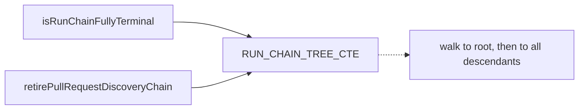

# Architecture review — symphonika — 2026-09-14

**Scope**: Hot-spot-weighted scan of the most-churned modules over the last ~120 commits
(`src/lifecycle/run-controller.ts` #1 at 40 touches, `src/run-store.ts`, `src/daemon.ts`,
`src/http/pages.ts`, `src/routines/dispatcher.ts`, `src/providers/*`), plus re-verification of the
six `proposed` backlog candidates a sub-agent could re-locate on the current tree. Fresh scan by
one sub-agent; the branch was adopted (see below).
**Picked**: `resolve-scheduled-dispatch-context` — see PR and `.architecture/backlog.md`
**Degradations**: none. Branch **adopted** (`sym/symphonika/routine/refactor-audit/01M2EG403B`;
step-0 conditions 1–4 all held — non-default, 0 unique commits ahead of `origin/main`, no upstream,
unpublished on origin). Not renamed per the adopted-branch rule; slug recorded here and in the
backlog. `codebase-design` vocabulary used as defined; `tdd`/`domain-modeling` not called (see SKILL).

**Diagram legend**: solid edges are the interface a caller wires by hand; dashed edges are behaviour
that moves *inside* the implementation once the seam exists.

## Candidates

### resolve-scheduled-dispatch-context — one resolver for the scheduled-dispatch prologue · Strong · score 21/25

- **Files**: `src/lifecycle/run-controller.ts` — five scheduled-dispatch entry points repeat the same
  project-context-and-refresh prologue: `executeRetry` (1358-1417), `reEvaluateWaitingRun`
  (2417-2444), `executeStateAdvance` (2833-2876), `executeContinuation` (3387-3431),
  `dispatchReviewFollowup` (3582-3688, interleaved). Existing partial model for the *fresh*-dispatch
  prologue: `resolveAndClaim` (1008-1073). New `src/lifecycle/scheduled-dispatch-context.ts`.
  Estimate **~3 files** (new module + run-controller + test; CONTEXT.md term optional → 4).
- **Score 21/25**:
  - **Leverage 4** — five call sites each hand-wire the identical ladder
    (`projectsLoader` → `get` → disabled/removed guard → `resolveTokenFromEnv` → `repository` build
    → `refreshIssue` → refresh-unavailable guard, ~15-20 lines each). Four collapse cleanly onto one
    seam; the fifth (`dispatchReviewFollowup`) uses the token/refresh tail after review-specific
    interleaving. Not 5: eligibility and drop reaction stay at the caller, so it does not erase a
    whole class of test setup by itself.
  - **Locality 4** — a change to how a scheduled dispatch resolves its project, token, repository or
    refreshes its issue (e.g. a new guard, a token-source change) becomes a one-place edit instead
    of five parallel ones that already log inconsistently.
  - **Blast radius 2** — one production file (`run-controller.ts`) plus a new sibling module and a
    test; no published/exported interface changes. Band-1 by raw file count, taken at 2 because the
    review surface spans five critical dispatch methods ("description wins" over the file range).
  - **Heat 5** — `run-controller.ts` is the single hottest file in the window (40 touches); the
    dispatch prologues churn on nearly every lifecycle PR.
- **Problem**: The prologue is a **shallow spread** — every scheduled-dispatch path re-implements the
  same "resolve this project's context and re-read its issue" sequence inline, and they have already
  drifted where it is invisible: `reEvaluateWaitingRun` **omits** the `isLabelWritingGitHubIssuesApi`
  guard on purpose (the wait-park re-eval path, ADR-adjacent to issues #731/#737/#740/#745), two of
  the five load `providersConfig` and three do not, and the drop-path logging ranges from a warn with
  `parentRunId` to a warn with `runId` to silent. A reader must hold five near-copies in their head
  to know which divergences are intentional. No single place owns "what it means to resolve a
  scheduled dispatch's context."
- **Deletion test**: **Concentrates.** Delete the resolver and the project/token/repository/refresh
  resolution scatters back across five methods — exactly today's state. The knowledge (how a
  scheduled dispatch reads its project and refreshes its issue, and which guards are conditional)
  lands in one module with one test surface. The divergent parts (eligibility scope, drop reaction)
  are genuinely per-caller and correctly stay outside the seam — the resolver returns a discriminated
  result, it does not decide the caller's reaction.
- **Solution**: A `resolveScheduledDispatchContext(deps, { projectName, issueNumber,
  requireLabelWriting })` returning a discriminated result — `{ kind: "ready", project, repository,
  refreshed }` (where `refreshed` is a non-`undefined` issue snapshot or `null`) or
  `{ kind: "dropped", reason }` for the project-unavailable / api-not-label-writing / token-missing /
  refresh-unavailable cases. `requireLabelWriting` defaults true; `reEvaluateWaitingRun` passes
  `false` so its deliberate omission of the label-writing guard stays behaviour-preserving. Each
  caller maps the `reason` to its own drop reaction (bare return, warn, `claimLabels.release`,
  `markCancelRequested`, typed `DispatchOneFreshResult`) and still owns its own eligibility check
  (`fsm_owned` vs `label_controlled`, the `refreshed === null` handling). Modeled on the existing
  `resolveAndClaim`; the design step decides whether the new seam is called from `resolveAndClaim`
  or shares its result type, to avoid a third parallel prologue variant.
- **Benefits**: **Leverage** — four (arguably five) callers shed their resolve/refresh boilerplate
  and can no longer drift on token resolution or refresh handling. **Locality** — the resolve/refresh
  behaviour gets one home and one test. **Test surface** — the resolver becomes exercisable directly
  through injected ports (`projectsLoader`, `githubIssuesApi`, `env`, `refreshIssue`): every drop
  reason and the ready case become a pure unit assertion, where today they are only reachable through
  five ~200-line dispatch methods that also spawn providers and write labels.





### run-chain-tree-walk-cte — one named CTE for the chain tree walk · Worth exploring · score 20/25

- **Files**: `src/run-store.ts` — byte-identical `WITH RECURSIVE up(id)…down(id)…` chain-tree walk in
  `isRunChainFullyTerminal` (5636-5655) and `retirePullRequestDiscoveryChain` (5684-5700), paired by
  `trackPullRequest` (gate ~5741, retire ~5789). Estimate **~1 file** (+ test). Precedent for the
  named-CTE-constant pattern already in the file: `RUN_CHAIN_ROOT_CTE` (~1174).
- **Score 20/25**: leverage 3 (two verbatim copies of a cycle-guarded traversal *algorithm* — walk to
  the chain root via `up`, then down to every descendant — defended by ~20 lines of cross-referencing
  correctness comments; a cycle-guard or index change needs one home), locality 4, blast radius 1
  (one file, no interface change), heat 5 (this is the #746/#753 trackPullRequest surface, landed
  2026-09-13).
- **Problem**: Two copies of a correctness-critical recursive walk, each carrying comments that
  point at the other ("keep in sync with…"). The interface (a `const` SQL string) is near-nothing
  while the implementation is a subtle traversal — a deep seam waiting to be named, not a plain
  column-list DRY.
- **Deletion test**: **Concentrates** — the traversal algorithm and its cycle guard get one home,
  like the existing `RUN_CHAIN_ROOT_CTE`. Bordering "moves" only because it is expressed as a shared
  string; the ~20 lines of shared correctness invariant push it over into a genuine seam.
- **Solution**: Extract exactly this one pair into a `RUN_CHAIN_TREE_CTE` constant (or a tiny
  builder). Do **not** unify the ancestor-only walk at ~6015 — it is a deliberately different shape
  for a documented performance reason (see [[project_sqlite_recursive_cte_materialization]]).
- **Benefits**: leverage/locality as above; test surface is unchanged (SQL correctness is already
  covered by the trackPullRequest tests), so this is the safer but slightly lower-leverage runner-up.





### handle-scheduled-dispatch-error — one post-dispatch teardown · Worth exploring · score 20/25

- **Files**: `src/lifecycle/run-controller.ts` — near-identical post-dispatch `catch`
  (`RegistryShutdownError` → cancel-parent-iff-`getRun`-undefined; `CapBreachedError | IssueReservedError`
  → warn + reschedule + `cancelRunAfterScheduleRefused`; else rethrow) in `executeStateAdvance`
  (~3089-3166) and `executeContinuation` (~3511-3573), with structural cousins in `executeRetry` and
  `dispatchReviewFollowup`. Estimate ~1-2 files.
- **Score 20/25**: leverage 3, locality 4, blast radius 1, heat 5. Epilogue twin of the pick, on the
  same methods — it encodes the subtle child-row-existence + parent-cancel + reschedule/refuse window
  that #663/#674 fixed. **Adjacent to the pick**: taking both in one PR would double the blast on the
  hottest file, so it is left `proposed` as the natural follow-up.

### routine-claim-window-membership-seam — one snapshot-window predicate · Worth exploring · score 19/25

- **Files**: `src/routines/dispatcher.ts` `confirmIssueClaimAction` (2460-2491),
  `observedNewPullRequestForBranch` (2999-3013) hand-mirror the open/close/new-PR-within-window rules
  that live in `src/routines/outcome.ts` `diffRoutineGithubSnapshots` (182-230). Estimate ~2 files.
- **Score 19/25**: leverage 3, locality 4, blast radius 2, heat 5 (routine outcome-claim verification
  is this fortnight's theme — #751/#754/#762/#756). A single `didActionHappenInWindow` snapshot
  predicate both the diff and the claim verifier call removes prose-compensated drift (comments at
  2456-2459 and 2987-2998 admit the mirror). Distinct from the backlog's `routine-github-observation`
  (that is capture; this is verification).

### provider-validate-harness-seam — fold command render+parse into the session · Worth exploring · score 18/25

- **Files**: `src/providers/codex.ts` (104-117), `claude.ts` (69-78), `omp.ts` (~134-143) each return
  `{ ...session, validate }` re-doing the render→parse the harness `createProviderSession` already
  owns (`src/providers/provider-session.ts` 152-156). Estimate ~4 files.
- **Score 18/25**: leverage 3, locality 4, blast radius 2, heat 4. `validate` and `runAttempt`
  tokenize the command independently and can drift; a `validateCommand?` config callback folds the
  render+parse+spread into the harness, leaving each adapter only its probe body. Sits on the
  recently-touched Agent Provider Session surface.

### issue-pr-label-editing-family — one label-editing section · Worth exploring · score 18/25

- **Files**: `src/http/pages.ts` `renderIssueLabelsSection` (4953-4977) vs
  `renderPullRequestLabelsSection` (5498-5522) — line-for-line identical bar route prefix, id field,
  note text; banner twins at ~4846/~5408 (a comment at 5404 admits the structural identity).
  Estimate ~1 file.
- **Score 18/25**: leverage 3, locality 4, blast radius 1, heat 3. The "`sym:*` renders read-only,
  everything else gets CSRF + snapshot-repo remove/add forms" policy lives twice and can drift; a
  seam taking `(route, idField, note)` owns it once.

### Carried-forward proposed backlog candidates (not re-verified this run)

`schedule-wait-park-epilogue`, `live-run-ownership-registry` (bail territory — a behavioural union,
not a preserving extraction), `routine-github-observation`, `snapshot-search`, `run-slot-lease`,
`daemon-project-state-projection`, `leaked-subject-sweep`, `config-project-parse-outcome`,
`provider-attempt-runner`, `artifact-kind-catalog`, `routine-evidence-redaction`, `coalesce-events`,
`status-presentation`, `create-waiting-run-normalization` remain `proposed`. The six the scan
re-located on the current tree (A1-A6 in the run notes) are all still present with drifted line
numbers; the eight others were carried forward without a fresh existence check this run. None
out-scores the pick.

## Dropped

| Candidate | Dropped because |
|---|---|
| `probe-shutdown-drift` | Not behaviour-preserving — unifying `shutdownProbeProcess` would add codex's missing SIGTERM→SIGKILL escalation, a behaviour change, not an extraction. A correctness item, not a deepening candidate. |
| `provider-outputschema-omp` | Already tracked as issue #759 (omp ignores `outputSchema`); a correctness gap, not a refactor. Not re-filed. |
| `column-list-select-dup` (runs / 30-col routine_firings / 16-col tracked_pull_requests) | Leverage 1 — pure column-list DRY; a shared list concentrates no behaviour (same class the 2026-09-11 run deferred). |
| `provider-json-field-accessors` (re-confirmed, ~8 files) | Leverage 1 — six one-line shallow accessors ≈ their impl; de-dup by pointing at `codex-json.ts`, not a new module. |
| `isTerminalFailure ×3` / `terminateProcess ×3` / `writeJson ×2` / settle-once idiom | Leverage 1 — byte-identical shallow leaves. |
| run-store drifted sibling pairs (`findLeaked*`, `markRunsStale`/`markRoutineFiringsFailed`, `replaceProject*Snapshots`) | Deletion test **moves** — the SQL differs by table/domain, so a shared port pushes differences into adapters (see backlog `leaked-subject-sweep`). |
| pages.ts sibling renders (`render*NotFound`, `render*SearchFilters`, `load*Detail` prologue, `isPullRequestForBranch`/`isOpenPullRequestForBranch`) | Either ride `issue-pr-label-editing-family` or are 2-line compositions, not seams. |

## Too large to automate

None. No surviving candidate scored blast radius 5; the highest-blast items in range this run were
1–2.

## Pick

**`resolve-scheduled-dispatch-context` (21/25)** over runner-up candidate **`run-chain-tree-walk-cte`
(20/25)** — within 1 point, so the pick was close and the runner-up is the natural next firing. The
pick wins on leverage (five hand-wired prologues vs two copies of one CTE) and heat-parity on the
hottest file; the runner-up is safer (byte-identical, one file, no test-surface change) but lower
leverage and borderline against the "shared SQL string = DRY" line. `handle-scheduled-dispatch-error`
(20/25) ties the runner-up on score but is deliberately deferred: it is the epilogue twin on the same
methods, and folding it in would double this PR's blast on `run-controller.ts`.

Tie-break note: the pick is not a tie (21 > 20), so no deterministic tie-break was needed; the
within-1-point rule applies for reviewer awareness only.

## Design

Three interfaces were produced by parallel sub-agents (design-it-twice), then adjudicated against, in
order: depth, locality, seam placement, test surface, blast radius. The advisor picked the winner
against those criteria.

**Empirical finding all three shared** (and it refined the pick): the prologue is **not one
contiguous block**. `executeRetry` interleaves a provider-missing check, and `dispatchReviewFollowup`
interleaves `isIssueReserved` + raw-FSM ownership + provider checks, *between* project-resolve and the
token/refresh work. The only span contiguous in all five callers is `[api guard?] → token →
repository → refresh`. So the clean seam is a **project-resolve head** plus a **token→repository→refresh
tail**, with each caller's own middle and its divergent drop reaction left in place. This refines the
committed *Solution* above: the extracted tail takes an **already-resolved `project`**, not a
`projectName` — the head (a 6-line `projectsLoader` + guard) stays a private method, which also keeps
the new module's imports type-only and avoids a runtime import cycle back into `run-controller.ts`.

### Design A — ports-and-adapters free function (WINNER)

Exported `resolveScheduledDispatchContext(ports, request)` in a new
`src/lifecycle/scheduled-dispatch-context.ts`, taking an explicit ports object (no `this`), returning
a discriminated result. `resolveDispatchProject` stays a **private** method on `RunController`.

```ts
type ScheduledDispatchPorts = {
  isLabelWritingApi: () => boolean;                          // closes over this.githubIssuesApi
  resolveToken: (tokenReference: string) => string | undefined; // closes over this.env
  refreshIssue: (input: { project: DispatchProjectConfig; issueNumber: number;
                          repository: GitHubIssueRepositoryInput }) =>
                Promise<IssueSnapshot | null | undefined>;
};
type ScheduledDispatchRequest = {
  project: DispatchProjectConfig; issueNumber: number; requireLabelWritingApi: boolean;
};
type ScheduledDispatchContext =
  | { kind: "resolved"; repository: GitHubIssueRepositoryInput; issue: IssueSnapshot | null }
  | { kind: "dropped"; reason: "label_writes_unavailable" | "token_unavailable" | "refresh_unavailable" };
```

- **Hides**: the api-writability guard (skipped when `requireLabelWritingApi` is false), token
  resolution, the `repository` literal, the `refreshIssue` call and its `undefined ⇒ dropped` fold.
- **Leaves to callers**: `providersConfig` loading (3 of 5), the `issue === null` / `state !== "open"`
  handling, eligibility scope (`fsm_owned` vs `label_controlled`), and the drop reaction (bare return
  / warn / `claimLabels.release` / `cancelScheduledLifecycleWork` / `markCancelRequested` / typed
  `DispatchOneFreshResult`) — the seam classifies via `reason`, the caller acts.
- **reEval's deliberate api-guard omission** (issues #731/#737/#740/#745) is expressed as
  `requireLabelWritingApi: false` — a required field so no future caller silently flips it.
- **Test surface (why it won)**: the exported function is exercisable with three plain fake ports, no
  `RunController` construction — so the test-first red phase pins the *adjudicated interface itself*
  (autonomy-contract done-#5), which a private method cannot do without a reach-past cast. It also
  preserves `providersLoader()`'s position byte-for-byte (it sits between head and tail, as today) and
  needs no drop reorder in `executeRetry`.

### Design B — single private method, minimal surface (runner-up design)

`private async resolveScheduledDispatchContext({projectName, issueNumber, requireLabelWriting})`
using `this.*`, hiding project-resolve **and** token/refresh behind one narrow interface. Smallest
diff, no new file, no knip surface. **Why it lost**: being `private`, its red-green can only reach it
through the public dispatch methods or a cast — it never pins the seam as an interface (done-#5,
criterion 4). It adopts only 4 of 5 callers (leaves `dispatchReviewFollowup`'s prologue duplicated,
undercutting the leverage-4 the pick was scored on) and needs an `executeRetry` drop-reorder hoist.
It is the strongest loser: it is the same tail logic, one indirection cheaper, and it is what to fall
back to if the exported seam proves awkward.

### Design C — layered private methods sharing a leaf with `resolveAndClaim`

A `resolveRepository` leaf shared by the fresh path too, `resolveDispatchProject`, a deep
`resolveRepositoryAndRefresh`, and a composer. Broadest concentration (all 5 scheduled + the fresh
leaf). **Why it lost**: same private-method test problem as B; its composer *relocates*
`providersLoader()` after the seam; and the shared leaf touches `resolveAndClaim` — the poll path —
to remove a single 5-line literal, and C's own analysis showed the fresh path's
`excludeProject`/`stopLoop` semantics make any shared union a locality loss. Two prologue variants
(fresh inline, scheduled seam) is the right stopping point; C's third layer is surface the criteria
did not reward.

### Verdict

Design A wins on test surface (decisively, via done-#5) and behaviour preservation, ties C on
depth/locality, and beats both on seam placement (it narrows an *existing* injected-dependency seam
rather than adding a private one or a poll-path-coupled leaf). Runner-up **design**: B.

