# Architecture review — symphonika — 2026-09-18

**Scope**: Hot spots by churn over the last 120 commits, in descending order:
`src/lifecycle/run-controller.ts` (117 touches), `src/run-store.ts` (117),
`src/http/pages.ts` (99), `src/routines/dispatcher.ts` (55),
`src/doctor.ts` (53), `src/providers/omp.ts` (18), plus `src/daemon.ts`,
`src/routines/outcome.ts`, `src/reload.ts`, `src/issue-polling.ts`. YAGNI:
deepening pays off through *future* change, so cold code was not scanned.
**Picked**: `editor-save-outcome-epilogue` — see `.architecture/backlog.md`
**Degradations**: none. `gh` authenticated; sub-agent exploration available;
`codebase-design` vocabulary applied throughout.

**Diagram legend**: solid edges are the interface a caller must learn; dashed
edges are inside the implementation, hidden behind the seam.

## Candidates

### editor-save-outcome-epilogue — one seam owns the editor save-response policy · Strong · score 22/25

- **Files**: `src/http/pages.ts:1734-1824` (`POST /projects/:name/workflow/edit/confirm`),
  `src/http/pages.ts:1977-2065` (`POST /config/edit/confirm`),
  `src/http/pages.ts:2360-2457` (`POST /routines/:name/edit/confirm`);
  `src/http/save-pipeline.ts:44-52` (the `SavePipelineResult` union being dispatched).
  **File-count estimate: ~5** — `pages.ts`, one new module, and the three editor
  test files (`workflow-contract-editor.test.ts`, `service-config-editor.test.ts`,
  `routine-declaration-editor.test.ts`).
- **Score**: 22/25 (leverage 4, locality 4, blast radius 1, heat 5)
  - *Leverage 4*: three call sites simplify, each shedding ~60 lines of
    hand-written status-code dispatch; no caller reaches past the seam afterwards.
    Not 5 — the route tests still exercise the matrix end-to-end over HTTP, so no
    whole class of test setup disappears.
  - *Locality 4*: a change to the save-response policy becomes a one-place edit
    instead of three. Not 5 — all three sites already live in one file, and the
    rubric reserves 5 for collapsing a several-*file* edit.
  - *Blast radius 1*: contained; no published package, wire, or CLI interface
    changes. ~5 files, of which 3 are tests.
  - *Heat 5*: `pages.ts` is the third-hottest file in the tree (99 touches in 120
    commits) and was touched on 2026-09-17, in `HEAD` itself (#787) and in #782.
- **Problem**: `save-pipeline.ts` is already a **deep module** for the *write* half
  of a Service Config / Workflow Contract / Routine Declaration save: one function
  hides validation, the stale-write check, atomic-rename-preserving-mode, and
  reload-outcome capture. The *respond* half has no module at all. Each of the
  three `/edit/confirm` routes re-implements, by hand, the same policy: resolve the
  write path or refuse with `403`; then map the four-variant `SavePipelineResult`
  onto `303` / `200` / `422` / `409` / `500`, with the reload-gating rule layered
  on top of `saved`. The asymmetry is the shallowness: the interface each route
  must learn (five branches, five status codes, one gating rule) is *more* complex
  than the behaviour it is calling into. The duplication is not incidental — the
  load-bearing invariant is copied verbatim three times as prose, at
  `pages.ts:1762-1766`, `2003-2007` and `2386-2390`: *"The pipeline writes before
  reload runs, so `saved` alone doesn't mean the new … took effect — redirecting …
  here regardless would read as success even when reload rejected it."* A policy
  a codebase has to restate in three comments is a policy with no home.
- **Deletion test**: **Concentrates.** Delete the proposed module and the five-way
  status mapping plus the reload gate go back to being written out longhand in
  every editor route — and a fourth editor (ADR-0076 is explicitly "filled in part
  by part") would restate them a fourth time. Nothing moves to callers: what the
  routes keep is only what genuinely differs between them (their own URLs, their
  own preview shape, their own artifact path).
- **Solution**: One module owning the write-path gate, the status-code mapping, and
  the reload-gating rule. The one branch whose divergence is real — `invalid`,
  which re-renders each editor's own preview with a different option surface per
  route — is *not* absorbed: it is supplied by the caller. Absorbing it would
  balloon the module's option surface (`workflowFormat`, `projectParam`,
  `includeInactive`, a conditional `expectedSourcePath`, and three different ways
  of obtaining `onDisk`) and rebuild the shallowness one layer up.
- **Benefits**: **Leverage** — a caller learns one call instead of five branches,
  and a new editor route gets the reload gate and the whole status matrix by
  construction rather than by copy-paste. **Locality** — the save-response policy
  becomes a one-place edit; today a status-code change or a new `SavePipelineResult`
  variant is a three-place edit with no compiler pressure to find the third.
  **Test surface** — the matrix becomes directly exercisable through one interface
  without standing up a Hono app, a CSRF token, a session, and a temp config file
  per assertion; the route tests then only need to pin what is genuinely per-route.
- **Before**

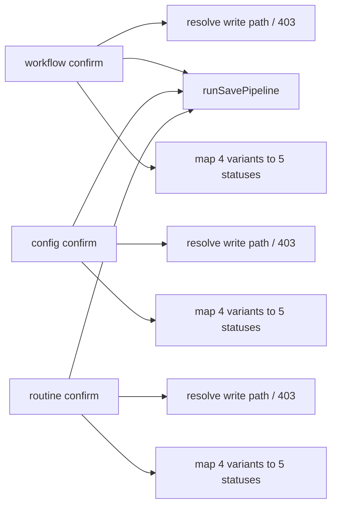

- **After**

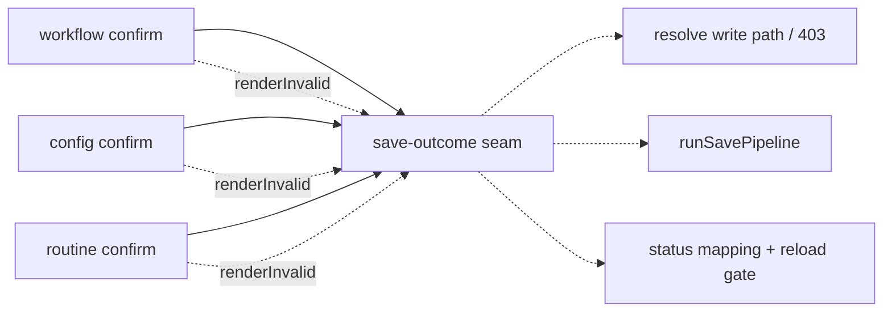

### routine-editor-target-prologue — one seam resolves a routine edit target · Strong · score 22/25

- **Files**: `src/http/pages.ts:2244-2276` (`POST /routines/:name/edit/preview`),
  `2321-2353` (`POST /routines/:name/edit/confirm`),
  `2473-2505` (`renderRoutineDisabledTogglePreview`, serving `/disable` and `/enable`).
  **File-count estimate: ~3.**
- **Score**: 22/25 (leverage 4, locality 4, blast radius 1, heat 5)
  - *Leverage 4*: three call sites shed 33 near-identical lines each.
  - *Locality 4*: the refusal policy becomes one edit; single-file today.
  - *Blast radius 1*: `pages.ts` plus two editor test files.
  - *Heat 5*: same file as the pick.
- **Problem**: 33 lines identical modulo indentation, repeated three times:
  `parseBody` → `project_param` / `expected_source_path` / `include_inactive` →
  `resolveNamedRoutineGroup` → early `renderUneditableRoutine` (200 when ambiguous,
  404 otherwise) → `resolveRoutineDeclaration` → `checkStaleRoutineDeclaration` →
  early return. The concentrated behaviour is a *refusal policy* — which resolution
  failure is 404 and which is 200, and the ADR-0076 guard that refuses a save when
  the name now resolves to a different declaration file than the form was opened
  for. Three copies means a fourth editor action can silently omit the stale guard,
  which is the precise bug the guard exists to prevent.
- **Deletion test**: **Concentrates.** The only genuine divergence is a parameter:
  the toggle's `editAction` omits the `/edit` path segment (`:2499` vs `:2270`/`:2347`).
- **Solution**: `resolveRoutineEditTarget(...)` returning
  `{ kind: "ok", … } | { kind: "refused", response }` — the discriminated-result
  house pattern `resolve-scheduled-dispatch-context` (PR #764) just landed on the
  run-controller side.
- **Benefits**: **Leverage** — a new routine-editor route inherits the stale guard.
  **Locality** — the refusal policy lands in one place. **Test surface** — the
  404-vs-200 matrix becomes assertable without three HTTP round-trips.
- **Before**

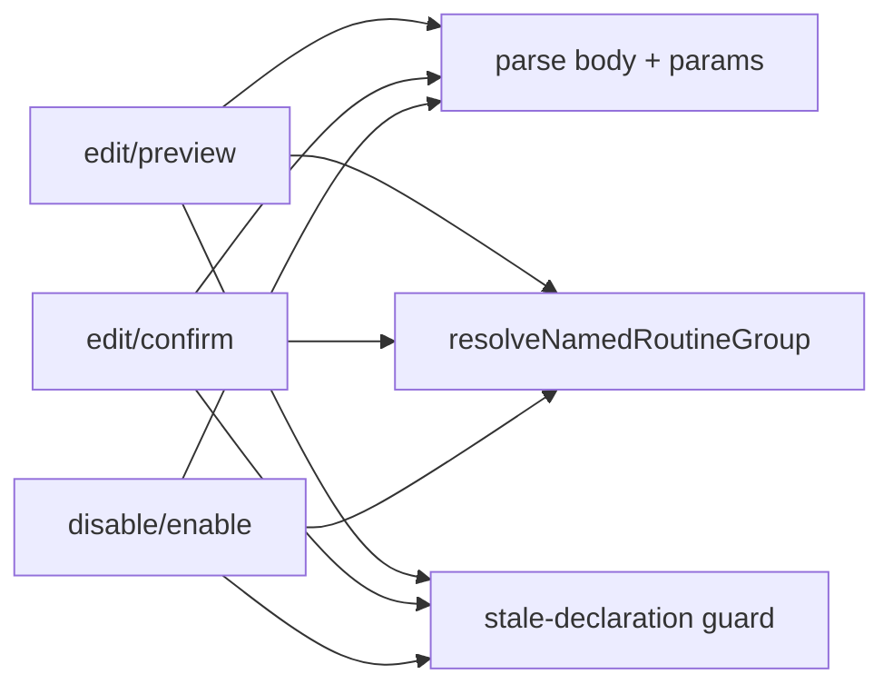

- **After**

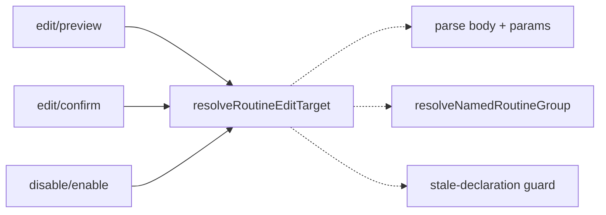

### run-chain-tree-walk-cte — one constant owns the chain-tree walk · Worth exploring · score 20/25

- **Files**: `src/run-store.ts:5729-5755` (`isRunChainFullyTerminal`),
  `5777-5800` (`retirePullRequestDiscoveryChain`); precedent constant
  `RUN_CHAIN_ROOT_CTE` at `:1174`. **File-count estimate: ~2.**
- **Score**: 20/25 (leverage 3, locality 4, blast radius 1, heat 5)
  — leverage 3: two call sites; locality 4: the cycle-guarded walk lands once;
  blast 1: one production file; heat 5: `run-store.ts` touched 2026-09-17, 117/120.
- **Problem**: A byte-identical `with recursive up/down` walk — up to the chain root,
  then down to every descendant — is written twice. Both copies carry long prose
  explaining *why* a forward-only walk is wrong. Re-verified present at HEAD.
- **Deletion test**: **Concentrates** — a ~20-line shared correctness invariant
  (cycle guard + root-find + descend), not a shared SQL string.
- **Solution**: a `RUN_CHAIN_TREE_CTE` constant, mirroring the existing
  `RUN_CHAIN_ROOT_CTE`. Do **not** unify the deliberately-different ancestor-only
  walk further down the file — its shape is a documented performance choice.
- **Benefits**: **Locality** — a fix to the traversal lands once.
- **Before**

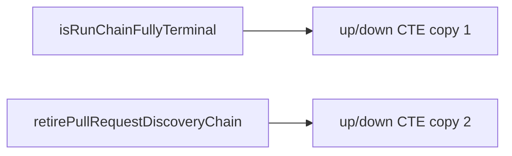

- **After**

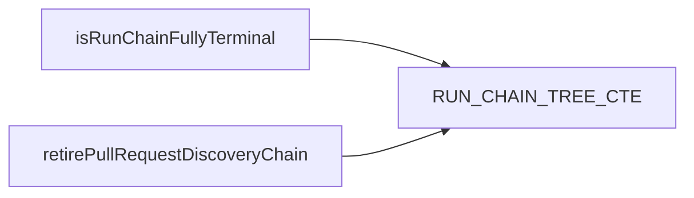

### handle-scheduled-dispatch-error — one teardown owns the post-dispatch catch · Worth exploring · score 20/25

- **Files**: `src/lifecycle/run-controller.ts:3105-3180` (`executeStateAdvance`),
  `3515-3575` (`executeContinuation`), structural cousin at `3698`
  (`dispatchReviewFollowup`). **File-count estimate: ~2.**
- **Score**: 20/25 (leverage 3, locality 4, blast radius 1, heat 5)
- **Problem**: The `RegistryShutdownError` → cancel-parent-iff-`getRun`-undefined /
  `CapBreachedError | IssueReservedError` → warn + reschedule +
  `cancelRunAfterScheduleRefused` / else-rethrow window that #663/#674 fixed is
  written out two-and-a-bit times. Friction re-verified present after PR #764.
- **Deletion test**: **Concentrates** — the epilogue twin of the prologue #764 landed.
- **Solution**: one teardown owning the error-classification window.
- **Benefits**: **Locality** — the error window becomes one edit.
- **Before**

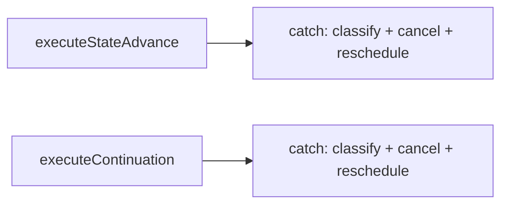

- **After**

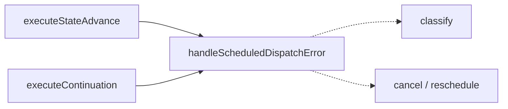

### routine-firing-terminal-write — one seam settles a terminal firing · Worth exploring · score 20/25

- **Files**: `src/routines/dispatcher.ts:1800-1828` (success path),
  `2001-2030` (failure/cancel path), both inside `runRoutineFiring`.
  **File-count estimate: ~2.**
- **Score**: 20/25 (leverage 3, locality 4, blast radius 1, heat 5)
- **Problem**: The rule "the reconciled Routine Outcome and the persisted terminal
  row agree" is assembled twice, and has **already drifted**: the failure path
  passes `observedAction: githubObservation.action` where the success path passes
  `claimUrlVerification ?? githubObservation.action`, and a comment at `:2025-2027`
  admits the failure path's `pullRequestObserved` is *inert* — accidentally correct
  today, wrong the moment the precondition widens.
- **Deletion test**: **Concentrates** — the divergences become named parameters
  (`firingDeadlineWon` failure-only, nullable `terminalReason`), not hooks.
- **Solution**: `settleRoutineFiringTerminal(runStore, {...})` owning the ADR-0068
  12-field `reconcileRoutineOutcome` assembly and its agreement with the row state.
- **Benefits**: **Locality** — the drift that already happened cannot recur.
- **Note**: the *wider* settlement sequence (`1606-1828` vs `1877-2030`) was examined
  and rejected — eight genuine divergences would land as per-path hooks, so that
  extraction **moves** rather than concentrates.
- **Before**

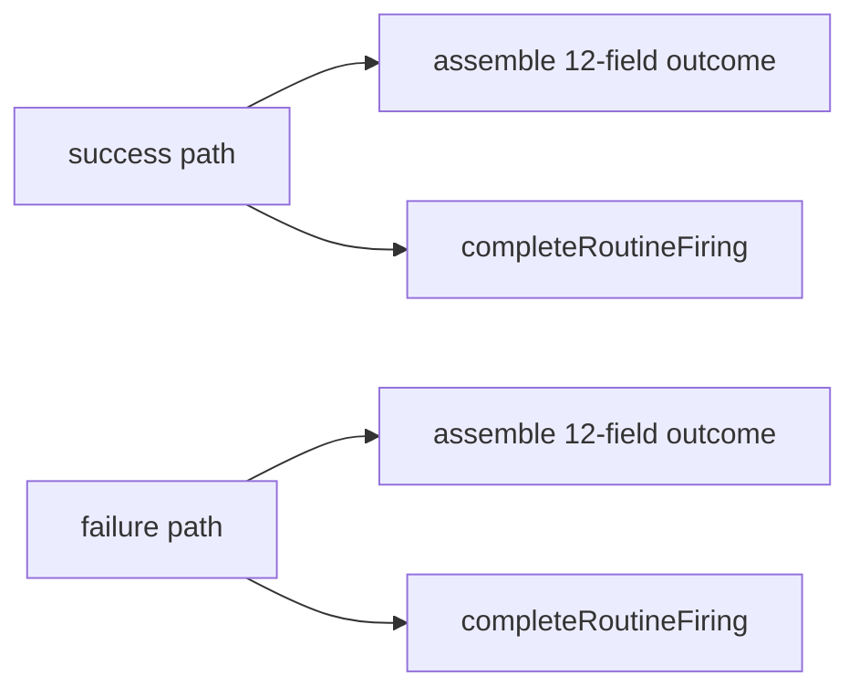

- **After**

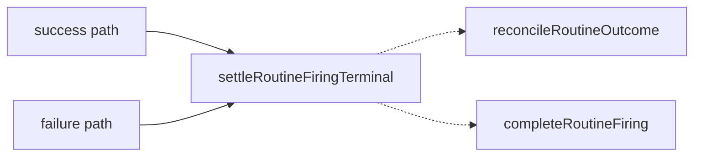

### omp-frame-read-loop — one generator owns the OMP terminal contract · Worth exploring · score 20/25

- **Files**: `src/providers/omp.ts:517-556` (`readUntilFrame`),
  `558-600` (`readUntilResponse`). **File-count estimate: ~2.**
- **Score**: 20/25 (leverage 3, locality 5, blast radius 1, heat 4)
  — locality 5: a fix to the terminal-event protocol currently lands twice in two
  functions whose call sites interleave in one turn generator.
- **Problem**: `diff` of the two spans yields only three hunks — the signature, the
  event-construction line, and the match condition. Everything else — `process_exit`
  → `missingTerminalAgentEndEvent`; `isTerminalAgentEnd` → `markTerminalAgentEnd` +
  `terminalAgentEndBeforePrompt` + `drainUntilExit`; `isTerminalFailure` → latch —
  is the OMP wire protocol's terminal contract, written twice.
- **Deletion test**: **Concentrates** — it is a protocol invariant, not a shared shape.
- **Solution**: one `readUntilMatch(queue, activeRun, { match, mapMatched })`; the
  two existing functions become thin adapters. `drainUntilExit` stays out — no match
  predicate, no terminal handling; folding it in widens the interface for nothing.
- **Benefits**: **Locality** — an ADR-0066 protocol fix lands once.
- **Before**

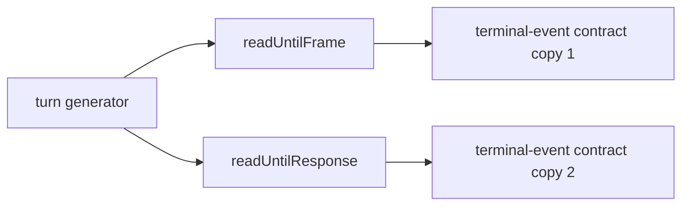

- **After**

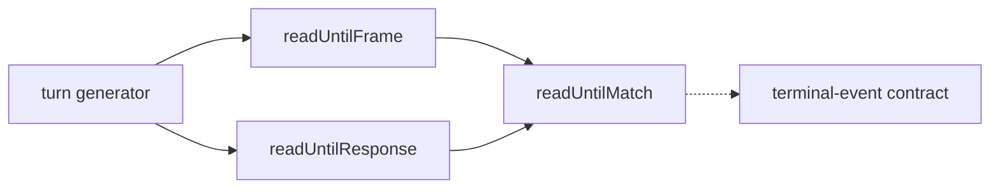

### routine-dispatch-refusal-ledger — atomic store-write / log / report triple · Speculative · score 20/25

- **Files**: `src/routines/dispatcher.ts` seven refusal sites in `dispatchDueRoutines`:
  `832-852`, `869-893`, `902-923`, `930-952`, `953-975`, `993-1019`, `1020-1044`.
  **File-count estimate: ~2.**
- **Score**: 20/25 (leverage 3, locality 4, blast radius 1, heat 5)
  — leverage held at 3 deliberately: see below.
- **Problem**: The invariant "what `dispatchDueRoutines` reports to the daemon is
  exactly what the Run Store accepted" is re-encoded seven times, with an unnamed
  asymmetry — the four `record*`-backed sites gate log+push on the store's return
  value, the two hold sites push unconditionally and log at `warn`. Corroborating
  drift risk: `:912-916` re-derives `scheduledAt` as
  `routine.nextFireAt ?? now.toISOString()` where `:841-845` uses the already-bound
  `scheduledAt` — the same expression today, one edit from not being.
- **Deletion test**: **Concentrates, weakly.** A four-member ledger wrapping four
  *different* Run Store methods with three *different* log shapes has an interface
  close to its implementation — the deepened result would itself be shallow. This is
  why leverage is 3 despite seven call sites: the sites are numerous but not alike.
- **Solution**: a per-call ledger closing over `runStore`, `logger`, `now` and the
  four result arrays, exposing `.skip` / `.miss` / `.defer` / `.hold`.
- **Benefits**: **Locality** — the gating rule becomes per-member and explicit.
- **Before**

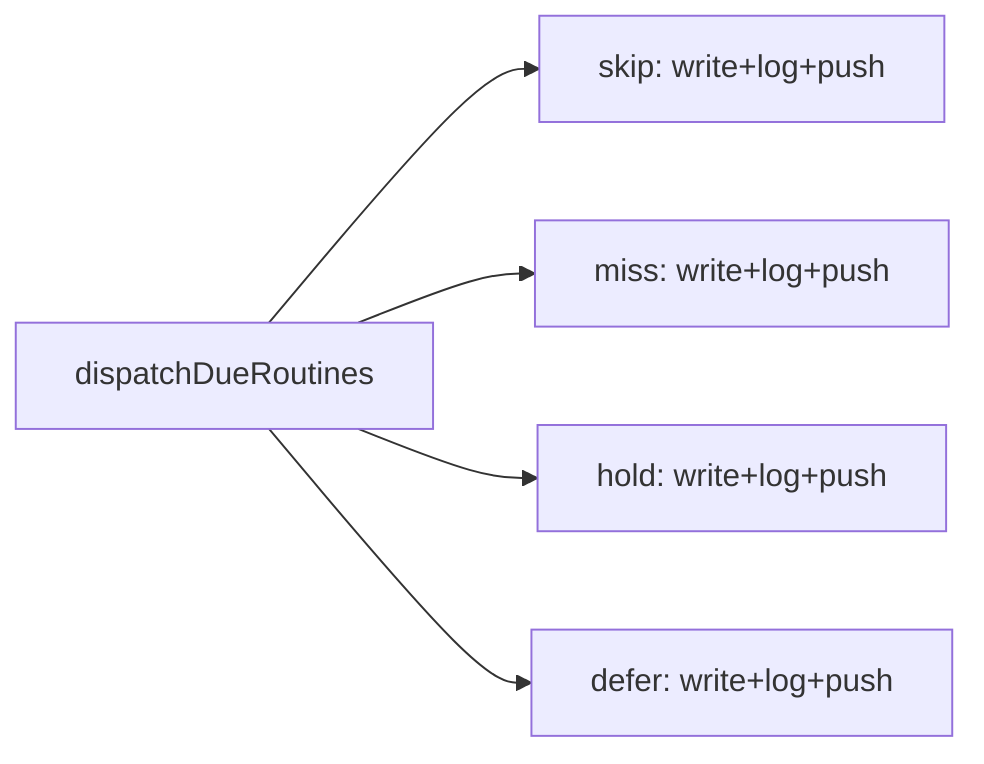

- **After**

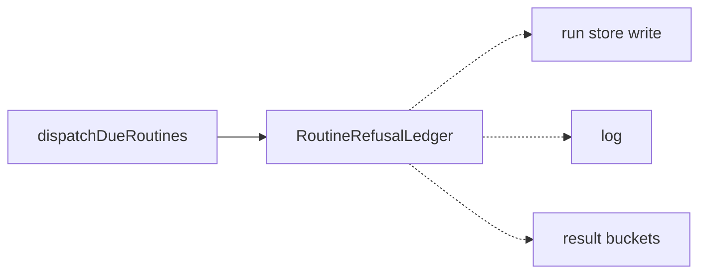

### init-project-prompt-session — one seam owns the init prompt lifecycle · Speculative · score 18/25

- **Files**: `src/doctor.ts:2611-2638` (`confirmOperationalLabelCreation`),
  `2640-2667` (`confirmEligibilityLabelCreation`), `2141-2261`
  (`collectProjectSettings`, lifecycle only). **File-count estimate: ~2.**
- **Score**: 18/25 (leverage 3, locality 4, blast radius 1, heat 3)
  — heat 3: `doctor.ts` is hot overall (53/120), but the `init project` prompt
  cluster is a cold corner of it.
- **Problem**: All three repeat `createInitProjectPromptController(prompt, yes)` →
  `try` → `finally { close() }`; the two `confirm*` functions share a further ~28
  lines differing only in three strings, including the consent parse.
- **Deletion test**: **Concentrates** — two real invariants: the readline interface
  is closed on every exit path, and anything other than `yes`/`y`/`no`/`n` throws
  rather than silently defaulting to consent for a live GitHub label write.
- **Solution**: `withInitProjectPrompt(prompt, yes, (ask) => …)` plus an
  `askYesNo(ask, { key, message, refusalNoun })` built on it.
- **Benefits**: **Locality** — one consent parser instead of two.
- **Before**

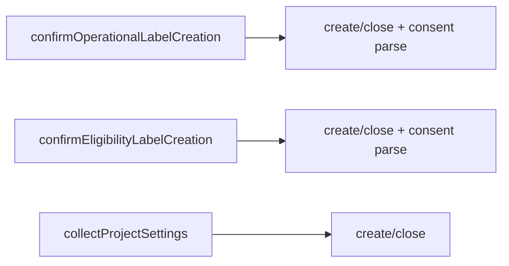

- **After**

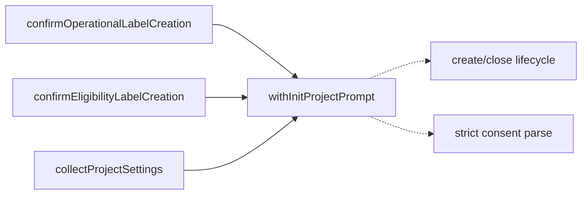

## Dropped

| Candidate | Dropped because |
|---|---|
| `daemon-project-snapshot-persist` | Leverage 1 — `daemon.ts:2579-2626` vs `2700-2738` share ~6 lines of policy; the row mappers share no columns, so a shared port pushes the difference into adapters. Complexity **moves**. |
| `daemon-inflight-promise-registration` | Leverage 1 — a real shutdown-drain invariant, but a 3-line helper: interface ≈ implementation. Same class as the already-dropped `mutate-and-publish`. |
| `daemon-poll-pipeline-pair` | Leverage 1 — the issue-poll side additionally owns merge/carry-forward, suppression and `projectModes`; extraction **moves**. |
| `routine-firing-settlement-sequence` | Leverage 1 — the *wide* `1606-1828` vs `1877-2030` mirror has eight genuine divergences (claim read ordering, deadline fail-soft, `withProviderStderrTail`, PR discovery, claim-URL verification) that land as per-path hooks. Superseded by the narrower `routine-firing-terminal-write` above. |
| `doctor-winning-assignment-family` | Not behaviour-preserving — `winningByteSizeAssignment` skips assignments systemd itself rejects and is case-exact; `winningAssignment` reports the last value case-insensitively for drift auditing. Prose at `doctor.ts:968-981` and `1391-1398` documents why. Unifying is a behaviour change, not an extraction. |

Previously-dropped entries re-checked this run and still excluded, filter unchanged:
`probe-shutdown-drift`, `wait-terminal-contract`, `blocked-terminalization-phase`,
`raw-fsm-park-ownership`, `wait-state-predicate-split`, `mutate-and-publish`,
`issue-polling-try-api-wrappers`, `github-pr-enum-normalizers`,
`provider-json-field-accessors`.

## Too large to automate

None. No candidate this run scored blast radius 5.

## Pick

**`editor-save-outcome-epilogue`, 22/25.**

The runner-up **candidate** is `routine-editor-target-prologue`, also **22/25** — a
genuine tie, and the rubric's deterministic tiebreak chain is **exhausted**: both
have blast radius band 1, both have heat 5, and "whose files were touched most
recently" cannot separate them because they are seams in the *same file*
(`src/http/pages.ts`), indeed in the same 3,000-line `registerPages` function.

So the pick is a documented judgement call, on **depth**:
`src/http/save-pipeline.ts` is *already* a deep module for the write half of a save
— it hides validation, the stale check, the atomic rename, and reload capture behind
one call. The respond half of that same contract has no module at all and is written
out longhand in three routes. That asymmetry is the strongest depth argument on the
board: the deepening does not invent a seam, it completes one that the codebase
half-built and then stopped. The prologue candidate is a clean extraction of a
refusal policy, but there is no existing deep counterpart it is failing to match.

Secondary reasons, recorded so a reviewer can disagree with the right thing:

- The epilogue's shared behaviour is load-bearing enough that the codebase restates
  it as prose three times, verbatim (`pages.ts:1762-1766`, `2003-2007`, `2386-2390`).
  A policy needing three identical comments is a policy with no home.
- ADR-0076 is explicitly written "part by part" and anticipates further editors.
  Each new editor pays the epilogue cost again.
- Taking both in one PR would double the blast on the highest-churn file in the
  tree. Per the `resolve-scheduled-dispatch-context` / `handle-scheduled-dispatch-error`
  precedent from the 2026-09-14 run, the coupled pair is split across firings, larger
  first. **`routine-editor-target-prologue` is the natural next firing.**

No hard filter was tripped: leverage is 4 (not 1), blast radius is 1 (not 5), it
contradicts no ADR — ADR-0076 fixes the two-phase POST *route shape* and the rule
that `/edit/confirm` is the only caller of `runSavePipeline`, both of which this
extraction preserves exactly — and current behaviour is pinnable by
`tests/workflow-contract-editor.test.ts`, `tests/service-config-editor.test.ts`,
`tests/routine-declaration-editor.test.ts` and `tests/save-pipeline.test.ts`.

### A claim deliberately *not* made

An earlier draft argued that a fifth `SavePipelineResult` variant would "silently
fall through to 500". That is **false** and is recorded here so it is not
re-derived: the three `if (result.kind === …)` blocks all return, so TypeScript
narrows `result` to `write_failed` afterwards, and a new union member makes
`result.error` a compile error in all three routes. The case for this extraction
rests on triplicated policy and the thrice-copied comment, which is sufficient
on its own.

## Design

Written at step 4 — see below.
