# Architecture review — symphonika — 2026-09-21

**Scope**: Whole-tree scan weighted by heat. Hot spots over the last 120 commits:
`src/lifecycle/run-controller.ts` (44 touches), `src/run-store.ts` (43), `src/http/pages.ts` (30),
`src/daemon.ts` (28), `src/routines/dispatcher.ts` (23), `src/providers/codex.ts` (14),
`src/doctor.ts` (13). Two sub-agents walked disjoint halves (lifecycle/store/workflow/providers;
routines/daemon/http/cli/doctor/workspace), each briefed off the persisted `.architecture/backlog.md`
so it would surface *fresh* friction rather than re-derive known entries. The 17 `proposed` backlog
entries were re-verified against `HEAD` and re-scored alongside.

**Picked**: `routine-editor-target-prologue` — see the PR linked from `.architecture/backlog.md`

**Degradations**: none. `gh` authenticated, sub-agents available, advisor available.

**Diagram convention**: solid edges are the **interface** a caller must learn; dashed edges are
inside the **implementation**, hidden behind the seam.

---

## Candidates

### routine-editor-target-prologue — one seam owning routine-editor target resolution · Strong · score 22/25

**Files**
- `src/http/pages.ts:2119-2155` — `POST /routines/:name/edit/preview`
- `src/http/pages.ts:2196-2232` — `POST /routines/:name/edit/confirm`
- `src/http/pages.ts:2275-2312` — `renderRoutineDisabledTogglePreview`, serving `POST /routines/:name/disable` (`:2358`) and `POST /routines/:name/enable` (`:2368`)
- Collaborators already extracted: `resolveNamedRoutineGroup` (`:5565`), `renderUneditableRoutine` (`:5631`), `resolveRoutineDeclaration` (`:5671`), `checkStaleRoutineDeclaration` (`:5767`), `routineQuerySuffix` (`:5796`)
- **File-count estimate**: ~3 (`src/http/pages.ts`, one new module, one new test file)

**Score 22/25** — leverage 4, locality 4, blast radius 1, heat 5

- *Leverage 4*: three call sites each shed ~33 lines and stop wiring five collaborators by hand; the
  refusal policy they currently restate becomes something a caller receives rather than composes.
- *Locality 4*: a change to the refusal status split or the ADR-0076 stale-declaration guard is a
  one-file edit afterwards; today it is three edits in one 3,000-line function, and a miss is silent.
- *Blast radius 1*: contained — one production file, one new module, no published package, wire, or
  CLI interface touched.
- *Heat 5*: `src/http/pages.ts` took 30 of the last 120 commits, and this exact cluster was edited by
  #789 (2026-09-18), #782, #787.

**Problem.** Three sibling handlers each write out the same eight-beat prologue by hand: parse the
body, read `project_param` / `expected_source_path` / `include_inactive`, call
`resolveNamedRoutineGroup`, branch on `resolved.kind !== "ok"` into `renderUneditableRoutine` at
`200` for `ambiguous` and `404` otherwise, call `resolveRoutineDeclaration`, build the `editAction`
URL, call `checkStaleRoutineDeclaration`, and return early when it refuses. The collaborators are
each deep enough; what has no owner is the **composition** — the order they must be called in, and
the refusal policy that decides between rendering an uneditable routine and short-circuiting on a
stale declaration. Every caller reaches past that seam and re-derives it, which is the definition of
shallowness here: the "interface" a new editor route must learn is the whole 33-line recipe.

The two surfaces have already drifted by one parameter: the toggle's `editAction` is
`/routines/:name{suffix}` (`:2306`) where preview and confirm use `/routines/:name/edit{suffix}`
(`:2150`, `:2227`). That difference is real — the toggle form posts from the routine detail page,
not from the text editor — but nothing in the code says so, and a fourth route added by copy-paste
has a one-in-three chance of picking the wrong one.

**Deletion test: concentrates.** Delete a `resolveRoutineEditTarget` and the eight-beat recipe
returns three times over, along with two independent statements of the `ambiguous → 200`,
everything-else → `404` rule and two spellings of the `editAction` URL. Nothing moves outward: the
callers get shorter, not the same length elsewhere. The only knowledge that stays at each caller —
which `editAction` this surface posts to, and what to do with a resolved target — is genuine
per-caller variance, not policy.

**Solution.** One `resolveRoutineEditTarget(runStore, context, { name, body, editActionFor })`
returning the discriminated result `{ kind: "ok", … } | { kind: "refused", response }` — the house
pattern PR #764 landed for `resolveScheduledDispatchContext` and #789 for `createSaveConfirmer`. The
seam owns the parse order, the collaborator sequence, the refusal status split, and the
stale-declaration short-circuit. `editAction` crosses as a caller-supplied value, because it varies
along URL topology and that variance is real.

**Benefits.** *Leverage*: a fourth routine-editor surface costs one call instead of 33 lines, and
cannot get the refusal statuses wrong. *Locality*: the ADR-0076 stale-declaration guard and the
404-vs-200 rule concentrate in one module. *Test surface*: today the refusal policy is only
reachable through an HTTP round-trip against a rendered HTML body; afterwards both refusal branches
and the `editAction` divergence are assertable directly through the interface, without reaching past
it — the same improvement `save-confirm.ts` bought for the respond half.

**Before**

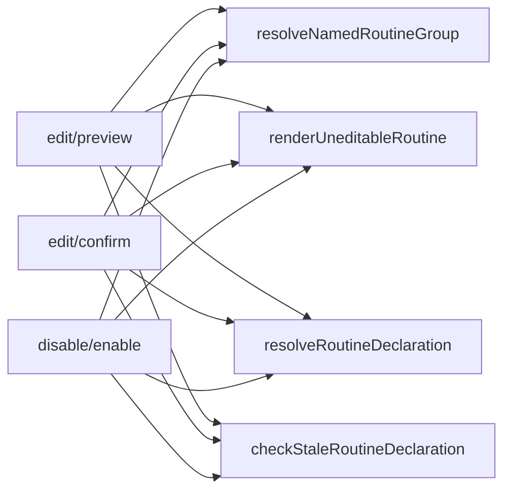
```mermaid
graph LR
  P[edit/preview] --> G[resolveNamedRoutineGroup]
  P --> U[renderUneditableRoutine]
  P --> D[resolveRoutineDeclaration]
  P --> S[checkStaleRoutineDeclaration]
  C[edit/confirm] --> G
  C --> U
  C --> D
  C --> S
  T[disable/enable] --> G
  T --> U
  T --> D
  T --> S
```

**After**

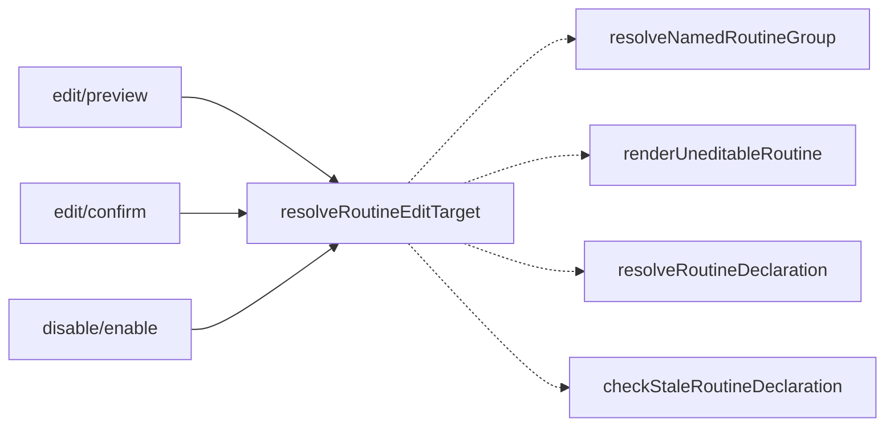
```mermaid
graph LR
  P[edit/preview] --> R[resolveRoutineEditTarget]
  C[edit/confirm] --> R
  T[disable/enable] --> R
  R -.-> G[resolveNamedRoutineGroup]
  R -.-> U[renderUneditableRoutine]
  R -.-> D[resolveRoutineDeclaration]
  R -.-> S[checkStaleRoutineDeclaration]
```

---

### github-backoff-ledger — the ADR-0083 rate-limit window as a testable module · Strong · score 22/25

**Files**
- `src/daemon.ts:563` — `githubBackoffUntilByToken`, a `Map` declared inside the ~1,500-line `startDaemon`
- `src/daemon.ts:736-755` (`isGithubBackoffActive`), `:757-781` (`engageGithubBackoff`), `:785-797` (`isProjectPollable`), `:799-807` (`partitionProjectsForPolling`)
- Eight call sites: `:835`, `:854`, `:959`, `:974`, `:1358`, `:1379`, `:1408`, `:1433`
- Already-extracted pure half: `src/issue-polling.ts:1781` (`backoffUntil`), `:1800` (`rateLimitedTokens`)
- **File-count estimate**: ~3

**Score 22/25** — leverage 4, locality 5, blast radius 2, heat 5

- *Leverage 4*: eight call sites stop reaching past a seam that has no interface at all today — four
  closures over a `Map` buried mid-function.
- *Locality 5*: the window lifetime, the transition-only logging rule and the unresolvable-token
  exemption become a one-file edit.
- *Blast radius 2*: the pure policy half already lives in `src/issue-polling.ts`, so a clean
  extraction is "a module and its direct callers" — `daemon.ts`, a new module, and its test — not a
  single contained file. This justification is what settles the tie below; see *Pick*.
- *Heat 5*: `src/daemon.ts` took 28 of the last 120 commits.

**Problem.** ADR-0083's rule — one credential's rate-limit window is shared by issue polling, the
fire-and-forget pull-request poll, and the fresh-claim boundary re-check; the window is logged only
on transition; an unresolvable token is always pollable — lives entirely in closures over a mutable
`Map` declared in the middle of `startDaemon`. There is no way to ask "does a second rate-limit
report inside an active window re-log?" without booting a daemon and faking GitHub.
`partitionProjectsForPolling` is additionally a one-line `filter` wrapper: interface ≈
implementation.

**Deletion test: concentrates.** Delete a `createGithubBackoffLedger` and the `Map` plus four
closures return to `startDaemon`, and the policy becomes unreachable from a unit test again. The
eight call sites already speak in exactly the three verbs the ledger would expose, so nothing moves
outward.

**Solution.** `createGithubBackoffLedger({ logger, now })` returning `{ isActive, engage, isPollable }`.

**Benefits.** *Leverage*: `startDaemon` sheds a mutable ledger. *Locality*: one home for the window
policy. *Test surface*: the largest single gain of any candidate this run — the transition-only
logging rule and the `nowMs === until` boundary become unit-testable for the first time.

**Before**

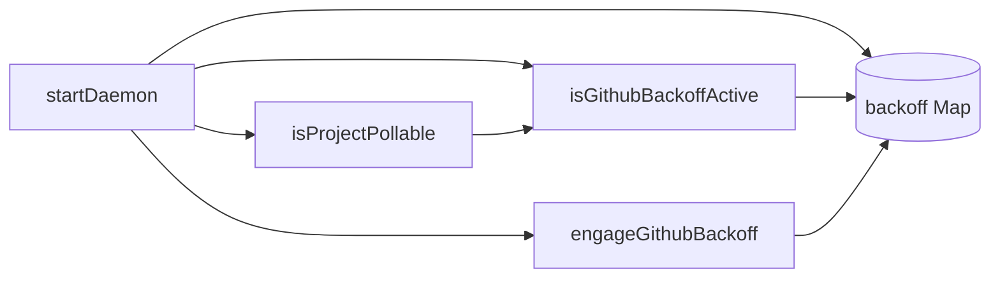
```mermaid
graph LR
  S[startDaemon] --> M[(backoff Map)]
  S --> A[isGithubBackoffActive]
  S --> E[engageGithubBackoff]
  S --> P[isProjectPollable]
  A --> M
  E --> M
  P --> A
```

**After**

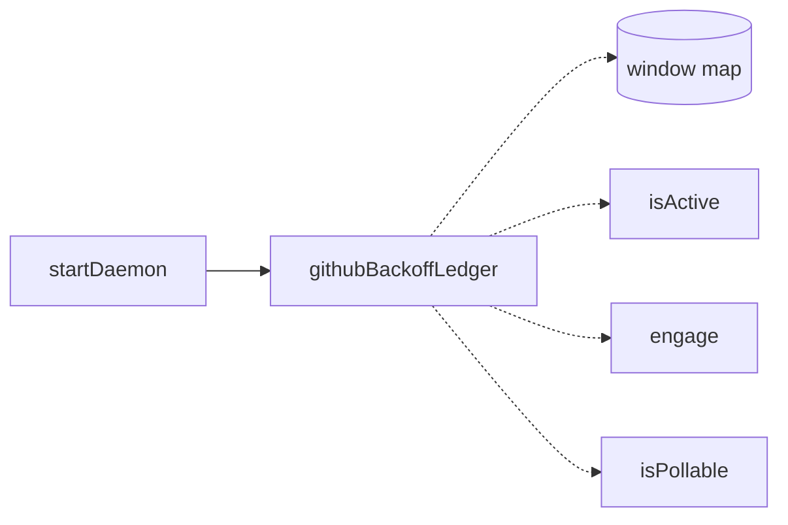
```mermaid
graph LR
  S[startDaemon] --> L[githubBackoffLedger]
  L -.-> M[(window map)]
  L -.-> A[isActive]
  L -.-> E[engage]
  L -.-> P[isPollable]
```

---

### dispatch-provider-resolution — one resolver for the state-provider override · Worth exploring · score 21/25

**Files**: `src/lifecycle/run-controller.ts:1143-1190`, `:3040-3080`, `:3480-3510`, `:3653-3670`;
rule restated at `src/doctor.ts:1750-1756` and as prose on `RetryPayload` at `run-controller.ts:428-440`.
**File-count estimate**: ~3.

**Score 21/25** — leverage 4 (four dispatch paths converge), locality 4, blast radius 2 (a module and
its direct callers), heat 5 (hottest file in the tree).

**Problem.** "The provider for this dispatch is the target state's `action.provider` when it names
one, else the Project default" is written out twice, deliberately omitted twice, and documented a
third time as a comment. The `provider_command_missing` / `provider_not_registered` failure pair —
including the `(providersConfig as Partial<…>)[name]?.command` cast — is restated four times.
`ContinuationPayload` carries no provider at all, so the hazard the `RetryPayload` comment names is
unguarded on the continuation path.

**Deletion test: concentrates.** A `resolveDispatchProvider(providersConfig, project, state?)`
returning `{ provider, providerCommand, providerName } | { failure }` absorbs the override rule, the
cast and both failure reasons; the omitting sites must then pass `undefined` explicitly, turning a
silent omission into a stated decision.

**Benefits.** *Locality* on the FSM's provider-selection rule; *test surface* — the continuation path
is currently unpinned (`tests/daemon-dispatch.test.ts:2727` and `:3195` cover only the honouring half).

**Before**

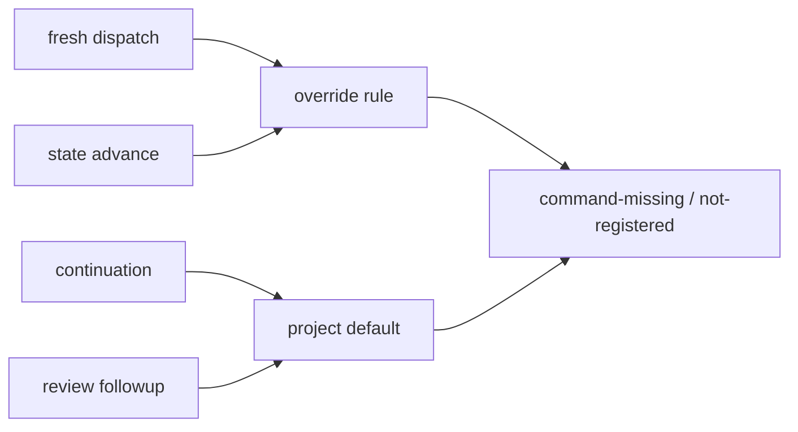
```mermaid
graph LR
  F[fresh dispatch] --> O[override rule]
  A[state advance] --> O
  C[continuation] --> D[project default]
  R[review followup] --> D
  O --> X[command-missing / not-registered]
  D --> X
```

**After**

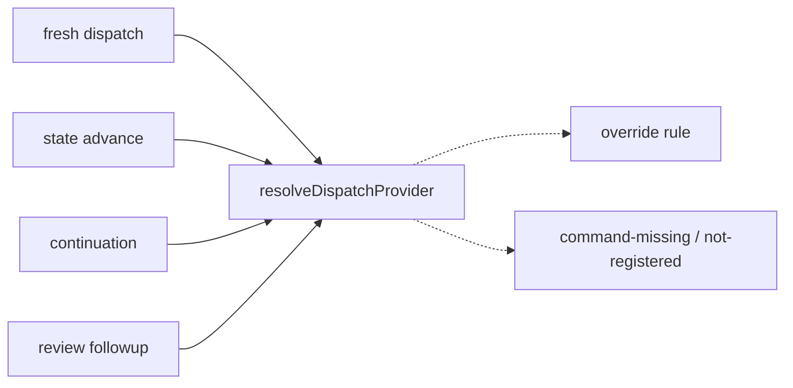
```mermaid
graph LR
  F[fresh dispatch] --> V[resolveDispatchProvider]
  A[state advance] --> V
  C[continuation] --> V
  R[review followup] --> V
  V -.-> O[override rule]
  V -.-> X[command-missing / not-registered]
```

---

### worktree-registration-probe — one owner for the worktree-registry grammar · Worth exploring · score 21/25

**Files**: `src/workspace.ts:584-615` (`worktreeListLines`, `parseWorktreeEntries`), `:694-709`
(`isWorktreeRegistered`), `:711-733` (`canonicalizePath` + its rationale comment), `:959`
(the already-exported `git`); `src/routines/workspace.ts:274-292`;
`src/routines/workspace-retention.ts:215-242`, `:256-259`;
`src/issue-workspace-retention.ts:161-178`, `:192-195`.
**File-count estimate**: ~5.

**Score 21/25** — leverage 4, locality 5, blast radius 2, heat 4.

**Problem.** "Is this path a registered linked worktree of this cache?" is answered four times, each
re-parsing `git worktree list --porcelain` by hand. The path-comparison rule is spelled out in prose
at `src/workspace.ts:711-716` — *"`git worktree add` records the resolved real path… Both sides must
therefore be canonicalized before comparison"* — and only `isWorktreeRegistered` obeys it; the other
three use bare `path.resolve`. `src/workspace.ts:959` already **exports** `git`, yet both retention
modules define their own private four-line copy. `src/issue-workspace-retention.ts` was created three
days ago (#794) by cloning `src/routines/workspace-retention.ts`, so the duplication is actively
reproducing.

> **Latent correctness finding, deliberately not fixed here.** On a host whose workspace root is
> reached through a symlink — a case `workspace.ts` explicitly handles — the three `path.resolve`
> sites conclude "not registered" for a worktree git still has registered, and the retention pass
> then marks the row pruned while the worktree survives. That is a **correctness item, not a
> deepening candidate**, the same class as the backlog's `probe-shutdown-drift`. It is recorded here
> and in the backlog so the finding survives this run; fixing it is a human's call.

**Deletion test: concentrates.** A `worktreeRegistry(cachePath)` owning the porcelain grammar, the
canonicalization rule and the branch-ref association is knowledge with no home today; deleting it
restores four copies of the parse and two incompatible path-comparison rules.

**Before**

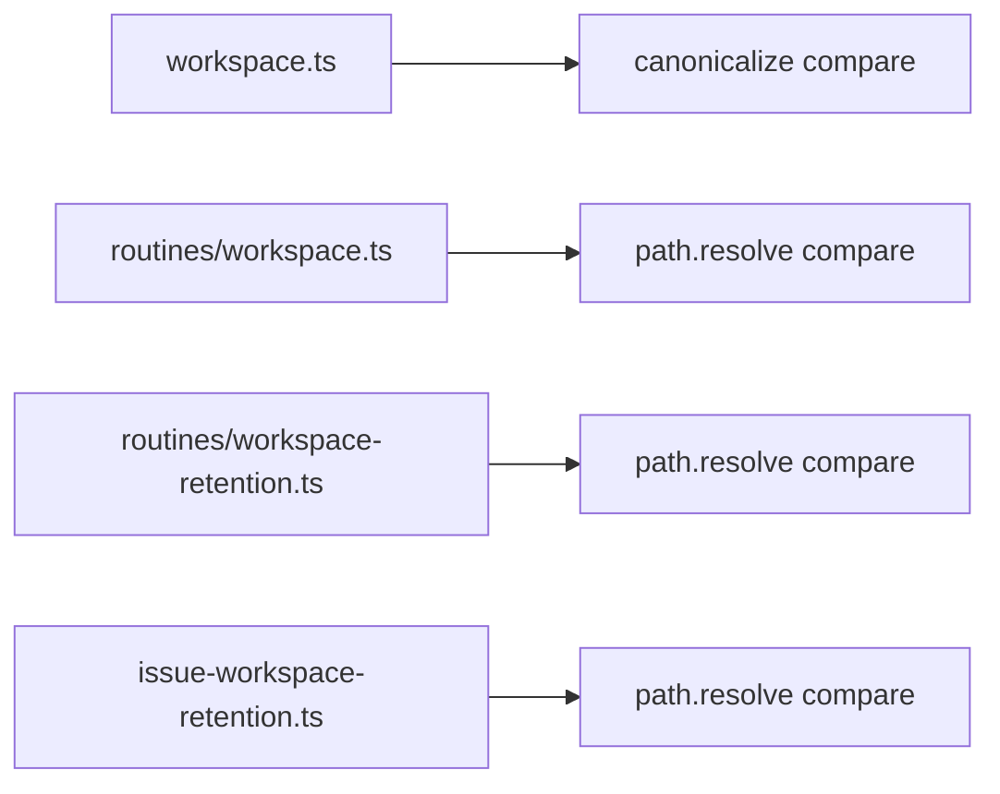
```mermaid
graph LR
  W[workspace.ts] --> C[canonicalize compare]
  RW[routines/workspace.ts] --> R1[path.resolve compare]
  RR[routines/workspace-retention.ts] --> R2[path.resolve compare]
  IR[issue-workspace-retention.ts] --> R3[path.resolve compare]
```

**After**

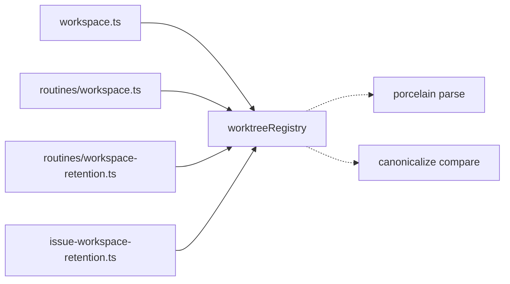
```mermaid
graph LR
  W[workspace.ts] --> REG[worktreeRegistry]
  RW[routines/workspace.ts] --> REG
  RR[routines/workspace-retention.ts] --> REG
  IR[issue-workspace-retention.ts] --> REG
  REG -.-> P[porcelain parse]
  REG -.-> C[canonicalize compare]
```

---

### service-config-schema-twin — finish the migration into `config-schemas.ts` · Worth exploring · score 21/25

**Files**: `src/doctor.ts:286-462`, `src/reload.ts:174-474` (and `:1117-1133`),
`src/config-schemas.ts:1-125`. **File-count estimate**: ~3.

**Score 21/25** — leverage 4, locality 5, blast radius 2, heat 4.

**Problem.** The Service Config's grammar is defined twice, in the same order, under the same names.
`serviceRoutineSchema` (39 lines, two custom ADR-0069 error messages) and `rejectPerProjectRoutines`
are byte-identical duplicates. It has already drifted: `reload.ts:426-429` types `state.root` as
`z.string().min(1)` with no `.passthrough()` where `doctor.ts:435-441` uses `pathStringSchema` with
`.passthrough()`, and `reload.ts:441-448` knows `global.pressure` (ADR 0088) where `doctor.ts` does
not. `symphonika doctor` therefore answers a different question from the reloader — exactly what
doctor exists to pre-empt. `src/config-schemas.ts` already exists as the sanctioned owner and stops
halfway.

**Deletion test: concentrates.** `config-schemas.ts` is already the owner by construction — deleting
it today restores two copies of five schemas.

**Before**

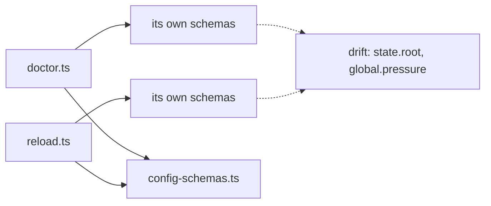
```mermaid
graph LR
  D[doctor.ts] --> DS[its own schemas]
  R[reload.ts] --> RS[its own schemas]
  D --> CS[config-schemas.ts]
  R --> CS
  DS -.-> X[drift: state.root, global.pressure]
  RS -.-> X
```

**After**

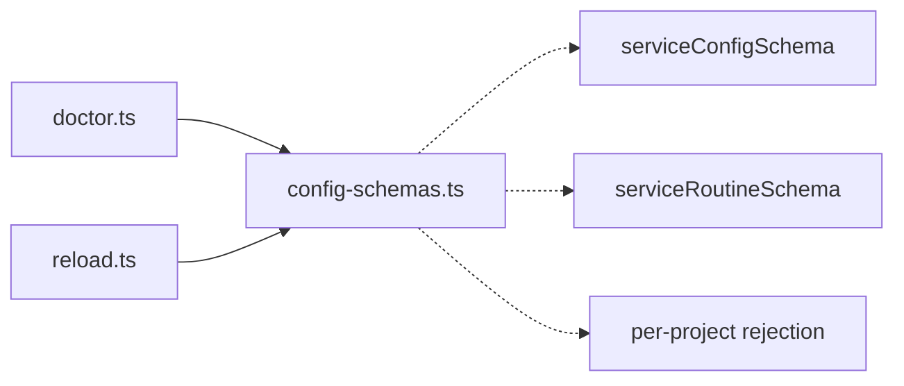
```mermaid
graph LR
  D[doctor.ts] --> CS[config-schemas.ts]
  R[reload.ts] --> CS
  CS -.-> S[serviceConfigSchema]
  CS -.-> T[serviceRoutineSchema]
  CS -.-> P[per-project rejection]
```

---

### firing-lifecycle-window — give the firing-side terminal set the home the run side already has · Worth exploring · score 21/25

**Files**: terminal-set restatements at `src/http/pages.ts:306-310`, `src/http/app.ts:1166-1170`,
`src/daemon.ts:1596-1608`, inline arrays at `src/cli.ts:1492`, `:1695`, `:3073`; window derivations at
`src/http/pages.ts:6369-6376`, `src/cli.ts:1486-1493`, `:1689-1696`; the precedent at
`src/run-store.ts:55-72` (`TERMINAL_RUN_STATES` + `TERMINAL_RUN_STATES_SQL_LIST`).
**File-count estimate**: ~5.

**Score 21/25** — leverage 4, locality 5, blast radius 3 (one set used across the repo), heat 5.

**Problem.** `TERMINAL_RUN_STATES` is exported *with* a comment warning that "a copy that drifts
would have each of them disagree about whether a Run is still moving", and a derived SQL list so the
SQL cannot drift. The Routine-Firing side of the same vocabulary has no such home: its terminal set
exists six times and the started/ended window derivation three times, and `daemon.ts:1596-1602`
hand-rolls its own set rather than importing one.

**Deletion test: concentrates** — `run-store.ts` already owns `RoutineFiringState` and has the exact
precedent to follow.

**Before**

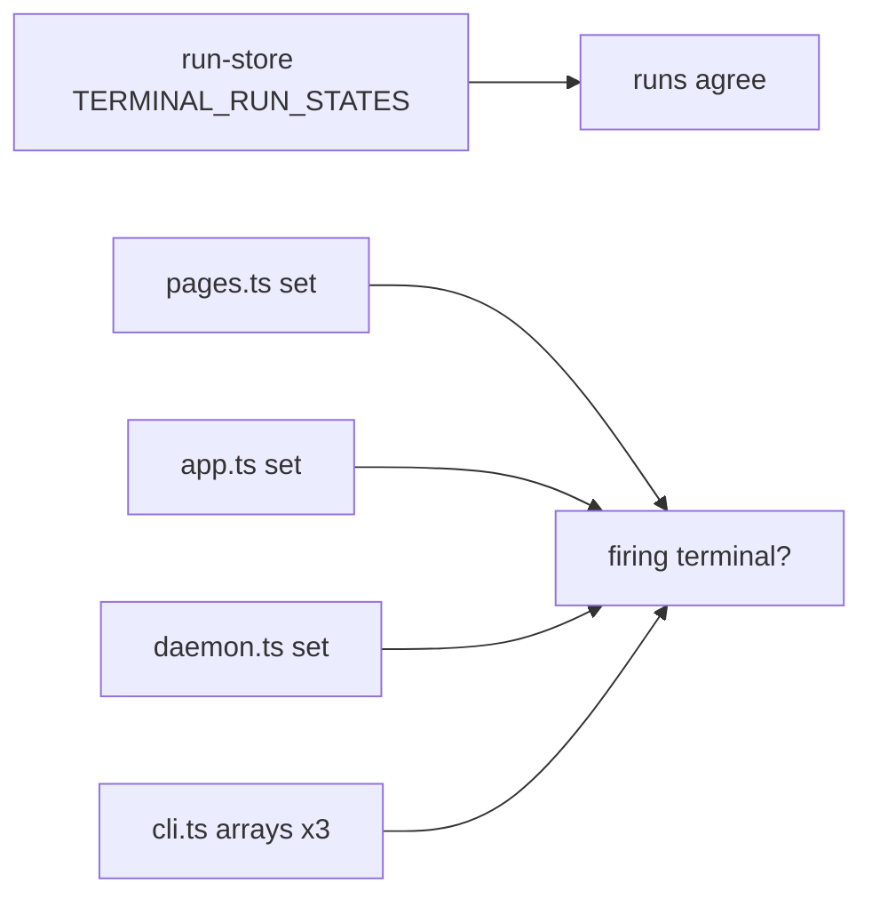
```mermaid
graph LR
  RS[run-store TERMINAL_RUN_STATES] --> OK[runs agree]
  P[pages.ts set] --> F[firing terminal?]
  A[app.ts set] --> F
  D[daemon.ts set] --> F
  C[cli.ts arrays x3] --> F
```

**After**

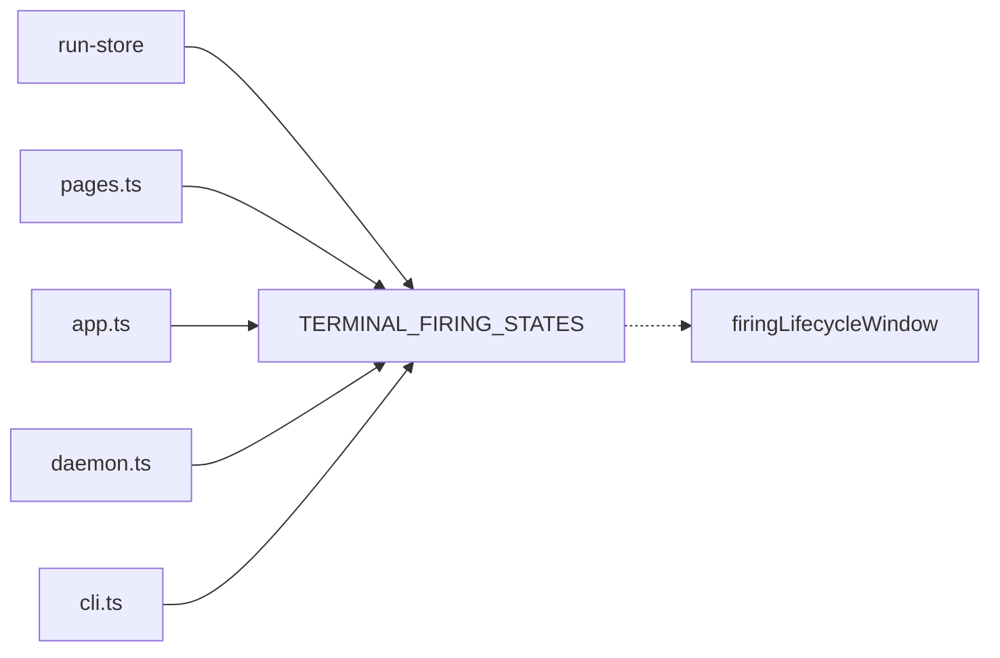
```mermaid
graph LR
  RS[run-store] --> TF[TERMINAL_FIRING_STATES]
  P[pages.ts] --> TF
  A[app.ts] --> TF
  D[daemon.ts] --> TF
  C[cli.ts] --> TF
  TF -.-> W[firingLifecycleWindow]
```

---

### pre-provider-terminal-write-trio — one owner for the pre-provider terminal write · Speculative · score 20/25

**Files**: `src/lifecycle/run-controller.ts:1258-1391` (`failFreshDispatchBeforeProvider`),
`:3203-3308` (`failScheduledRunBeforeProvider`), `:3310-3414` (`recordStateAdvanceTerminalTarget`).
**File-count estimate**: ~3.

**Score 20/25** — leverage 3, locality 4, blast radius 1, heat 5.

**Problem.** Three siblings restate the same seven-beat sequence for "record a Run that dies before
any provider launches": shutdown gate → best-effort `sym:claimed` add with a per-site `phase` → a
second shutdown gate → create the row → `recordTerminalReason` + `updateRunState` → log →
`claimLabels.applyTerminal({fsmContinuing:false, willRetry:false})`. The invariant restated rather
than owned is that *a pre-provider terminal write is a claim boundary*. Two of the three hold
`dispatchMutex` (`:1282`, `:3340`, each with a comment saying it mirrors the other);
`failScheduledRunBeforeProvider` does not.

**Deletion test: concentrates for the tail, moves for the head.** The shared stretch is genuinely the
*tail* (row write → terminal reason → state → log → `applyTerminal`); the heads diverge on real
policy — claim guard and suppression check in one, mutex in two of three, and three different
shutdown reactions (throw-and-roll-back vs cancel-parent-and-log vs cancel-parent-silently). A seam
drawn around the whole sequence would push three of seven beats into per-caller hooks, which is the
`routine-firing-settlement-sequence` failure mode. **Leverage held at 3 for that reason**, which is
what keeps it below the pick despite sitting on the hottest file with the lowest blast radius.

**Before**

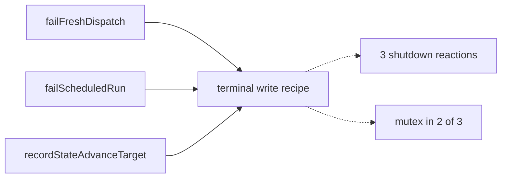
```mermaid
graph LR
  F[failFreshDispatch] --> T[terminal write recipe]
  S[failScheduledRun] --> T
  A[recordStateAdvanceTarget] --> T
  T -.-> H1[3 shutdown reactions]
  T -.-> H2[mutex in 2 of 3]
```

**After**

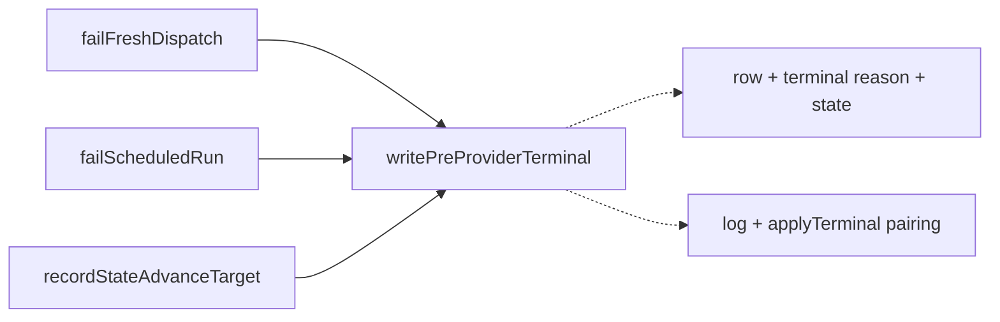
```mermaid
graph LR
  F[failFreshDispatch] --> W[writePreProviderTerminal]
  S[failScheduledRun] --> W
  A[recordStateAdvanceTarget] --> W
  W -.-> R[row + terminal reason + state]
  W -.-> L[log + applyTerminal pairing]
```

---

### workflow-reload-degradation-policy — one answer to "the contract will not load" · Worth exploring · score 20/25

**Files**: `src/lifecycle/run-controller.ts:2911-2958` (reload threw), `:2959-2992` (reload returned
errors), `:4611-4638` (`runAttemptLifecycle` silently skips the FSM overlay), duplicated
`LoadedWorkflow` literal at `:5384-5399` / `:5440-5451`. **File-count estimate**: ~2.

**Score 20/25** — leverage 3, locality 4, blast radius 1, heat 5.

**Problem.** One question — what happens when the Workflow Contract will not load at dispatch time? —
has three different answers in one file. The two blocks inside `executeStateAdvance` are structurally
identical, differing only in how the reason string is built and one word in the log message ("reload
failed" at `:2953` vs "reload invalid" at `:2989`). `runAttemptLifecycle` answers by doing nothing.
SPEC §5.2's "a transient malformed edit must not fail an otherwise valid mid-walk run" is owned by
no one. Worth sequencing *after* `dispatch-provider-resolution`, which deletes the provider-identity
re-derivation at `:2926-2930` and `:2963-2967` outright.

**Before**

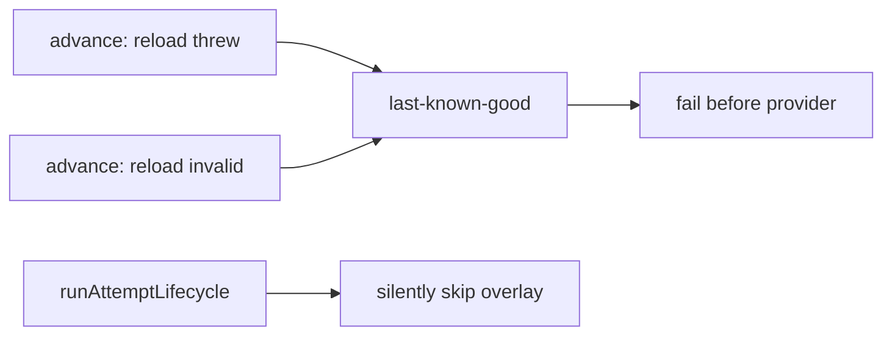
```mermaid
graph LR
  T[advance: reload threw] --> LKG[last-known-good]
  E[advance: reload invalid] --> LKG
  R[runAttemptLifecycle] --> N[silently skip overlay]
  LKG --> FL[fail before provider]
```

**After**

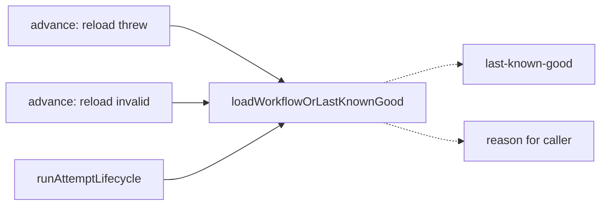
```mermaid
graph LR
  T[advance: reload threw] --> L[loadWorkflowOrLastKnownGood]
  E[advance: reload invalid] --> L
  R[runAttemptLifecycle] --> L
  L -.-> LKG[last-known-good]
  L -.-> FL[reason for caller]
```

---

### agent-state-prompt-reference — one enumeration of where an agent state's prompt lives · Worth exploring · score 20/25

**Files**: `src/workflow/fsm-expansion.ts:152-175` (`validateExpandedWorkflowReferences`), `:189-215`
(`collectWorkflowPromptConventionWarnings`), `src/lifecycle/run-controller.ts:4709-4732`.
**File-count estimate**: ~3.

**Score 20/25** — leverage 4, locality 5, blast radius 2, heat 3.

**Problem.** Three places independently enumerate the prompt file each agent state points at, each
guarding `source.kind === "raw_fsm"`, computing `path.dirname(workflowPath)` and resolving against it.
The "prompt not found" message is duplicated verbatim (`fsm-expansion.ts:171`,
`run-controller.ts:4728`), and the guards have already drifted — `fsm-expansion` tests
`typeof action.prompt !== "string"`, `run-controller` tests `!== undefined`. A change to prompt
resolution would silently desynchronize validation from execution: the validator passes, the run
fails at attempt time. Held at heat 3 — `fsm-expansion.ts` took 6 of the last 120 commits.

**Before**

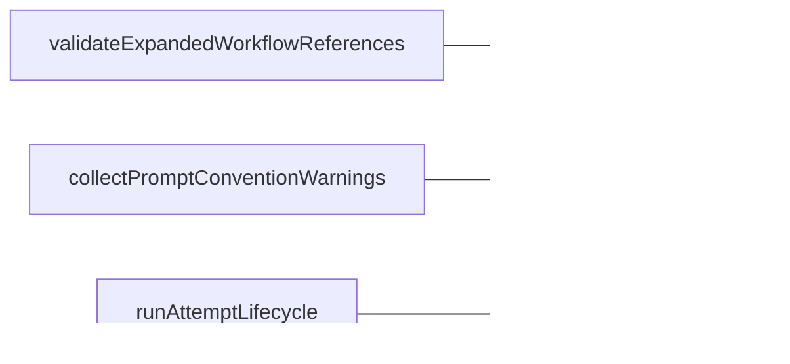
```mermaid
graph LR
  V[validateExpandedWorkflowReferences] --> P[resolve prompt path]
  W[collectPromptConventionWarnings] --> P2[resolve prompt path]
  R[runAttemptLifecycle] --> P3[resolve prompt path]
```

**After**

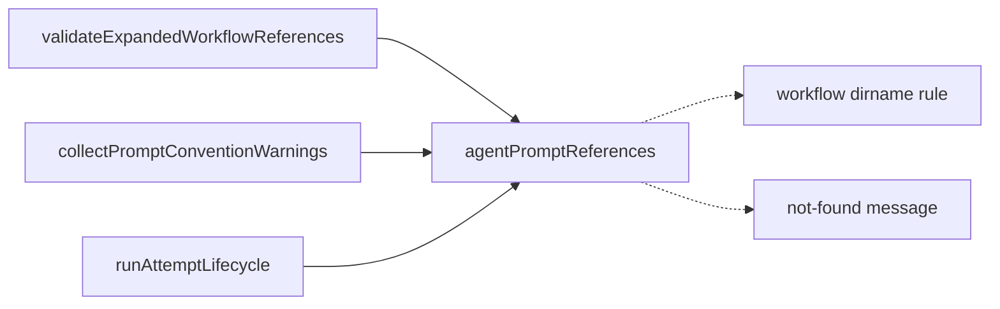
```mermaid
graph LR
  V[validateExpandedWorkflowReferences] --> A[agentPromptReferences]
  W[collectPromptConventionWarnings] --> A
  R[runAttemptLifecycle] --> A
  A -.-> D[workflow dirname rule]
  A -.-> M[not-found message]
```

---

### snapshot-search — shared shell for the two snapshot browse surfaces · Speculative · score 20/25

*(Re-scored from the existing backlog entry, 15/25 → 20/25, with the scope narrowed.)*

**Files**: `src/http/pages.ts:4024-4093` vs `:5044-5103`; `:4120-4139` vs `:5105-5126`;
`:4179-…` vs `:5128-…`. **File-count estimate**: ~2.

**Score 20/25** — leverage 3, locality 4, blast radius 1, heat 5.

**Problem.** The two polled-snapshot browse surfaces are parallel implementations of one rule set:
narrow `projectNames` by `filters.project` (four identical lines), lowercase-`q` substring match on
`title`, stamp `preRestart`, and sort by `projectName.localeCompare` then descending number. The
give-away that the shape was cloned rather than designed: **both input types declare `nowMs: number`
and neither body ever reads it** (`:4027`, `:5047`).

**Deletion test: concentrates, but only for the shell.** The *domain predicates* differ honestly
(verdict/label vs origin/tracking); pushing those into a shared driver as six callbacks would only
move complexity. The 2026-08-31 entry scored this 15/25 on exactly that borderline; narrowing the
seam to the shell and the four shared rules is what lifts it — **moved back toward viable, not
picked.**

**Before**

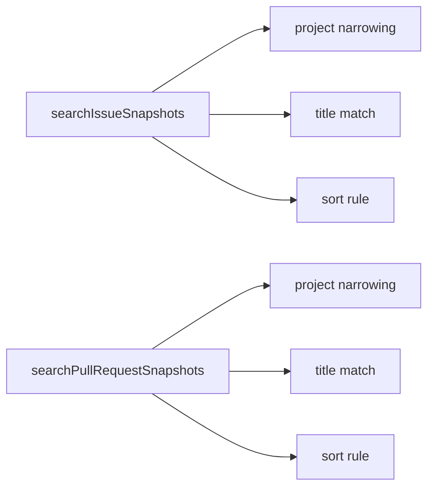
```mermaid
graph LR
  I[searchIssueSnapshots] --> N[project narrowing]
  I --> Q[title match]
  I --> S[sort rule]
  P[searchPullRequestSnapshots] --> N2[project narrowing]
  P --> Q2[title match]
  P --> S2[sort rule]
```

**After**

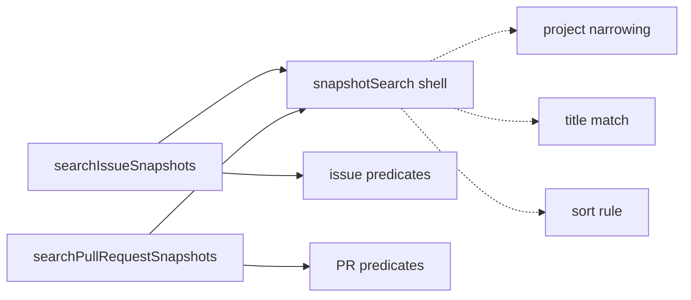
```mermaid
graph LR
  I[searchIssueSnapshots] --> SH[snapshotSearch shell]
  P[searchPullRequestSnapshots] --> SH
  SH -.-> N[project narrowing]
  SH -.-> Q[title match]
  SH -.-> S[sort rule]
  I --> IP[issue predicates]
  P --> PP[PR predicates]
```

---

### tracked-pull-request-column-projection — one column list for the Tracked PR readers · Speculative · score 19/25

**Files**: `src/run-store.ts:6136-6147`, `:6201-6209`, `:6230-6240`, `:6256-6266`; row type at
`:931-950`; mapper at `:8335-8350`. **File-count estimate**: ~1.

**Score 19/25** — leverage 2 (callers do the same work afterwards; the interface shrinks but nothing
gains depth), locality 5, blast radius 1, heat 5.

**Problem.** `mapTrackedPullRequestRow` owns the row→domain mapping, but the 17-column projection
that must feed it is hand-restated in four SQL string arrays, one alias-prefixed. Adding a column
means editing four SQL literals, the row type and the mapper; a miss throws only at runtime. The
table took four commits in the last twenty on this file.

**Deletion test: concentrates**, but it is a shared SQL string — closer to DRY than to depth, which
is what caps leverage at 2. Recorded because it is the cheapest item on the list, not because it is
the most valuable.

**Before**

```mermaid
graph LR
  A[byIssue] --> C1[17 columns]
  B[forRunChain] --> C2[17 columns aliased]
  D[listOpen] --> C3[17 columns]
  E[byProjectAndNumber] --> C4[17 columns]
  C1 --> M[mapTrackedPullRequestRow]
```

**After**

```mermaid
graph LR
  A[byIssue] --> K[trackedPullRequestColumns]
  B[forRunChain] --> K
  D[listOpen] --> K
  E[byProjectAndNumber] --> K
  K -.-> M[mapTrackedPullRequestRow]
```

---

### workspace-retention-prune-twin — one driver for the two retention passes · Speculative · score 17/25

**Files**: `src/routines/workspace-retention.ts:36-96`, `:244-274`;
`src/issue-workspace-retention.ts:24-91`, `:180-212`; admission comment at
`src/issue-workspace-retention.ts:134-138` ("Mirrors routines/workspace-retention.ts's
routineWorkspacePlan…"). **File-count estimate**: ~5 (`src/daemon.ts` and `src/cli.ts` consume the
report types).

**Score 17/25** — leverage 3, locality 4, blast radius 3, heat 4.

**Problem.** Two modules restate one rule: a retention pass selects rows by outcome-specific age
cutoff, honours `dryRun`, reclaims each worktree, marks the row pruned, and reports
`{candidates, pruned, failures}` where a per-row throw becomes a failure entry and never aborts the
pass. `exists`, `git`, `cutoff` and `isNodeError` are byte-identical in both files; the concurrency
comment is the same paragraph typed twice. Held below the pick by blast radius: the report types
reach `daemon.ts` and `cli.ts`. Sequences naturally *after* `worktree-registration-probe`, which
makes it nearly free.

**Before**

```mermaid
graph LR
  R[pruneRoutineWorkspaces] --> L1[select, dryRun, reclaim, mark, report]
  I[pruneIssueWorkspaces] --> L2[select, dryRun, reclaim, mark, report]
  L1 -.-> H1[exists/git/cutoff/isNodeError]
  L2 -.-> H2[exists/git/cutoff/isNodeError]
```

**After**

```mermaid
graph LR
  R[pruneRoutineWorkspaces] --> D[retention driver]
  I[pruneIssueWorkspaces] --> D
  D -.-> L[select, dryRun, reclaim, mark]
  D -.-> RP[never-abort report shape]
```

---

### routine-name-uniqueness-ledger — one owner for the ADR-0069 name reservation · Speculative · score 18/25

**Files**: `src/doctor.ts:1563-1708`, `src/reload.ts:1517-1629`; admission comment at
`src/doctor.ts:1579-1583`. **File-count estimate**: ~3.

**Score 18/25** — leverage 3, locality 4, blast radius 2, heat 4.

**Problem.** ADR-0069's "a routine name is globally unique across the service, and a broken
declaration still reserves the name it recovered" is implemented twice, with the same six-line
explanatory comment pasted into both. They have already diverged on *which* name an invalid file
reserves: `reload.ts:1567-1575` reserves the carried-forward previous name when one exists;
`doctor.ts:1621-1633` has no carry-forward concept and always reserves `partialName`. For a config
with one broken file whose name changed in the broken edit, `doctor` and the reloader emit different
duplicate-name verdicts.

**Before**

```mermaid
graph LR
  D[doctor validateServiceRoutines] --> S1[seenNames + reserve rule]
  R[reload readRoutineDeclarations] --> S2[seenNames + reserve rule]
  S1 -.-> X[diverge on partialName vs carried-forward]
  S2 -.-> X
```

**After**

```mermaid
graph LR
  D[doctor validateServiceRoutines] --> L[RoutineNameLedger]
  R[reload readRoutineDeclarations] --> L
  L -.-> RR[reserve / reserveRecovered]
  L -.-> MSG[duplicate message]
```

---

### daemon-retention-pass-epilogue — one swallow-and-log discipline for automatic retention · Speculative · score 17/25

**Files**: `src/daemon.ts:1224-1254` (the two mutex-gate/`finally`-release blocks), `:3077-3110`
(`runAutomaticRoutineWorkspaceRetention`), `:3112-3145` (`runAutomaticIssueWorkspaceRetention`).
**File-count estimate**: ~1.

**Score 17/25** — leverage 2 (only two call sites; the interface would shrink but callers do the same
work), locality 4, blast radius 1, heat 5.

**Problem.** Two 33-line functions differ only in the prune fn, the report id field and three log
strings. The invariant restated rather than owned: an automatic retention pass never throws into the
tick — pruned ids at `info`, each failure at `warn` with `{err, <id>, workspacePath}`, a whole-pass
throw at `error`. Risk is near zero but leverage is genuinely modest.

**Before**

```mermaid
graph LR
  T[tick] --> RA[runAutomaticRoutineRetention]
  T --> IA[runAutomaticIssueRetention]
  RA -.-> S1[swallow + log schema]
  IA -.-> S2[swallow + log schema]
```

**After**

```mermaid
graph LR
  T[tick] --> P[runAutomaticRetentionPass]
  P -.-> S[swallow + log schema]
  P -.-> RA[routine prune fn]
  P -.-> IA[issue prune fn]
```

---

## Dropped

Hard filters, per `references/ranking.md`. All 14 pre-existing `dropped` entries were re-checked
against `HEAD` before the filters ran (ranking.md reconciliation step 4): every named module still
exists, and only `src/daemon.ts` changed since the last firing (#793, #794), neither commit touching
the dropped clusters' structure. **No dropped entry moved back to `proposed`** — each was excluded on
leverage 1 or on not-behaviour-preserving, both structural judgements that three days of unrelated
commits do not flip.

| Candidate | Dropped because |
|---|---|
| `watchdog-sample-subject-store` | Leverage 2 and the guard genuinely differs per subject (run fences on `watchdog_generation`, firing on `state='running' and cancel_requested=0`) — threading it through as a closure moves the asymmetry rather than concentrating it. New this run; recorded so the next firing does not re-derive it. |
| `routine-firing-settlement-sequence` | Leverage 1 (pre-existing) — eight genuine divergences would land as per-path hooks. Re-checked: still applies. |
| `daemon-project-snapshot-persist` | Leverage 1 (pre-existing) — the row mappers share no columns. Re-checked: still applies. |
| `daemon-inflight-promise-registration` | Leverage 1 (pre-existing) — a 3-line helper, interface ≈ implementation. Re-checked: still applies. |
| `daemon-poll-pipeline-pair` | Leverage 1 (pre-existing) — extraction moves merge/carry-forward and suppression into per-side hooks. Re-checked: still applies. |
| `doctor-winning-assignment-family` | Not behaviour-preserving (pre-existing) — the four readers are deliberately different. Re-checked: still applies. |
| `probe-shutdown-drift` | Not behaviour-preserving (pre-existing) — unifying would give codex omp's SIGKILL escalation. Re-checked: still applies. |
| `wait-terminal-contract`, `blocked-terminalization-phase`, `raw-fsm-park-ownership`, `wait-state-predicate-split`, `mutate-and-publish`, `issue-polling-try-api-wrappers`, `github-pr-enum-normalizers`, `provider-json-field-accessors` | Leverage 1 or not behaviour-preserving (pre-existing). Re-checked against `HEAD`: modules unchanged, filters still apply. |

## Too large to automate

None this run. No candidate scored blast radius 5.

## Pick

**`routine-editor-target-prologue`, 22/25.** It tied on total with the runner-up **candidate**
`github-backoff-ledger`, also 22/25 — **within 1 point, so the pick was close and the runner-up is
the natural next firing.**

The tie was broken by the rubric's deterministic chain, first step only: **lower blast radius wins,
1 vs 2.** The blast-2 score for `github-backoff-ledger` is load-bearing, so it is justified
explicitly rather than asserted: the *pure* half of the ADR-0083 policy already lives in
`src/issue-polling.ts` (`backoffUntil:1781`, `rateLimitedTokens:1800`), so a clean extraction
necessarily spans `daemon.ts`, a new module and its test — "a module and its direct callers", band 2
— where the pick touches one production file plus a new module with no second module involved. Had
the chain needed to continue it would have gone to heat (both 5) and then to most-recently-touched.

The pick is also robust to generous re-scoring of the near-misses: `worktree-registration-probe` at a
charitable heat 5 reaches 22/25 and **still** loses the same tie-break at blast 2. No candidate below
22 can reach it without a two-axis revision.

Two further reasons the pick is the right one to take now, neither of which entered the score:

- The 2026-09-18 firing scored this candidate an exact 22/25 tie with `editor-save-outcome-epilogue`
  and deferred it **only** to avoid doubling blast on the same 3,000-line `registerPages` function in
  one PR. That PR (#789) merged 2026-09-18 (`2ceebe4`), so the deferral reason is discharged, and the
  backlog names this entry "the natural next firing". The persisted memory and today's fresh scan
  agree.
- The two landed neighbours make the shape a known quantity: #764 established the
  `{kind:"ok"} | {kind:"refused"}` discriminated-result house pattern, and #789 took the *respond*
  half of the same editor. This takes the *resolve* half.

**Scope fences, decided now so the diff cannot drift:**

- The seven `renderEditorPreview` confirm/preview/review URL-triplet sites (`pages.ts:1708`, `:1754`,
  `:1846`, `:1904`, `:1930`, `:2176`, `:2247`, `:2339`) are real adjacent friction with a confirmed
  drift, but folding them in doubles the diff past the ~3-file estimate. Out of scope; recorded in
  the backlog.
- `editAction` is a **caller-supplied parameter**, not derived inside the seam. It varies along URL
  topology — the toggle posts from the routine detail page (`/routines/:name{suffix}`), the text
  editor from the edit page (`/routines/:name/edit{suffix}`) — and that is genuine caller variance.
  Normalizing it would point the toggle's stale-declaration form at a URL that does not exist.
- `worktree-registration-probe`'s symlink defect is a correctness finding, recorded, not fixed here.

## Design

Three interfaces were produced in parallel by sub-agents, each briefed to be *radically* different:
ports-and-adapters free function (A), factory bound once in `registerPages` (B), and minimal pure
surface with HTTP kept out (C). All three were written down here before adjudication.

Common to all three: the seam returns a discriminated result (the `{kind:"ok"} | {kind:"refused"}`
house pattern from #764/#789), `editAction` is caller-supplied rather than normalized, and the
`ambiguous → 200` / `not_found → 404` rule moves inside.

### Design A — ports-and-adapters, exported free function

`src/http/routine-edit-target.ts` exporting
`resolveRoutineEditTarget<Declaration, Group>(context, {editActionPath, name, ports, runStore})`,
`async`, returning `{kind:"refused", response} | {kind:"ok", body, declaration, expectedSourcePath,
includeInactive, projectParam}`.

**Interface.** Six collaborators cross as a named `RoutineEditTargetPorts` table — `checkStale`,
`querySuffix`, `readField`, `renderRefusal`, `resolveDeclaration`, `resolveGroup` — declared once in
`pages.ts` as a module-scope `const` whose every value is a bare identifier (no wrapper lambdas).
Generic in `Group`/`Declaration` so `RoutineGroup` and `RoutineDeclarationView` stay unexported.
`runStore` is deliberately *outside* `ports` so the table can be a `const` rather than a closure.
`editAction` is an input-derived internal: the caller supplies the stem (`/routines/:name/edit` or
`/routines/:name`), the module appends `querySuffix(...)` because only it has read the body.

**Usage.** Each site: 33 lines → 12, five call arguments plus the shared port table. All three
handler tails stay byte-identical. `pages.ts` −63 lines; total `src/**` lines rise (~100-line module).

**Hides.** The three form-field names, the beat ordering, the 200/404 policy, the `editAction`
assembly, and that a stale refusal is a short-circuit.

**Caller must learn.** Context + name + runStore + refusal stem; the six-member port table; the
`refused`/`ok` contract; the five carried values; that only three body fields are consumed.

**Dependency strategy.** Everything crosses as an explicit port; nothing is closed over. No HTML in
the new module — `renderRefusal` returns a `string`, `checkStale` returns its own 409 `Response`.

**Trade-offs (its own words).** "Two of six ports are pure functions with no environment… a reviewer
is entitled to call it noise." "The interface is nearly as large as the implementation — ~55 lines of
types for ~35 lines of body." Its unit test stubs `querySuffix`/`readField`/`renderRefusal`, so the
`editAction` assertion is made against the test's own re-implementation of `routineQuerySuffix`
rather than the real rule. **Blast radius: 3 files.**

### Design B — factory bound once in `registerPages`

`createRoutineEditTargetResolver<Group, Declaration>(deps)` in `src/http/routine-edit-target.ts`,
returning `(context, {editAction, name}) => Promise<{kind:"refused", response} | {kind:"ok", target}>`.
Deliberately a sibling of `createSaveConfirmer` (`src/http/save-confirm.ts`), bound one line below it.

**Interface.** Five deps bound once — `layout`, `renderUneditable`, `resolveDeclaration`,
`resolveGroup`, `runStore` — all passed by reference, unchanged. Per-request payload is two fields.
`editAction` crosses as a **callback** `({includeInactive, projectParam}) => string`, the direct
sibling of `SaveConfirmation.renderInvalid`, because the query suffix depends on form fields only
the module has read. `checkStaleRoutineDeclaration` and `renderRoutineDeclarationChangedNotice` are
**moved into** the module, so it owns the ADR-0076 guard outright rather than calling it.

**Usage.** One 8-line binding in `registerPages`; each site 33 lines → 10. `pages.ts` ≈ −97 lines.
The confirm site additionally drops its third restatement of the `editAction` template.

**Hides.** The wire contract, the 200/404 rule, the beat ordering, the *whole* stale guard (its 409,
its title, its notice body, and that `expectedSourcePath === undefined` means "no guard"), and the
run-store plumbing.

**Caller must learn.** Four things: call it with `(context, {editAction, name})`; `editAction` is a
function of the body-derived values; on `!== "ok"` return `response` unexamined; on `"ok"` the target
carries `body`, `declaration`, `editAction`, and the three form-derived values.

**Trade-offs (its own words).** "Four of the five deps have exactly one implementation, forever. That
is indirection, not polymorphism." The binding "converts a unit-testable function into one reachable
only through `createHttpApp`" — and because four deps are unexported functions inside `pages.ts`, a
module-level test cannot construct them at all. Consequently its **first test is route-level and
explicitly a characterization test that runs green against HEAD**: "It is not red-by-construction."
The generics also break the `Parameters<Confirmer>[1]` trick the `save-confirm` precedent uses.
**Blast radius: 3 files.**

### Design C — minimal pure surface, HTTP kept out

`src/http/routine-resolution.ts` exporting a **synchronous, Hono-free**
`resolveRoutineEditTarget({body, name, reopenAt, runStore})` returning
`{kind:"ok", declaration, editAction, expectedSourcePath, includeInactive, projectParam, querySuffix}`
| `{kind:"refused", refusal}`, where `RoutineEditRefusal` is a **data** union carrying its own status:
`{kind:"ambiguous", groups, status:200}` | `{kind:"not_found", status:404}` |
`{kind:"declaration_changed", actualSourcePath, editAction, expectedSourcePath, status:409}`.

**Interface.** One dependency: `runStore`, narrowed to a two-method `RoutineDeclarationReader`
(`getRoutine`, `listRoutines`) that the real `RunStore` satisfies structurally with no adapter and no
cast. `editAction` crosses as `reopenAt: "editor" | "routine"` — two self-describing values rather
than a string, a path fragment, or a callback. HTTP re-enters at exactly one place: a 21-line private
`refuseRoutineEdit(context, name, refusal)` adapter left in `pages.ts`, because
`renderUneditableRoutine` reaches `renderRoutineDisambiguation`, a page shared with
`GET /routines/:name`.

**Usage.** Sites: 34 → 12, 34 → 19, 33 → 11. The caller writes `await context.req.parseBody()` itself
and one `return refuseRoutineEdit(...)` line. `pages.ts` ≈ −250 lines net.

**Relocations.** Six symbols move verbatim into the new module because the pure seam cannot call them
across a cycle: `RoutineGroup`, `groupRoutinesByName`, `resolveNamedRoutineGroup`,
`RoutineDeclarationView`, `resolveRoutineDeclaration`, `routineQuerySuffix`. All are re-imported by
`pages.ts`, which still names every one. `checkStaleRoutineDeclaration` is **deleted**, becoming the
`declaration_changed` arm. A second new module `src/http/form-fields.ts` holds
`readOptionalFormField`/`readRequiredFormField` verbatim, to avoid a cycle.

**Hides.** Everything A and B hide, plus `resolveRoutineDeclaration`'s valid-targets-first ordering,
`routineQuerySuffix`'s rules, and `encodeURIComponent` on every URL.

**Caller must learn.** Four fields in, `reopenAt`'s two values, one refusal line, six ordinary values
out. No status code, no URL template, no form-field name appears at a call site.

**Trade-offs (its own words).** Costs **+24 lines in `pages.ts` versus a `Response`-returning design**
— +3 across the call sites and the 21-line adapter. "Two places to change, not one": a fourth refusal
reason touches both the union and the adapter (though a `switch` + `never` default makes that a
compile error rather than a silent gap). The adapter itself is untested by the pure test. A third
file exists only for the form-field helpers. Its export list reads as nine symbols, six of which are
relocations — the *new* surface is one function and one type. **Blast radius: 4 files.**

**Test surface.** A table-driven `it.each` with four independently-failing cases, zero I/O — no
`mkdtemp`, no `new Hono()`, no `await`, no `response.text()`. Cases 3 and 4 are identical but for
`reopenAt`, so the only thing that can explain the differing `editAction` is the caller-variance
parameter; cases 1 and 2 together pin the *conditional*, which neither alone does. Red is produced by
creating the module with the real signature and a `throw new Error("not implemented")` body, wiring
the import, and watching the four named behaviours fail — not an import error.

### Adjudication

