# Architecture review — symphonika — 2026-09-22

**Scope**: Delta scan weighted by heat. The last full scan was the 2026-09-21 firing. Since then only
#799 (the `routine-editor-target-prologue` deepening, `src/http/pages.ts` plus a new module) and four
dependency bumps have landed, so the tree is structurally the one that firing scored. Commit counts
since 2026-08-20: `src/run-store.ts` (49), `src/lifecycle/run-controller.ts` (49),
`src/http/pages.ts` (43), `src/daemon.ts` (33), `src/routines/dispatcher.ts` (27),
`src/providers/codex.ts` (16), `src/http/app.ts` (16), `src/doctor.ts` (15), `src/cli.ts` (14),
`src/issue-polling.ts` (13), `src/providers/omp.ts` (12). One explore sub-agent walked these hot
spots. Its brief listed the 62 existing backlog slugs so it would report *fresh* friction rather
than re-derive known entries. It returned six new candidates, all verified below against `HEAD`
(`604d0b4`). The `proposed` entries were checked for whether their friction is still present, and
the 14 `dropped` entries were checked for whether their filter still applies.

**Branch**: `sym/symphonika/routine/refactor-audit/01M33370QG` — **adopted**. All four conditions
held: it is not the default branch, it has 0 unique commits ahead of `origin/main`, it has no
upstream, and it is unpublished on origin. It was not renamed, per the adopted-branch rule; the slug
is recorded here and in the backlog instead.

**Picked**: `github-backoff-ledger` — see the PR linked from `.architecture/backlog.md`

**Degradations**: none. `gh` is authenticated, and sub-agents and the advisor are available.

**Diagram convention**: solid edges are the **interface** a caller must learn; dashed edges are
inside the **implementation**, hidden behind the seam.

---

## Candidates

### github-backoff-ledger — the ADR-0083 rate-limit window as a testable module · Strong · score 22/25

**Files**
- `src/daemon.ts:563` — `githubBackoffUntilByToken`, a `Map` declared inside the ~1,500-line `startDaemon`
- `src/daemon.ts:733-755` (`isGithubBackoffActive`), `:757-781` (`engageGithubBackoff`), `:783-797` (`isProjectPollable`), `:799-807` (`partitionProjectsForPolling`)
- Eight call sites: `:835`, `:854`, `:959`, `:974`, `:1358`, `:1379`, `:1408`, `:1433`
- Already-extracted pure half: `src/issue-polling.ts:1781` (`backoffUntil`), `:1800` (`rateLimitedTokens`)
- **File-count estimate**: ~3 (`src/daemon.ts`, a new module, its test)

**Score 22/25** — leverage 4, locality 5, blast radius 2, heat 5. The score is unchanged from the
2026-09-21 firing, which ran over an identical `daemon.ts`.

- *Leverage 4*: eight call sites stop reaching past a seam that has no interface today — it is four
  closures over a `Map` buried in the middle of a function.
- *Locality 5*: the window lifetime, the transition-only logging rule and the unresolvable-token
  exemption would all become a one-file edit.
- *Blast radius 2*: "a module and its direct callers". The pure policy half already lives in
  `issue-polling.ts`, so a clean extraction spans `daemon.ts`, a new module and its test.
- *Heat 5*: `src/daemon.ts` took 33 commits since 2026-08-20, the fourth-hottest file.

**Problem.** ADR 0083 sets the rule. One credential's rate-limit window is shared by three
consumers: issue polling, the fire-and-forget pull-request poll, and the fresh-claim boundary
re-check. A window is logged only when it starts or ends. A clean result lets a window lapse but
never clears it. A token that cannot be resolved is always pollable. All of this lives in closures
over a mutable `Map` declared in the middle of `startDaemon`. There is no way to ask "does a second
rate-limit report inside an active window log again?" without booting a daemon and faking GitHub —
which is exactly what the ten rate-limit tests in `tests/daemon-issue-polling.test.ts`
(`:460`–`:1437`) do. `partitionProjectsForPolling` is also a one-line `filter` wrapper, so its
interface is as complex as its implementation.

**Deletion test: concentrates.** Delete a `createGithubBackoffLedger` and the `Map` plus four
closures go back into `startDaemon`, where the policy is out of reach of a unit test again. The eight
call sites already use the three verbs the ledger would expose, so nothing moves out to the callers.

**Solution.** A small module owning the per-token window map, the lapse-only expiry with its one-time
"elapsed" log, engage/extend with its transition-only "rate limited" log, and the
unresolvable-token-is-pollable rule. `startDaemon` holds one instance.

**Benefits.**
- *Leverage*: `startDaemon` stops carrying a mutable ledger.
- *Locality*: the ADR-0083 window policy has one home.
- *Test surface*: the transition-only logging rule, the `nowMs === until` boundary and the
  lapse-never-clear rule become unit-testable for the first time. The existing daemon-level tests
  stay as the integration pin.

**Before**

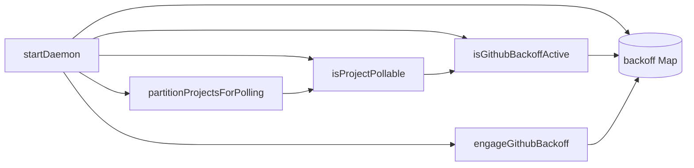

**After**

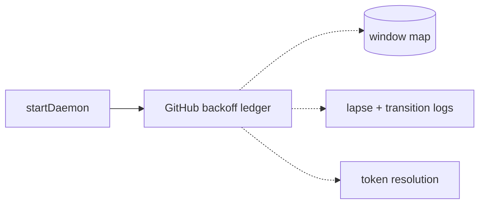

---

### omp-event-reducer — OMP frame mapping as a reducer, third sibling of #617/#627 · Strong · score 22/25

**Files**
- `src/providers/omp.ts:299-441` (`mapOmpFrame`)
- `:443-515` (`mapStateResponse`, `mapFailedResponse`, `mapPromptResponse`, `mapNegotiationResponse`)
- `:287-297` (`providerEventFromQueueItem`)
- The mapping-only state on `ActiveOmpRun` (`sessionId`, `assistantText`, `completedAssistantText`, `:29-37`)
- **File-count estimate**: ~3 (`omp.ts`, new `omp-events.ts`, new test)

**Score 22/25** — leverage 5, locality 4, blast radius 2, heat 4

- *Leverage 5*: it removes a whole class of test setup. Of the 96 tests in
  `tests/omp-provider.test.ts`, 33 call `runAttempt` against a fake OMP subprocess, and both recent
  mapping changes paid that cost (#780 for `agent_start`, #778 for prompt-response acceptance). This
  is scored the same as its landed siblings `codex-event-reducer` (#617) and `claude-event-reducer`
  (#627), both leverage 5.
- *Locality 4*: the carry-assistant-text-into-`turn_end` rule and the "clear once consumed" rule
  (comment at `:418-421`) move into one module.
- *Blast radius 2*: the same shape as the siblings — a provider module, a new module, a new test.
- *Heat 4*: `omp.ts` took 12 commits since 2026-08-20, with mapper lines touched 09-16 and 09-02.
  This is scored like the sibling codex heat.

**Problem.** Mapping state is mixed into `ActiveOmpRun`. Outside `:299-516`, `sessionId`,
`assistantText` and `completedAssistantText` appear only where they are declared and initialised,
which is the same clean condition that let `claude-event-reducer` take no injected dependencies. The
mapping rules can only be reached by spawning a subprocess.

**Deletion test: concentrates.** This is the third instance of a proven pattern.

**Solution.** `createOmpEventReducer()` returning per-frame-kind methods that yield `ProviderEvent`.
The reducer owns the session and assistant-text state. `promptDispatched` and `terminalEventSeen`
stay with the turn loop.

**Benefits.** Mapping becomes unit-testable. Landing this first would also turn `mapMatched` in
`omp-frame-read-loop` into a clean parameter.

**Before**

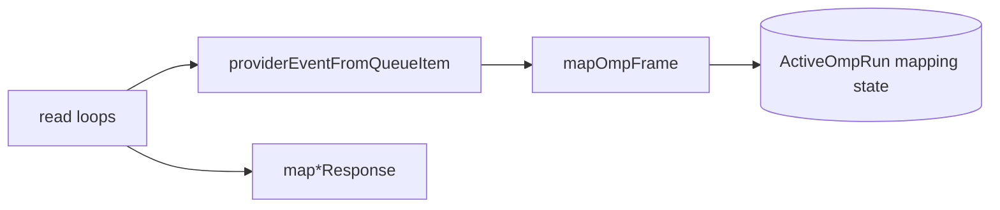

**After**

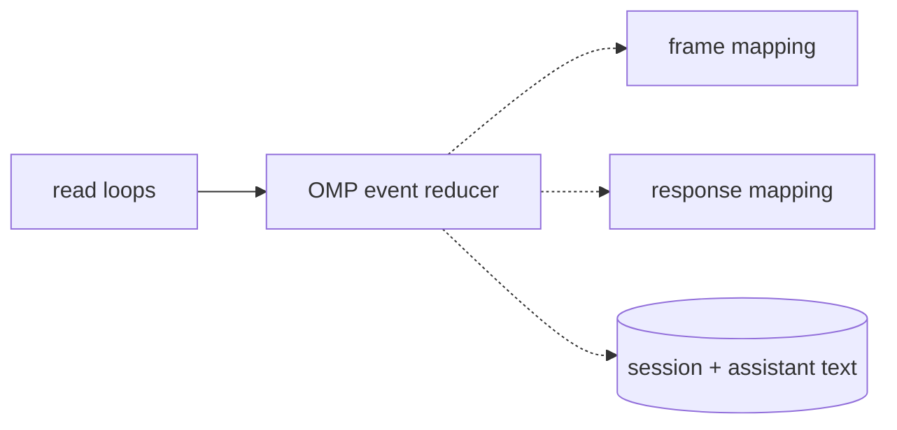

---

### cli-daemon-call-prologue — one owner for "is the right daemon reachable?" · Worth exploring · score 21/25

**Files**
- `src/cli.ts`: `poll-now` `:1039-1066`, `update` `:1095-1126`, `fire-now` `:1164-1191`, `cancel` `:1810-1836`, `adopt-pr` `:1887-1913`
- Helpers `fetchDaemonStatus` `:2037-2067`, `resolveDaemonUrl` `:2069-2079`; the `status` variant at `:876-880`
- **File-count estimate**: ~3

**Score 21/25** — leverage 4, locality 4, blast radius 1, heat 4

- *Leverage 4*: five commands shrink by the same ~25 lines.
- *Locality 4*: the endpoint-descriptor check and the state-root mismatch guard get one owner, within one file.
- *Blast radius 1*: contained to `cli.ts` plus a new module and its test.
- *Heat 4*: `cli.ts` took 14 commits since 2026-08-20.

**Problem.** Five commands each write out the same steps: resolve the state root, resolve the
daemon URL, and on a missing endpoint write `"<cmd> failed: daemon endpoint not found at <path>"`
through `writeErr` + `program.error`. Then they call `fetchDaemonStatus` (the state-root check) and
repeat the same two-line failure. Two variations are deliberate: `update` adds a second hint line,
and `status` falls back to an "unavailable" result instead of failing.

**Deletion test: concentrates** the daemon-reachability policy.

**Solution.** `connectToDaemon({stateRoot, explicitUrl, fetcher})` returning
`{kind:"connected", daemonUrl, status} | {kind:"unavailable", message}`, plus a commander adapter
for the two-line failure.

**Benefits.** A sixth daemon-backed command costs one call. The test surface barely changes, because
the CLI tests already inject a fetcher. That is why leverage is 4, not 5.

**Before**

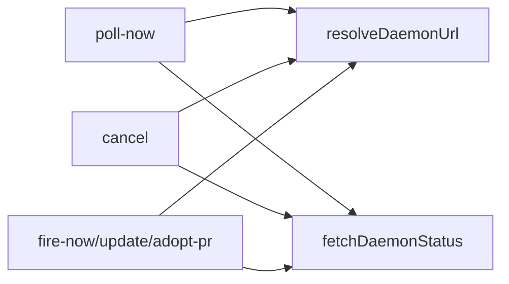

**After**

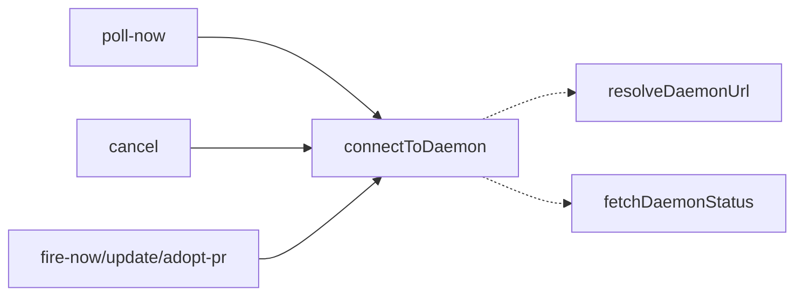

---

### daemon-operator-action-prologue — shared tracker+token resolution for operator mutations · Speculative · score 20/25

**Files**
- `src/daemon.ts`: `adoptPullRequest` `:1683-1726`, `mergePullRequest` `:2095-2132`, `writeIssueLabels` `:2198-2239`
- Helpers `verifySnapshotRepositoryBinding` `:2780-2800`, `sameGitHubRepository` `:2766-2774`
- **File-count estimate**: ~3

**Score 20/25** — leverage 3, locality 4, blast radius 1, heat 5

- *Leverage 3*: three call sites, but the shared stretch is only ~12 lines and it is not
  contiguous. Adopt interleaves the priority, workflow and adoptable-state checks between the
  tracker lookup and the token lookup. Merge and labels interleave `verifySnapshotRepositoryBinding`.
  Collapsing those steps into one call would reorder which error wins when more than one check
  fails. The seam that preserves behaviour is therefore two thin calls, which is close to
  interface ≈ implementation.
- *Locality 4*: the two refusal messages get one owner.
- *Blast radius 1*: `daemon.ts`, a new module, a test.
- *Heat 5*: `daemon.ts`.

**Problem.** The same `projects.X.tracker is not configured` / `projects.X.tracker.token is not
available` refusal pair and the same `{owner, repo, token}` assembly appear three times, and each
copy wraps the result in a different shape.

**Deletion test: mostly moves.** The ordering constraint limits the concentration to the messages.

**Correctness question, recorded, not fixed.** None of the three checks `project.disabled`, whereas
`repositoryForProject` (`src/pull-request-followup.ts:607-632`) does. An operator may therefore be
able to merge, label or adopt in a gracefully-disabled Project (ADR 0021). Whether that is intended
was not verified; a human should look.

**Before**

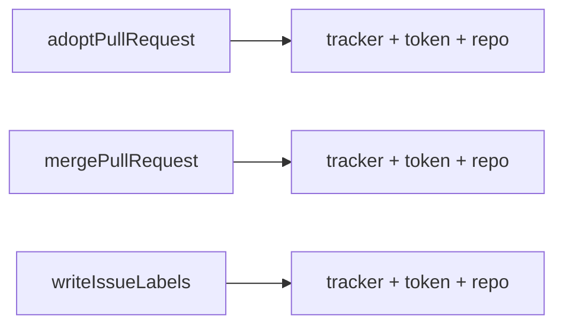

**After**

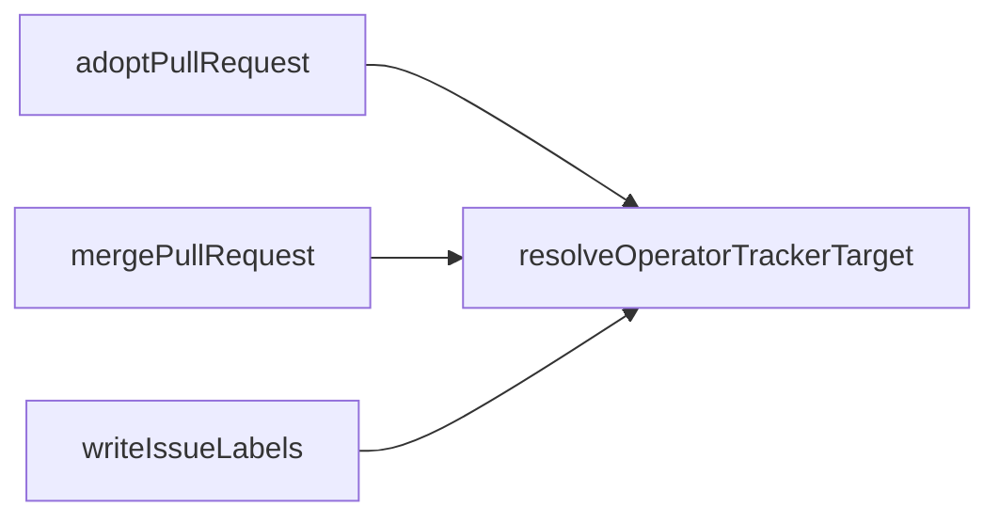

---

### operator-cancel-decision-twin — one cancel decision for daemon and fallback · Speculative · score 19/25

**Files**
- `src/daemon.ts:1609-1635` (`cancelViaUi`, the production path)
- `src/http/app.ts:392-396` (the fallback wiring), `:1172-1215` (`cancelRunInStore`)
- The same "Run or Firing?" discrimination at `app.ts:775-780` and `daemon.ts:2474-2488`
- **File-count estimate**: ~4

**Score 19/25** — leverage 3, locality 4, blast radius 2, heat 5

- *Leverage 3*: the main gain is that tests would exercise the real path.
- *Locality 4*: the Run-vs-Firing discrimination and the terminal guard would get one owner.
- *Blast radius 2*: spans `daemon.ts` and `app.ts`.
- *Heat 5*: `daemon.ts` and `app.ts`.

**Problem.** `createHttpApp`'s only production caller always passes `cancelRun`, so
`cancelRunInStore` never runs in production. Yet the tests that pin cancel behaviour
(`tests/http-app-runs.test.ts:1252-1355`, `tests/routine-surfaces.test.ts:301-370`, whose comment at
`:325` says so) exercise that fallback. The two paths differ in kind. The fallback finishes the
cancel immediately; the daemon path is cooperative (`markCancelRequested` + `requestCancel`).

**Deletion test: concentrates** the discrimination. The fallback's settlement semantics are a
separate question that needs a human: making the HTTP option required changes what those tests
exercise.

**Before**

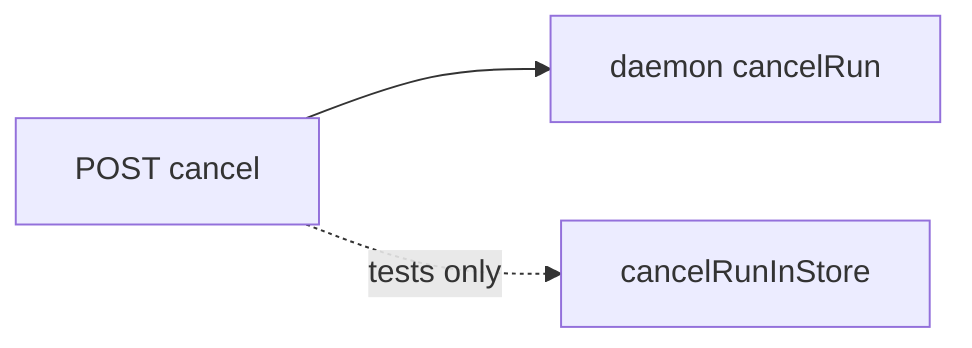

**After**

---

### cli-daemon-response-envelope — one envelope for daemon POST responses · Speculative · score 18/25

**Files**
- `src/cli.ts`: `postPollNow` `:2217-2253`, `postUpdateNow` `:2255-2295`, `postFireRoutine` `:2297-2345`, `waitForRoutineFiring` `:2347-2399`
- Response types declared twice (`cli.ts:127-160` against `app.ts:101-112`, `:176-182`, `:424-473`)
- **File-count estimate**: ~2

**Score 18/25** — leverage 3, locality 3, blast radius 1, heat 4

- *Leverage 3*: the four-step envelope collapses, but each call site keeps its own `read*`
  narrowing.
- *Locality 3*: partial.
- *Blast radius 1*.
- *Heat 4*: `cli.ts`.

**Problem.** The same four steps appear four times: fetch and catch, parse JSON and catch to
`undefined`, on `!ok` use `body.error` or fall back to `daemon returned HTTP N`, and on a bad body
report "unexpected X response". There is drift: `postCancel` ignores `body.error` on an unexpected
non-OK status. A 403 `{error}` from `requireAuthorizedMutation` therefore reads "daemon returned
HTTP 403" for `cancel` but shows the reason for `poll-now`. Best done after
`cli-daemon-call-prologue`.

**Deletion test: partly concentrates.**

**Before**

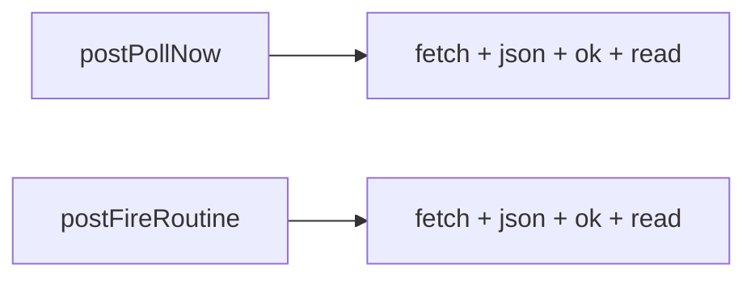

**After**

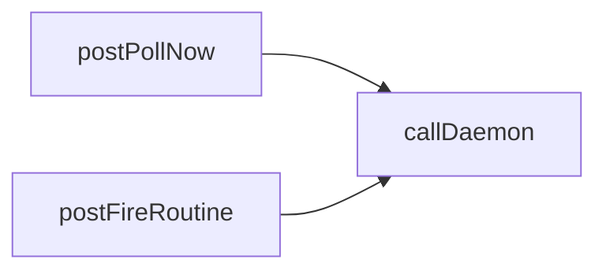

---

### Carried over, re-verified, not re-carded

These `proposed` entries were checked against `HEAD`. Their modules still exist and their friction is
still present. Their cards are in `2026-09-21-routine-editor-target-prologue.md` and earlier reports.
Line numbers in `pages.ts` after `:2119` shifted by about −177 because of #799. No friction changed.

| Slug | Score | Note this run |
|---|---|---|
| `dispatch-provider-resolution` | 21/25 | **Scope widened**: `src/routines/dispatcher.ts:325-341` (`fireRoutineNow`) and `:925-975` (`dispatchDueRoutines`) repeat the same `routine.provider ?? project.agent.provider` rule, `Partial<>` cast and not-registered/command-missing pair. The estimate grows from ~3 to ~4 files; the blast band stays 2. |
| `worktree-registration-probe` | 21/25 | Unchanged. The symlink correctness finding still stands. |
| `service-config-schema-twin` | 21/25 | Friction unchanged. **Caveat for whoever picks it**: ADR 0079 (`docs/adr/0079-github-releases-and-self-update.md:100-103`) records doctor's *top-level* Service Config schema as deliberately thinner (omits daemon-runtime-only keys), so the entry's `global.pressure` drift point is by design, not drift. Moving the shared *sub-schemas* into `config-schemas.ts` remains eligible; unifying the top-level schemas would contradict ADR 0079. |
| `firing-lifecycle-window` | 21/25 | Unchanged. The `pages.ts` sites moved with #799. |
| `pre-provider-terminal-write-trio`, `workflow-reload-degradation-policy`, `agent-state-prompt-reference`, `routine-firing-terminal-write`, `omp-frame-read-loop`, `routine-dispatch-refusal-ledger`, `run-chain-tree-walk-cte`, `handle-scheduled-dispatch-error`, `snapshot-search` | 20/25 | Unchanged. |
| remaining `proposed` entries | 15–19/25 | Unchanged. |

**Considered, not carded** (leverage 2 or lower, below the bar for a card):
- The run-detail progress signal: the `5 * 60_000` window and `enabled && sampledAt !== undefined`
  guard at `pages.ts:721-750` and `cli.ts:1614-1645`.
- The routine-firing launch tail: `routines/dispatcher.ts:407-462` and `:1122-1173`, only two sites.
- The env-backed token resolver copied three times: `lifecycle/token.ts:1-11`,
  `issue-polling.ts:1665-1681`, `doctor.ts:3170-3195`. The copies are identical and have not
  drifted, so this is plain de-duplication, the same class as the dropped
  `provider-json-field-accessors`.

## Dropped

| Candidate | Dropped because |
|---|---|
| `workflow-validation-entry-point-drift` | **Contradicts ADR 0076** (`docs/adr/0076-config-editors.md:95-99`: sharing the reload and editor validation paths is "deliberately not shared"), and the fix is **not behaviour-preserving**, because `workflow validate` would start failing on some inputs. New this run. |
| 14 pre-existing `dropped` entries | Re-checked against `HEAD` before the filters ran. The only source change since the 2026-09-21 firing is #799 (the `pages.ts` routine-editor prologue), which touches none of the dropped clusters. **No dropped entry moved back to `proposed`.** |

> **Contradicts ADR 0076.** Worth a human look, not necessarily a reopening. Four entry points answer
> "is this Workflow Contract valid?": reload (`src/reload.ts:1453-1515`), doctor
> (`src/doctor.ts:1711-1791`), the editor (`src/workflow/fsm-expansion.ts:125-150`) and the CLI
> `workflow validate`/`explain` (`fsm-expansion.ts:222-305`, via `cli.ts:745-805`). Three drifts
> were observed:
>
> 1. `symphonika workflow validate` never calls `validateExpandedWorkflowReferences`, so it reports
>    "ok" for a raw-FSM contract whose agent-state prompt file is missing, while reload rejects it
>    (`tests/reload.test.ts:390`). The ADR 0051 addendum (`:111-114`) says the CLI uses that path.
> 2. Reload joins `parseWorkflowContract` errors with `expanded.errors` (`reload.ts:1500-1502`),
>    but the markdown branch already includes them (`fsm-expansion.ts:398-400`), so front-matter
>    errors are listed twice in reload status.
> 3. Only doctor checks workflow provider references.
>
> Item 1 is a **correctness** fix that does not require reopening ADR 0076 — it can be scheduled on
> its own.

## Too large to automate

None this run. No candidate scored blast radius 5.

## Pick

**`github-backoff-ledger`, 22/25.** It tied on total with the new runner-up **candidate**
`omp-event-reducer`, also 22/25. **That is within 1 point, so the pick was close, and the runner-up
is the natural next firing.**

The rubric's deterministic tie-break settles it at its second step. First step: blast radius is 2
for both, so no decision. Second step: **higher heat wins, 5 against 4.** `src/daemon.ts` took 33
commits since 2026-08-20 and `src/providers/omp.ts` took 12. The 12-commit heat for omp was scored 4
to match how the landed `codex-event-reducer` scored `codex.ts` heat; scoring it 5 would have been
the only way to reach the third tie-break, and nothing supports that.

The 2026-09-21 firing, over an identical `daemon.ts`, recorded this entry as the tied runner-up
candidate that lost only on blast radius, and named it "the natural next firing". The persisted
memory and today's fresh scan agree. The next-best new candidate, `cli-daemon-call-prologue`, reaches
21/25, one point below the pick, even at blast 1.

**Scope fences, decided now so the diff cannot drift:**

- The pure half stays where it is. `backoffUntil` and `rateLimitedTokens` remain in
  `src/issue-polling.ts`. The new module consumes them, so `issue-polling.ts` is not edited.
- **The behaviour is preserved exactly.** This covers the lapse-only expiry, the one-time log on
  expiry, the transition-only engage log, the unresolvable-token-is-pollable rule, and the
  re-partition before the PR poll.
- No new `now` behaviour: every existing call site passes `Date.now()` explicitly, or the
  implementation reads it once, and that stays as it is.
- ADR 0083 names `githubBackoffUntilByToken`, `engageGithubBackoff`, `isGithubBackoffActive` and
  `partitionProjectsForPolling` by symbol. The decisions it records are unchanged. The ADR text is
  **not edited** by this run; a proposed amendment note goes in the PR body instead.
- `daemon-operator-action-prologue`'s `project.disabled` question and
  `workflow-validation-entry-point-drift`'s CLI gap are correctness findings. They are recorded here
  and not fixed.

## Design

*Written at step 4, below.*
